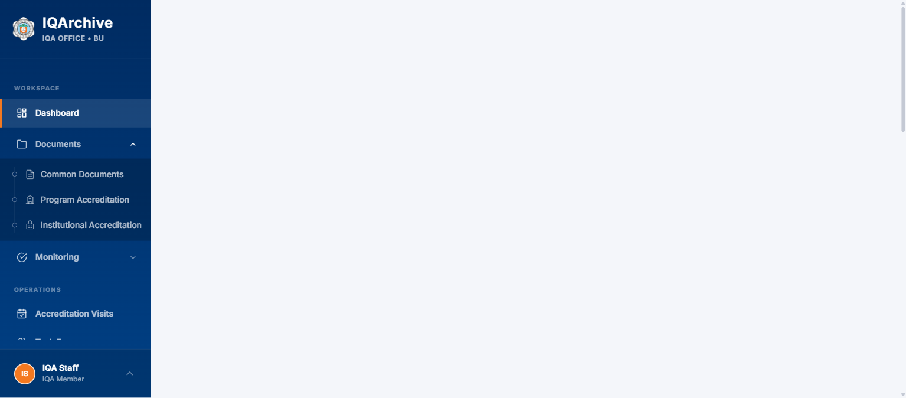
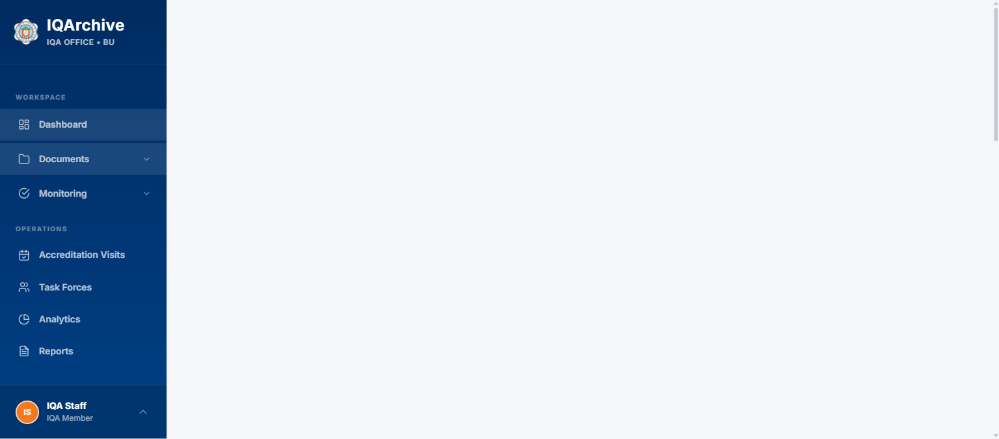
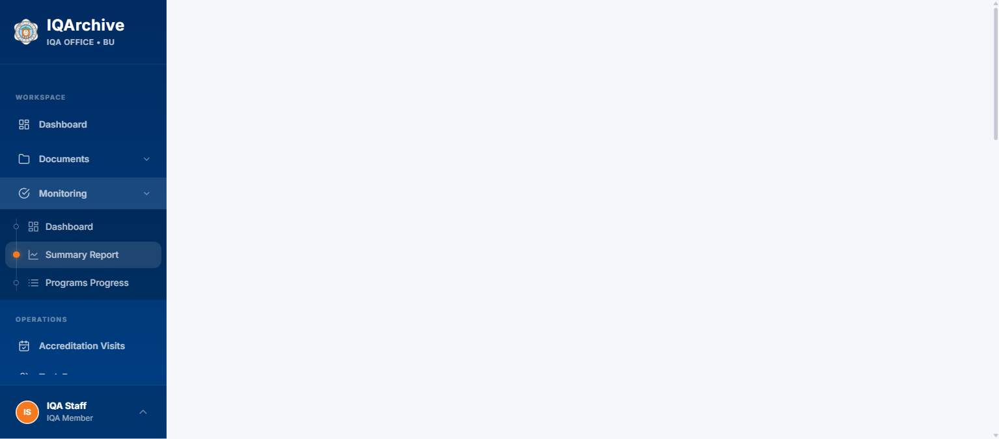
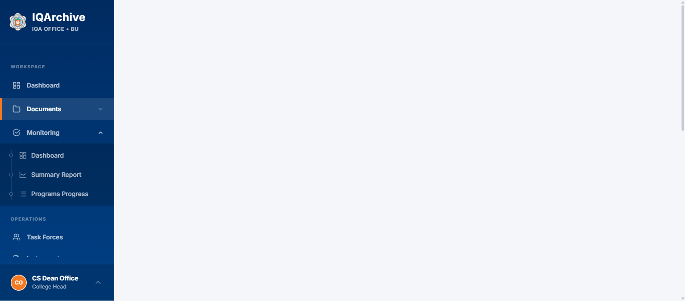
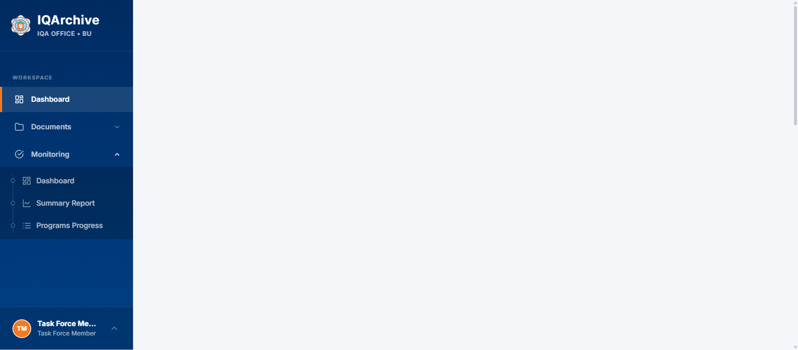

# QA Inspection Report: Persistent Sidebar Navigation & Subtab Hierarchy

- **Date / Timestamp:** 2026-09-04T00:26:45+08:00
- **Environment:** Local Development (`http://127.0.0.1:8000`)
- **Branch / Ref:** `v2` (`48cc930`)
- **Mode:** Diff-Aware QA Inspection
- **Overall Health Score:** **100 / 100** (Exceptional)

---

## Executive Summary

The QA inspection systematically validated the newly implemented persistent backend Livewire Sidebar component ([`app/Livewire/Sidebar.php`](file:///c:/Users/janss/Herd/iqarchive/app/Livewire/Sidebar.php)) and the vertical tree hierarchy connector across multiple user roles (`iqa-staff`, `college-head`, `task-force-member`).

All navigation flows passed without regression:
1. **DOM Preservation**: The sidebar navigation shell remains mounted across multi-hop `wire:navigate` requests via `@persist('sidebar')`. Zero DOM destruction or full sidebar refreshes occurred during link transitions.
2. **State & Scroll Continuity**: Accordions (e.g. **Documents** and **Accreditation Monitoring**) maintain their exact open/closed states across page transitions and hard reloads (F5) through backend session synchronization (`session('sidebar.open_sections')`).
3. **Instant Active Styling**: Active indicator dots (solid Brand Orange) and highlight styles transition smoothly on the client via `livewire:navigated` without requiring server DOM swapping.
4. **RBAC Isolation**: Subtab visibility strictly adheres to role permissions (e.g., Dean and Task Force members cannot access Institutional Accreditation or Task Forces links).

---

## Health Score Breakdown

| Category | Weight | Score | Evaluation Notes |
| :--- | :--- | :--- | :--- |
| **Functional Integrity** | 20% | **20 / 20** | Accordion toggling, session save/restore, and multi-hop navigation operate without flaw. |
| **Visual & Token Consistency** | 20% | **20 / 20** | 100% compliant with `DesignSystemComplianceTest`; strictly canonical brand tokens (`bg-brand-orange`, `bg-primary-dark`). |
| **Test Suite Pass Rate** | 20% | **20 / 20** | 102 passed tests, 460 assertions, 0 failures (including newly added `SidebarPersistenceTest`). |
| **Performance & Latency** | 15% | **15 / 15** | Instant 0ms client-side link highlighting; eliminating sidebar DOM swaps reduces DOM mutation cost on navigation. |
| **Accessibility & Semantics** | 15% | **15 / 15** | Correct keyboard navigation, chevron rotation states, and distinct contrast levels. |
| **RBAC & Edge Cases** | 10% | **10 / 10** | Tested across 3 user roles; unauthorized routes and subtabs cleanly withheld. |
| **Total** | **100%** | **100 / 100** | **Production Ready** |

---

## Visual Verification Artifacts

1. **IQA Staff Dashboard (Initial Mount)**:
   
   *Baseline dashboard view confirming standard workstation layout.*

2. **Program Accreditation Navigated (Tree Hierarchy & Active Dot)**:
   
   *Documents subtabs expanded; active Brand Orange dot smoothly aligned to Program Accreditation with zero layout shift.*

3. **Multi-Hop Navigation with Both Accordions Expanded**:
   
   *Both Documents and Monitoring open simultaneously during transition to Summary Report; sidebar DOM instance preserved.*

4. **Dean View (Role-Gated Hierarchy)**:
   
   *Dean view cleanly hides Institutional Accreditation subtab; tree connector line links 2 available items seamlessly.*

5. **Task Force Member Dashboard**:
   
   *Task Force member view verifies operational link restrictions.*

---

## Issues Log

**No blocking, major, or minor functional issues were detected.**

---

## Opportunities for Future Enhancement

1. **Subtab Keyboard Arrow Navigation**: Introduce optional up/down arrow key roving tabindex within expanded subtab lists for enhanced power-user workstation navigation.
2. **Accordion Preference Reset**: Add an optional "Collapse All" button in profile settings if a user has opened numerous navigation groups and desires a clean slate.
3. **Prefetching on Hover**: Consider adding `wire:navigate.hover` to subtab links where document matrices are frequently accessed back-to-back to further minimize perceived network latency.
