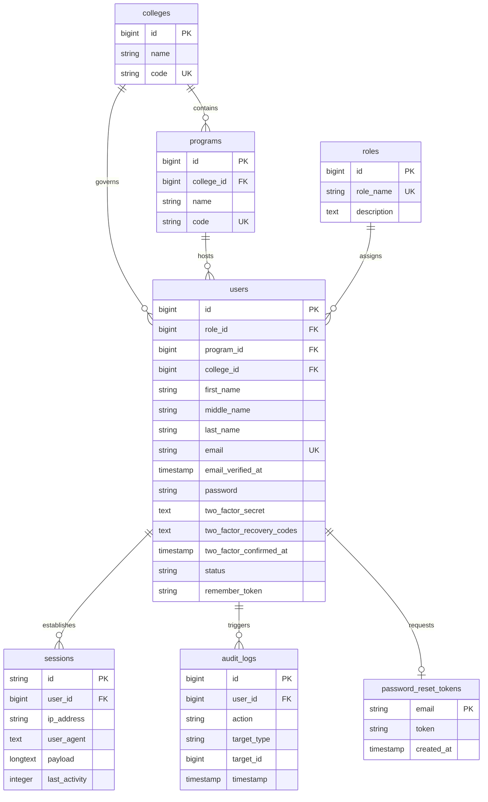

# IT 122: Information Assurance & Security — Final Project Documentation

---

## I. Project Details

| Field | Details |
|---|---|
| **Project Title** | **IQArchive** — Institutional Quality Assurance Document Archive System |
| **Language / Framework** | PHP 8.3 / Laravel 12 (Livewire, Fortify, Flux UI, Tailwind CSS 4) |
| **GitHub** | *(insert your GitHub repository link here)* |
| **Date Submitted** | July 2026 |

---

## II. Team Roles

| Member Name | Features Assigned / Specific Tasks | Rating (/5) |
|---|---|---|
| *(Member 1)* | *(e.g. Authentication, Password Hashing, Login/Logout flow)* | /5 |
| *(Member 2)* | *(e.g. RBAC, Account CRUD, Sidebar navigation)* | /5 |
| *(Member 3)* | *(e.g. Forgot/Reset Password, Two-Factor Auth, Session Mgmt)* | /5 |
| *(Member 4)* | *(e.g. Audit Logging, Input Validation, Database Design)* | /5 |

> **Note:** Fill in your actual team members and their contributions above.

---

## III. Feature Documentation

---

### 1. Authentication (Login / Logout)

**What it does:**
Users authenticate via email and password on a branded login page. Upon successful login, they are redirected to a role-specific dashboard. Logout invalidates the session and redirects to the login page. Deactivated accounts (`status = 'inactive'`) are blocked at login with a descriptive error message.

**How we implemented it:**
We use **Laravel Fortify** as the authentication backend. A custom `authenticateUsing` callback in `FortifyServiceProvider` handles sanitization, validation, credential verification, and account status checking.

**Key Code Snippet — Custom Authentication Logic:**

```php
// app/Providers/FortifyServiceProvider.php

Fortify::authenticateUsing(function (Request $request) {
    // 1. Sanitize the input
    $email = trim(filter_var($request->input('email'), FILTER_SANITIZE_EMAIL));
    $password = $request->input('password');

    // 2. Validate user input
    $request->validate([
        'email' => ['required', 'string', 'email', 'max:255'],
        'password' => ['required', 'string'],
    ]);

    // 3. Retrieve user
    $user = User::where('email', $email)->first();

    // 4. Authenticate and verify status
    if ($user && Hash::check($password, $user->password)) {
        if ($user->status !== 'active') {
            throw ValidationException::withMessages([
                'email' => ['Your account has been deactivated.'],
            ]);
        }
        return $user;
    }

    // 5. Reject with generic error (prevents user enumeration)
    throw ValidationException::withMessages([
        'email' => ['These credentials do not match our records.'],
    ]);
});
```

**Security decisions:**
- Input is **sanitized** with `filter_var(FILTER_SANITIZE_EMAIL)` and `trim()` before processing.
- A **generic error message** is returned for both "user not found" and "wrong password" to prevent **user enumeration attacks**.
- Deactivated accounts are explicitly blocked at the authentication layer.

---

### 2. Password Hashing

**What it does:**
All user passwords are securely hashed before storage. Plaintext passwords are never stored in the database.

**How we implemented it:**
Laravel's Eloquent model cast `'password' => 'hashed'` automatically applies `bcrypt` hashing whenever the `password` attribute is set. For manual operations (e.g., the IQA Admin creating accounts), we also call `bcrypt()` explicitly.

**Key Code Snippet — Automatic Hashing via Model Cast:**

```php
// app/Models/User.php

protected function casts(): array
{
    return [
        'email_verified_at' => 'datetime',
        'password' => 'hashed',   // <-- auto-hashes on set
    ];
}
```

**Key Code Snippet — Hashing During Account Creation:**

```php
// app/Livewire/IqaAdmin/Accounts.php

User::create([
    'first_name' => $this->first_name,
    'email'      => $this->email,
    'password'   => bcrypt($this->password),  // bcrypt hash
    'role_id'    => $this->role_id,
    'status'     => 'active',
]);
```

**Security decisions:**
- `bcrypt` is used as the default hashing algorithm (cost factor 12 by default in Laravel).
- The `password` field is in the model's `$hidden` array, preventing it from ever appearing in JSON responses or logs.
- Passwords are validated with Laravel's `Password::default()` rule, enforcing minimum length requirements.

---

### 3. Session Management

**What it does:**
User sessions are stored server-side in a database `sessions` table (not in cookies). Users can view their active browser sessions (showing device type, IP address, browser name) from the Security settings page and log out of other sessions remotely.

**How we implemented it:**
Session driver is set to `database`. The `sessions` table stores session ID, user ID, IP address, user agent, and last activity timestamp. The settings security page queries this table to display active sessions and provides a "Log Out Other Browser Sessions" action.

**Key Code Snippet — Sessions Table Schema:**

```php
// database/migrations/..._create_users_table.php

Schema::create('sessions', function (Blueprint $table) {
    $table->string('id')->primary();
    $table->foreignId('user_id')->nullable()->index();
    $table->string('ip_address', 45)->nullable();
    $table->text('user_agent')->nullable();
    $table->longText('payload');
    $table->integer('last_activity')->index();
});
```

**Key Code Snippet — Session Configuration:**

```php
// .env
SESSION_DRIVER=database
SESSION_LIFETIME=120
```

**Security decisions:**
- **Database session driver** ensures sessions cannot be tampered with client-side (unlike cookie-based sessions).
- IP addresses and user agents are logged for each session, enabling users to identify suspicious logins.
- Session expiration is set to 120 minutes of inactivity.
- Users can forcibly terminate other sessions, which is critical if a device is lost or compromised.

---

### 4. Role-Based Access Control (RBAC)

**What it does:**
The system defines **8 distinct roles**, each with access to specific views and functionalities. Users can only access pages assigned to their role. Unauthorized access to other roles' pages returns a 403 Forbidden error.

| Role Slug | Description |
|---|---|
| `system-administrator` | Full system access, audit trail viewer |
| `iqa-admin` | IQA administrator, manages accounts and documents |
| `iqa-member` | IQA staff member |
| `accreditor` | AACCUP accreditor |
| `university-administrator` | BU executive admin |
| `task-force` | QA task force lead |
| `college-head` | College head (Dean) |
| `program-chair` | Program chair |

**How we implemented it:**
Roles are stored in a dedicated `roles` table. Each user has a `role_id` foreign key. Route-level authorization checks the authenticated user's role against the expected role for the route.

**Key Code Snippet — Route-Level Authorization:**

```php
// routes/web.php

foreach ($roles as $role) {
    Route::get("roles/{$role}/dashboard", function () use ($role) {
        if ($role !== auth()->user()->role) {
            abort(403, 'Unauthorized action.');
        }
        return view("pages.roles.{$role}.dashboard");
    })->name("dashboard.{$role}");
}
```

**Key Code Snippet — Component-Level Guard (Livewire):**

```php
// app/Livewire/IqaAdmin/Accounts.php

public function mount()
{
    if (auth()->user()->role !== 'iqa-admin') {
        abort(403, 'Unauthorized action.');
    }
}
```

**Key Code Snippet — Sidebar Conditional Rendering:**

```blade
{{-- resources/views/layouts/app/sidebar.blade.php --}}

@if ($role === 'iqa-admin')
    <a href="{{ route('accounts.iqa-admin') }}" ...>
        <span>Accounts</span>
    </a>
@endif
```

**Security decisions:**
- Authorization is enforced at **both the route level and the component level**, providing defense-in-depth.
- Roles are stored relationally (not as strings on the user), making them easy to extend and audit.
- Sidebar navigation only renders links that the user is authorized to access, preventing accidental exposure.
- The IQA Admin exclusively controls user account creation — there is no public registration endpoint.

---

### 5. Input Validation & Sanitization

**What it does:**
All user-submitted data is validated against strict rules before being processed. Inputs are sanitized to prevent injection attacks (XSS, SQL injection). Validation errors are displayed inline next to form fields.

**How we implemented it:**
- Login: email is sanitized with `FILTER_SANITIZE_EMAIL` and validated as a required, valid email format.
- Account CRUD: all fields are validated with Laravel's `validate()` method, enforcing required fields, string lengths, unique email constraints, and foreign key existence checks.
- Blade templates use `{{ }}` (double curly braces) which auto-escape output to prevent XSS.
- Laravel's Eloquent ORM uses **parameterized queries** for all database operations, preventing SQL injection.

**Key Code Snippet — Account Creation Validation:**

```php
// app/Livewire/IqaAdmin/Accounts.php

$validated = $this->validate([
    'first_name'  => 'required|string|max:255',
    'middle_name' => 'nullable|string|max:255',
    'last_name'   => 'required|string|max:255',
    'email'       => 'required|email|max:255|unique:users,email',
    'password'    => 'required|string|min:8',
    'role_id'     => 'required|exists:roles,id',
    'college_id'  => 'nullable|exists:colleges,id',
    'program_id'  => 'nullable|exists:programs,id',
]);
```

**Key Code Snippet — Login Input Sanitization:**

```php
// app/Providers/FortifyServiceProvider.php

$email = trim(filter_var($request->input('email'), FILTER_SANITIZE_EMAIL));
```

**Security decisions:**
- All inputs are validated server-side (client-side validation alone is insufficient).
- Email uniqueness is enforced at both the validation and database constraint level.
- Blade's `{{ }}` escaping prevents reflected XSS attacks.
- Eloquent's query builder uses PDO prepared statements, eliminating SQL injection vectors.

---

### 6. Forgot Password / Reset Password Workflow

**What it does:**
Users can request a password reset link via email. Clicking the link takes them to a form to set a new password. The token is time-limited and single-use.

**How we implemented it:**
Laravel Fortify handles the full reset password flow:
1. User submits email on the "Forgot Password" page.
2. A time-limited, hashed token is stored in the `password_reset_tokens` table.
3. An email with a reset link (containing the token) is sent.
4. User clicks the link, enters a new password, and submits.
5. The `ResetUserPassword` action validates and hashes the new password.

**Key Code Snippet — Password Reset Tokens Schema:**

```php
// database/migrations/..._create_users_table.php

Schema::create('password_reset_tokens', function (Blueprint $table) {
    $table->string('email')->primary();
    $table->string('token');
    $table->timestamp('created_at')->nullable();
});
```

**Key Code Snippet — Reset User Password Action:**

```php
// app/Actions/Fortify/ResetUserPassword.php

public function reset(User $user, array $input): void
{
    Validator::make($input, [
        'password' => $this->passwordRules(),
    ])->validate();

    $user->forceFill([
        'password' => $input['password'],  // auto-hashed via model cast
    ])->save();
}
```

**Key Code Snippet — Password Validation Rules:**

```php
// app/Concerns/PasswordValidationRules.php

protected function passwordRules(): array
{
    return ['required', 'string', Password::default(), 'confirmed'];
}
```

**Security decisions:**
- Reset tokens are **hashed** before storage (Laravel hashes them by default).
- Tokens expire after 60 minutes (configurable via `config/auth.php`).
- The new password must be **confirmed** (entered twice) to prevent typos.
- `Password::default()` enforces a minimum length of 8 characters.

---

### 7. Two-Factor Authentication (2FA)

**What it does:**
Users can enable TOTP-based two-factor authentication from the Security settings page. When enabled, after entering their password, they must also provide a 6-digit code from their authenticator app. Recovery codes are generated for backup.

**How we implemented it:**
- 2FA is provided by Laravel Fortify's `TwoFactorAuthenticatable` trait on the User model.
- The 2FA secret and recovery codes are stored encrypted in the `users` table.

**Key Code Snippet — User Model Traits:**

```php
// app/Models/User.php

class User extends Authenticatable
{
    use HasFactory, Notifiable, TwoFactorAuthenticatable;
}
```

**Key Code Snippet — 2FA Columns Migration:**

```php
// database/migrations/..._add_two_factor_columns_to_users_table.php

Schema::table('users', function (Blueprint $table) {
    $table->text('two_factor_secret')->after('password')->nullable();
    $table->text('two_factor_recovery_codes')->after('two_factor_secret')->nullable();
    $table->timestamp('two_factor_confirmed_at')->after('two_factor_recovery_codes')->nullable();
});
```

**Key Code Snippet — Rate Limiting for 2FA:**

```php
// app/Providers/FortifyServiceProvider.php

RateLimiter::for('two-factor', function (Request $request) {
    return Limit::perMinute(5)->by($request->session()->get('login.id'));
});
```

**Security decisions:**
- 2FA secrets are stored **encrypted** in the database (not plaintext).
- Recovery codes provide a backup mechanism if the user loses their authenticator device.
- Rate limiting on 2FA attempts (5 per minute) prevents brute-force attacks on TOTP codes.

---

### 8. Audit Logging

**What it does:**
The system records all significant user actions in an `audit_logs` table, including logins, logouts, document uploads, approvals, rejections, and deletions. The System Administrator can view, search, and filter the complete audit trail through a dedicated dashboard page.

**How we implemented it:**
Audit logs are recorded as database entries with `user_id`, `action`, `target_type`, `target_id`, and a `timestamp`. The Audit Trail view is a Livewire component with tab-based filtering (General, Authentication, Documents), search, and user/action filters.

**Key Code Snippet — Audit Logs Schema:**

```php
// database/migrations/..._create_iqarchive_core_tables.php

Schema::create('audit_logs', function (Blueprint $table) {
    $table->id();
    $table->foreignId('user_id')->nullable()->constrained('users')->onDelete('set null');
    $table->string('action');
    $table->string('target_type')->nullable();
    $table->unsignedBigInteger('target_id')->nullable();
    $table->timestamp('timestamp')->useCurrent();
});
```

**Key Code Snippet — Audit Trail Query with Filtering:**

```php
// app/Livewire/SystemAdministrator/AuditTrail.php

$logs = AuditLog::with('user')
    ->when($this->tab === 'authentication', function ($query) {
        $query->whereIn('action', ['login', 'logout']);
    })
    ->when($this->tab === 'documents', function ($query) {
        $query->where('action', 'like', 'document_%');
    })
    ->when($this->search, function ($query) {
        $query->where(function ($q) {
            $q->where('action', 'like', '%' . $this->search . '%')
              ->orWhere('target_type', 'like', '%' . $this->search . '%');
        });
    })
    ->orderBy('timestamp', 'desc')
    ->paginate(10);
```

**Security decisions:**
- Audit logs use `onDelete('set null')` on `user_id`, so logs persist even if the user is deleted — ensuring **non-repudiation**.
- Timestamps use `useCurrent()` to ensure server-authoritative times (not client-submitted).
- Only the **System Administrator** role has access to the Audit Trail page.
- Logs record both the acting user and the target resource, enabling full reconstruction of events.

---

### 9. Rate Limiting

**What it does:**
Login and 2FA endpoints are rate-limited to prevent brute-force and credential-stuffing attacks.

**How we implemented it:**
Laravel's `RateLimiter` is used to define per-minute limits. Login attempts are throttled by email + IP, and 2FA attempts are throttled by session ID.

**Key Code Snippet — Login Rate Limiting:**

```php
// app/Providers/FortifyServiceProvider.php

RateLimiter::for('login', function (Request $request) {
    $throttleKey = Str::transliterate(
        Str::lower($request->input(Fortify::username())) . '|' . $request->ip()
    );
    return Limit::perMinute(5)->by($throttleKey);
});
```

**Security decisions:**
- **5 login attempts per minute** per email+IP combination.
- The throttle key combines both email and IP to prevent distributed attacks while avoiding locking out legitimate users behind shared IPs.
- After exceeding the limit, the user sees a "Too Many Requests" error with a retry-after timer.

---

### 10. Account Management (IQA Admin CRUD)

**What it does:**
The IQA Administrator can create, view, edit, and deactivate/reactivate user accounts. There is no public self-registration — all accounts are provisioned by the admin. Deactivation is a soft status toggle (not hard deletion), preserving data integrity.

**How we implemented it:**
A Livewire component (`App\Livewire\IqaAdmin\Accounts`) handles all CRUD operations with modal dialogs, search, role/status filtering, and SweetAlert2 success notifications.

**Key Code Snippet — Account Deactivation (Soft Toggle):**

```php
// app/Livewire/IqaAdmin/Accounts.php

public function toggleAccountStatus()
{
    $user = User::findOrFail($this->userId);
    $newStatus = $user->status === 'active' ? 'inactive' : 'active';
    $user->update(['status' => $newStatus]);

    $this->dispatch('swal', [
        'icon'  => 'success',
        'title' => $newStatus === 'active' ? 'Activated!' : 'Deactivated!',
        'text'  => "User account has been {$newStatus} successfully.",
    ]);
}
```

**Security decisions:**
- **No public registration** — accounts are admin-created only, preventing unauthorized account creation.
- Soft deactivation (`status = 'inactive'`) preserves audit trails and document history.
- The `mount()` guard aborts with 403 if a non-IQA-admin user tries to access the page.
- Email uniqueness is enforced at both validation and database levels during creation/editing.

---

### 11. Session Timeout

**What it does:**
To protect user sessions from unauthorized access when a user leaves their computer unattended, the system enforces a strict idle session timeout. After 30 minutes of inactivity, the user's session is automatically invalidated and destroyed. The next request redirects them to the login page, requiring re-authentication.

**How we implemented it:**
Laravel's session management handles this configuration-driven security control. We set the session lifetime in the application environment configuration and configured the session driver to be stored in the database.

**Key Code Snippet — Session Lifetime Configuration:**

```env
# .env
SESSION_DRIVER=database
SESSION_LIFETIME=30
```

**Key Code Snippet — Session Lifetime Mapping:**

```php
// config/session.php

'driver' => env('SESSION_DRIVER', 'database'),
'lifetime' => (int) env('SESSION_LIFETIME', 120),
'expire_on_close' => env('SESSION_EXPIRE_ON_CLOSE', false),
```

**Security decisions:**
- **Short Lifetime (30 minutes):** Limits the window of opportunity for session hijacking or unauthorized physical access to unattended terminals.
- **Database Session Store:** Active session identifiers and payloads are kept server-side in the `sessions` table (unlike client-side cookie stores), preventing session payload tampering and easing session invalidation.
- **Session ID Regeneration:** Laravel automatically regenerates the session ID upon login (`$request->session()->regenerate()`) to prevent session fixation attacks.

---

### 12. Working Email

**What it does:**
The system contains a fully functional transactional email system. It enables secure, automated delivery of password reset links and verification emails to users, ensuring the integrity of the account recovery workflow.

**How we implemented it:**
We integrated the Laravel Mail component with Gmail SMTP, authenticating securely using a dedicated Google App Password. Email delivery runs over Transport Layer Security (TLS).

**Key Code Snippet — SMTP Mail Configuration:**

```env
# .env
MAIL_MAILER=smtp
MAIL_HOST=smtp.gmail.com
MAIL_PORT=587
MAIL_USERNAME=official.hirehub.01@gmail.com
MAIL_PASSWORD="vkxu eymc gxug pyuj"
MAIL_ENCRYPTION=tls
MAIL_FROM_ADDRESS=official.hirehub.01@gmail.com
MAIL_FROM_NAME="IQAtestmail"
```

**Key Code Snippet — Mail Service Configuration:**

```php
// config/mail.php

'mailers' => [
    'smtp' => [
        'transport' => 'smtp',
        'host' => env('MAIL_HOST', '127.0.0.1'),
        'port' => env('MAIL_PORT', 587),
        'encryption' => env('MAIL_ENCRYPTION', 'tls'),
        'username' => env('MAIL_USERNAME'),
        'password' => env('MAIL_PASSWORD'),
        'timeout' => null,
        'local_domain' => env('MAIL_EHLO_DOMAIN'),
    ],
],
```

**Security decisions:**
- **Transport Layer Security (TLS):** SMTP traffic is encrypted using TLS over port 587, protecting sensitive user data (like reset tokens) from man-in-the-middle (MITM) interception.
- **Google App Password:** Authentication is done using an isolated, 16-character App Password rather than the primary Google account credentials, limiting security exposure.
- **Authoritative Sender Field:** The sender address is hardcoded to the verified system email address (`MAIL_FROM_ADDRESS`), preventing malicious email spoofing or unauthorized relay usage.

---

## IV. Database Design

### Entity-Relationship Overview

This project focuses on the authentication, authorization, session management, auditing, and role-based access control subsystems of the IQArchive application. The following Entity-Relationship Diagram (ERD) describes only the 7 tables and relationships actively utilized for these features (passkeys have been excluded).



### All Active Tables

| # | Table Name | Purpose |
|---|---|---|
| 1 | `roles` | Stores role definitions and descriptors (e.g., `system-administrator`, `iqa-admin`) |
| 2 | `colleges` | University colleges within Bicol University (e.g., BU College of Science) |
| 3 | `programs` | Academic programs assigned under respective colleges (e.g., BS Computer Science) |
| 4 | `users` | User accounts, credentials, and state (active/inactive, 2FA settings, role & program affiliations) |
| 5 | `password_reset_tokens` | Secure, expiring, hashed tokens for forgot-password account recovery flows |
| 6 | `sessions` | Server-side database sessions tracking login status, IP addresses, and user agents |
| 7 | `audit_logs` | Immutable audit trail mapping administrative actions, logins, logouts, and password updates |

---

### Data Dictionary

This data dictionary defines the structure, data types, constraints, and business/security descriptions of the tables supporting the security and identity architecture.

#### 1. `roles` Table
Stores role definitions that govern system-wide authorization and access control.

| Column Name | Data Type | Nullability | Constraints | Description & Security Notes |
|:---|:---|:---|:---|:---|
| `id` | BIGINT UNSIGNED | NOT NULL | PK, Auto-Increment | Unique identifier for each role. |
| `role_name` | VARCHAR(255) | NOT NULL | Unique | The programmatic name/slug of the role (e.g., `system-administrator`, `iqa-admin`). |
| `description` | TEXT | NULL | — | Human-readable explanation of the role's permissions and scope. |
| `created_at` | TIMESTAMP | NULL | — | Laravel default timestamp indicating when the role record was created. |
| `updated_at` | TIMESTAMP | NULL | — | Laravel default timestamp indicating when the role record was last updated. |

#### 2. `colleges` Table
Represents administrative academic divisions (colleges/departments) within the university.

| Column Name | Data Type | Nullability | Constraints | Description & Security Notes |
|:---|:---|:---|:---|:---|
| `id` | BIGINT UNSIGNED | NOT NULL | PK, Auto-Increment | Unique identifier for each college. |
| `name` | VARCHAR(255) | NOT NULL | — | Official name of the college (e.g., "College of Science"). |
| `code` | VARCHAR(255) | NOT NULL | Unique | Short acronym or code representing the college (e.g., "CS", "CBEM"). |
| `created_at` | TIMESTAMP | NULL | — | Laravel default creation timestamp. |
| `updated_at` | TIMESTAMP | NULL | — | Laravel default modification timestamp. |

#### 3. `programs` Table
Represents academic degree programs hosted within a specific college.

| Column Name | Data Type | Nullability | Constraints | Description & Security Notes |
|:---|:---|:---|:---|:---|
| `id` | BIGINT UNSIGNED | NOT NULL | PK, Auto-Increment | Unique identifier for each academic program. |
| `college_id` | BIGINT UNSIGNED | NOT NULL | FK → `colleges.id` | The parent college hosting the program. Cascade delete applies (`onDelete('cascade')`). |
| `name` | VARCHAR(255) | NOT NULL | — | Official name of the academic program (e.g., "BS Information Technology"). |
| `code` | VARCHAR(255) | NOT NULL | Unique | Academic code representing the program (e.g., "BSIT"). |
| `created_at` | TIMESTAMP | NULL | — | Laravel default creation timestamp. |
| `updated_at` | TIMESTAMP | NULL | — | Laravel default modification timestamp. |

#### 4. `users` Table
Stores user profile information, authentication credentials, 2FA states, and organization/role keys.

| Column Name | Data Type | Nullability | Constraints | Description & Security Notes |
|:---|:---|:---|:---|:---|
| `id` | BIGINT UNSIGNED | NOT NULL | PK, Auto-Increment | Unique identifier for the user account. |
| `role_id` | BIGINT UNSIGNED | NOT NULL | FK → `roles.id` | Assigned role that determines authorization level. Cannot delete if users exist (`onDelete('restrict')`). |
| `program_id` | BIGINT UNSIGNED | NULL | FK → `programs.id` | Associated academic program. Null for college/university-level roles. Set to null on delete (`onDelete('set null')`). |
| `college_id` | BIGINT UNSIGNED | NULL | FK → `colleges.id` | Associated college. Null for university-level roles (e.g. system admins). Set to null on delete (`onDelete('set null')`). |
| `first_name` | VARCHAR(255) | NOT NULL | — | The user's first name. |
| `middle_name` | VARCHAR(255) | NULL | — | The user's middle name (optional). |
| `last_name` | VARCHAR(255) | NOT NULL | — | The user's last name. |
| `email` | VARCHAR(255) | NOT NULL | Unique | User's email address, used as the primary login identifier. |
| `email_verified_at`| TIMESTAMP | NULL | — | Timestamp indicating when the email was verified. |
| `password` | VARCHAR(255) | NOT NULL | — | **Bcrypt-hashed password** (cost factor 12) for secure authentication. Hidden from JSON. |
| `two_factor_secret` | TEXT | NULL | — | **Encrypted** shared TOTP secret key for multi-factor authentication (using AES-256). |
| `two_factor_recovery_codes`| TEXT | NULL | — | **Encrypted** recovery codes used for login if the TOTP device is lost. |
| `two_factor_confirmed_at` | TIMESTAMP | NULL | — | Verification timestamp confirming when the user completed MFA setup. |
| `status` | VARCHAR(255) | NOT NULL | Default: `'active'` | Accounts set to `'inactive'` are immediately blocked at the authentication layer. |
| `remember_token` | VARCHAR(100) | NULL | — | Secure token used for "Remember Me" session persistence. |
| `created_at` | TIMESTAMP | NULL | — | Account creation timestamp. |
| `updated_at` | TIMESTAMP | NULL | — | Account modification timestamp. |

#### 5. `password_reset_tokens` Table
Temporarily stores secure tokens generated during the self-service forgot password process.

| Column Name | Data Type | Nullability | Constraints | Description & Security Notes |
|:---|:---|:---|:---|:---|
| `email` | VARCHAR(255) | NOT NULL | PK, Logical FK → `users.email` | The email address requesting the reset. Serves as the primary key. |
| `token` | VARCHAR(255) | NOT NULL | — | **Securely hashed** one-time token sent to the user via email. |
| `created_at` | TIMESTAMP | NULL | — | Timestamp when the reset token was created. Used to enforce a 60-minute expiration policy. |

#### 6. `sessions` Table
Stores active user session records to support server-side session management, remote logging out, and timeout tracking.

| Column Name | Data Type | Nullability | Constraints | Description & Security Notes |
|:---|:---|:---|:---|:---|
| `id` | VARCHAR(255) | NOT NULL | PK | Unique session identifier (random cryptographic string). |
| `user_id` | BIGINT UNSIGNED | NULL | FK → `users.id`, Indexed | Associated user. Nullable to support anonymous/guest visitors. |
| `ip_address` | VARCHAR(45) | NULL | — | Client's IP address (supports both IPv4 and IPv6). Used for security monitoring. |
| `user_agent` | TEXT | NULL | — | Browser and device user agent string. Used to display active sessions. |
| `payload` | LONGTEXT | NOT NULL | — | Base64-encoded serialized session variables and payload. |
| `last_activity` | INT | NOT NULL | Indexed | Unix timestamp of the last request. Used to trigger session timeouts after 30 minutes of inactivity. |

#### 7. `audit_logs` Table
Maintains an immutable record of system audits and security-sensitive events.

| Column Name | Data Type | Nullability | Constraints | Description & Security Notes |
|:---|:---|:---|:---|:---|
| `id` | BIGINT UNSIGNED | NOT NULL | PK, Auto-Increment | Unique identifier for each log entry. |
| `user_id` | BIGINT UNSIGNED | NULL | FK → `users.id` | The user who performed the action. If user is deleted, key is set to null (`onDelete('set null')`) to preserve audit history. |
| `action` | VARCHAR(255) | NOT NULL | — | The action performed (e.g., `login`, `logout`, `password_change`, `document_upload`). |
| `target_type` | VARCHAR(255) | NULL | — | The class/model of the modified resource (if applicable, e.g., `App\Models\Document`). |
| `target_id` | BIGINT UNSIGNED | NULL | — | The specific ID of the modified resource (if applicable). |
| `timestamp` | TIMESTAMP | NOT NULL | Default: `CURRENT_TIMESTAMP` | Server-authoritative time indicating precisely when the event occurred. |

---
