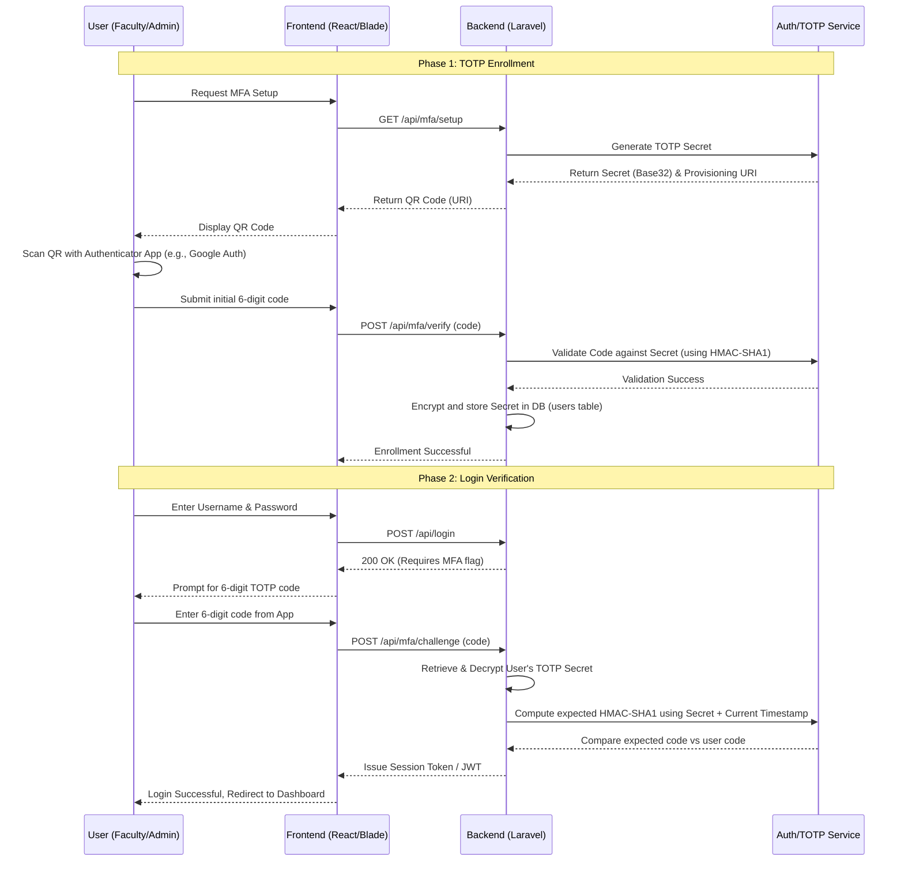

# Part 1 - Security Architecture Design: IQArchive Capstone

Based on the nature of the IQArchive system—which handles highly sensitive university accreditation evidence, faculty PII, and requires strict access separation among 9 distinct user roles—the most appropriate modules to implement are **Module A (Identity & Access Fortification)** and **Module B (Cryptographic Data Protection)**.

---

## Module A: Identity & Access Fortification

Given the complexity of the accreditation process, an accreditor must only see approved evidence, while faculty members should only modify their own submissions. Implementing strict RBAC combined with MFA ensures that unauthorized users cannot tamper with or leak accreditation evidence.

### 1. TOTP Enrollment and Verification Flow Diagram



### 2. Complete RBAC Matrix

| Role | User Accounts | Accreditation Folders | Documents/Evidence | System Settings | Final Reports |
| :--- | :--- | :--- | :--- | :--- | :--- |
| **system-administrator** | Create, Read, Update, Delete | Read | Read | Create, Read, Update, Delete | Read |
| **iqa-admin** | Create, Read, Update | Create, Read, Update, Delete | Read, Delete | Read | Read, Approve |
| **iqa-member** | Read | Create, Read, Update | Read, Update (Metadata) | No Access | Read |
| **accreditor** | No Access | Read | Read | No Access | Read |
| **university-administrator**| Read | Read | Read | No Access | Read |
| **task-force** | Read (Self/Team) | Read | Read, Update, Delete (Own Area) | No Access | Create, Read, Update |
| **college-head** | Read (College only) | Read | Read | No Access | Read, Approve |
| **program-chair** | Read (Program only) | Read | Read, Update | No Access | Read, Update |
| **faculty-member** | Read (Self), Update (Self)| Read | Create, Read, Update, Delete (Own Docs)| No Access | No Access |

### 3. Design Rationale and Connection to Principles

**Design Rationale:** 
The TOTP implementation directly utilizes hashing and Message Authentication Codes (MAC). Specifically, the algorithm uses HMAC-SHA1 (Hash-based Message Authentication Code), combining a cryptographic hash function with the user's provisioned secret key and the current Unix time (the message). Because the secret is shared only between the server and the user's authenticator app, a valid hash verifies identity. The RBAC matrix enforces the principle of least privilege, ensuring that an `accreditor` cannot accidentally delete evidence, and a `faculty-member` cannot access another department's files. By binding strong authentication (HMAC-based TOTP) to strictly defined access roles, the system prevents privilege escalation and lateral movement if standard passwords are compromised.

---

## Module B: Cryptographic Data Protection

The IQArchive system stores personal identifiable information (PII) of faculty members (e.g., ID numbers, contact details) as well as internal evaluation scores. This data must be protected both at rest in the database and in transit over the network.

### 1. Data-Flow Diagram (Encryption-at-Rest)

```mermaid
flowchart TD
    subgraph Client [Client Tier]
        Browser[User Browser]
    end

    subgraph AppLayer [Application Layer - Laravel]
        Controller[Profile/Faculty Controller]
        Model[Eloquent User/Profile Model]
        Crypto[Encryption Service (AES-256-CBC)]
    end

    subgraph DBLayer [Database Layer - MySQL/PostgreSQL]
        DB[(Database)]
        Table[Faculty Profiles Table]
        Fields[Encrypted Fields: <br> - ssn / faculty_id<br> - contact_number<br> - home_address]
    end

    %% Data Flow
    Browser -- "TLS 1.3 (In Transit)" --> Controller
    Controller --> Model
    Model -- "Plaintext Data" --> Crypto
    Crypto -- "AES-256 Encrypted Ciphertext" --> Model
    Model -- "Saves Ciphertext" --> Table
    Table --> Fields

    %% Read Flow
    Fields -. "Reads Ciphertext" .-> Model
    Model -. "Ciphertext" .-> Crypto
    Crypto -. "Decrypts to Plaintext" .-> Model
    Model -. "Plaintext Data" .-> Controller
    Controller -. "TLS 1.3 (In Transit)" .-> Browser
```

### 2. Key Management Approach

- **Storage:** The master application key (APP_KEY) used for AES-256 encryption will be stored in the `.env` file for development, but in production, it will be injected securely via a secret manager (e.g., AWS Secrets Manager or HashiCorp Vault) as an environment variable. It will never be hardcoded or committed to version control.
- **Rotation Policy:** The encryption key will be rotated annually or immediately upon suspected compromise. To facilitate rotation without data loss, the system will implement an iterative re-encryption script: it will decrypt the database fields using the old key, and re-save them using the newly generated key during a scheduled maintenance window.

### 3. TLS / Header Configuration Table

| Header Name | Value / Configuration | Purpose |
| :--- | :--- | :--- |
| **Strict-Transport-Security (HSTS)** | `max-age=31536000; includeSubDomains; preload` | Forces browsers to strictly use HTTPS for 1 year, preventing downgrade attacks (SSL stripping) on the IQArchive portal. |
| **Content-Security-Policy (CSP)** | `default-src 'self'; script-src 'self'; frame-ancestors 'none';` | Mitigates XSS attacks by restricting where scripts and resources can be loaded from. Prevents clickjacking by blocking framing. |
| **X-Content-Type-Options** | `nosniff` | Prevents the browser from trying to MIME-sniff the response, forcing it to stick to the declared content type. |
| **X-Frame-Options** | `DENY` | A legacy fallback for `frame-ancestors 'none'` to ensure the site cannot be embedded in an iframe. |

### 4. Design Rationale and Connection to Principles

**Design Rationale:** 
By implementing AES-256 encryption at the application layer (using Laravel's built-in encrypter), we ensure that even if the database layer is compromised or a database backup is stolen, the sensitive faculty PII remains unreadable without the application key. Coupling this with strict TLS 1.3 enforcement and security headers (HSTS, CSP) guarantees that data is protected from interception (Man-in-the-Middle) while in transit. This layered defense approach explicitly connects the cryptographic protection of data at rest to the secure transmission of that data, ensuring confidentiality across the entire system lifecycle.
