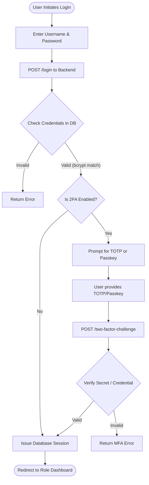
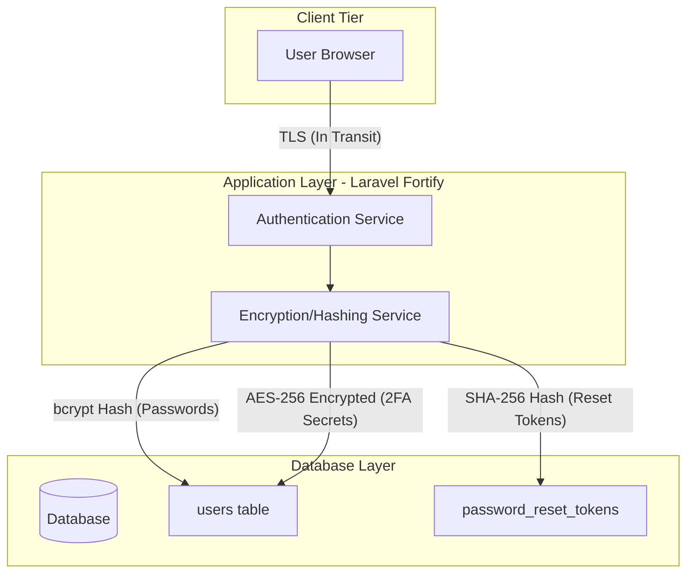

# Part 1 - Security Architecture Design: IQArchive Capstone

Based on the nature of the IQArchive system—which handles highly sensitive university accreditation evidence, user accounts, and requires strict access separation among 8 distinct user roles—the most appropriate modules to implement are **Module A (Identity & Access Fortification)** and **Module B (Cryptographic Data Protection)**.

---

## Module A: Identity & Access Fortification

Given the complexity of the accreditation process, an accreditor must only see approved evidence, while administrative users must manage system configuration securely. Implementing strict RBAC combined with MFA (TOTP & Passkeys) ensures that unauthorized users cannot tamper with or leak accreditation evidence.

### 1. TOTP & Passkey Authentication Flow Diagram

### 2. Complete RBAC Matrix

The system enforces authorization at both the route and component levels across 8 defined roles:

| Role | Description |
| :--- | :--- |
| **system-administrator** | Full system access, audit trail viewer |
| **iqa-admin** | IQA administrator, manages accounts and documents |
| **iqa-member** | IQA staff member |
| **accreditor** | AACCUP accreditor |
| **university-administrator**| BU executive admin |
| **task-force** | QA task force lead |
| **college-head** | College head (Dean) |
| **program-chair** | Program chair |

### 3. Design Rationale and Connection to Principles

**Design Rationale:** 
The authentication layer utilizes multi-factor authentication, including TOTP and FIDO2/WebAuthn standard passkeys, providing robust, phishing-resistant security. Furthermore, rate limiting (5 attempts per minute) prevents brute-force attacks on logins and 2FA. The RBAC matrix enforces the principle of least privilege, ensuring strict separation of duties. By binding strong authentication to strictly defined access roles, the system prevents privilege escalation. A strict 30-minute session timeout limits the window of opportunity for session hijacking.

---

## Module B: Cryptographic Data Protection

The IQArchive system stores sensitive credentials, multi-factor tokens, and audit logs. This data must be protected both at rest in the database and in transit over the network.

### 1. Data-Flow Diagram (Encryption-at-Rest)

### 2. Key Management & Cryptographic Approaches

- **Password Hashing:** All passwords are automatically hashed using `bcrypt` (cost factor 12) before storage. Plaintext passwords are never stored.
- **2FA Secrets:** The `two_factor_secret` and `two_factor_recovery_codes` are stored symmetrically encrypted (AES-256-CBC) in the database to protect against database leaks.
- **Reset Tokens:** Password reset tokens are time-limited (60 minutes) and securely hashed before being stored in the database.
- **Storage:** The master application key (`APP_KEY`) used for AES-256 encryption is managed securely via environment variables.

### 3. TLS / Network Protection Table

| Component | Value / Configuration | Purpose |
| :--- | :--- | :--- |
| **SMTP Email** | `TLS on port 587` | Protects transactional emails (like password reset links) from Man-in-the-Middle interception. |
| **Session Driver** | `database` | Server-side sessions prevent payload tampering compared to client-side cookies. |

### 4. Design Rationale and Connection to Principles

**Design Rationale:** 
By implementing `bcrypt` for passwords, AES-256 for 2FA secrets, and hashing for reset tokens, the application ensures confidentiality and integrity of critical authentication material even if the database is compromised. Enforcing TLS for both web traffic and SMTP email communications guarantees that data is protected from interception while in transit. This layered defense approach explicitly connects the cryptographic protection of data at rest to the secure transmission of that data.
