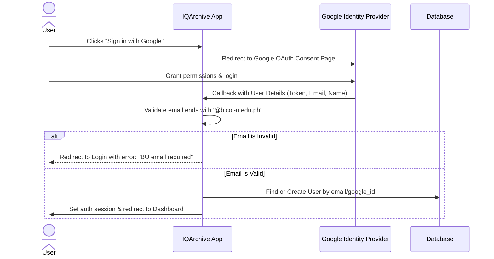

# Google Authentication Integration Plan & Setup

This document outlines the design, configuration, and implementation details for integrating Google OAuth authentication into IQArchive using Laravel Socialite, with strict domain restrictions for Bicol University (`@bicol-u.edu.ph`).

## 1. Authentication Flow



---

## 2. Configuration Steps

### Step 2.1: Google Cloud Console Setup
To authenticate users via Google, you must register the application in the [Google Cloud Console](https://console.cloud.google.com/):

1. **Create a Project**: Create or select a Google Cloud project.
2. **OAuth Consent Screen**:
   - Go to **APIs & Services > OAuth consent screen**.
   - Select **External** (or **Internal** if Bicol University has a Google Workspace organization and you want to restrict it at the Google API gateway level).
   - Fill in the application name, user support email, and developer contact information.
   - Under **Scopes**, add `.../auth/userinfo.email` and `.../auth/userinfo.profile`.
3. **Credentials**:
   - Go to **APIs & Services > Credentials**.
   - Click **Create Credentials** and select **OAuth client ID**.
   - Set **Application type** to *Web application*.
   - Add **Authorized JavaScript origins**:
     - `http://localhost:8000` (Local Dev)
     - `https://iqarchive.bicol-u.edu.ph` (Staging/Production)
   - Add **Authorized redirect URIs**:
     - `http://localhost:8000/auth/google/callback` (Local Dev)
     - `https://iqarchive.bicol-u.edu.ph/auth/google/callback` (Staging/Production)
   - Click **Create** to obtain your **Client ID** and **Client Secret**.

---

## 3. Environment & Service Settings

### Step 3.1: Environment Variables
Add the following keys to your `.env` file (and `.env.example`):

```env
# Google OAuth Configuration
GOOGLE_CLIENT_ID="your-google-client-id.apps.googleusercontent.com"
GOOGLE_CLIENT_SECRET="your-google-client-secret"
GOOGLE_REDIRECT_URI="${APP_URL}/auth/google/callback"

# Restriction Config
ALLOWED_EMAIL_DOMAINS="bicol-u.edu.ph"
```

### Step 3.2: Services Configuration
Add the configuration block to [config/services.php](file:///c:/Users/janss/Herd/iqarchive/config/services.php):

```php
'google' => [
    'client_id' => env('GOOGLE_CLIENT_ID'),
    'client_secret' => env('GOOGLE_CLIENT_SECRET'),
    'redirect' => env('GOOGLE_REDIRECT_URI'),
],
```

---

## 4. Package Installation

Run the following command to install Laravel Socialite:

```bash
composer require laravel/socialite
```

---

## 5. Database Schema Changes

Create a new migration to update the `users` table:

```bash
php artisan make:migration add_google_id_to_users_table
```

Inside the migration file, define the schema updates:

```php
use Illuminate\Database\Migrations\Migration;
use Illuminate\Database\Schema\Blueprint;
use Illuminate\Support\Facades\Schema;

return new class extends Migration
{
    public function up(): void
    {
        Schema::table('users', function (Blueprint $table) {
            $table->string('google_id')->nullable()->unique()->after('id');
            // Make password nullable for OAuth users
            $table->string('password')->nullable()->change();
        });
    }

    public function down(): void
    {
        Schema::table('users', function (Blueprint $table) {
            $table->dropColumn('google_id');
            $table->string('password')->nullable(false)->change();
        });
    }
};
```

Apply the migration:
```bash
php artisan migrate
```

---

## 6. Implementation Code

### Step 6.1: The Google Authentication Controller
Create the controller at `app/Http/Controllers/Auth/GoogleAuthController.php`:

```php
<?php

namespace App\Http\Controllers\Auth;

use App\Http\Controllers\Controller;
use App\Models\User;
use Illuminate\Support\Facades\Auth;
use Illuminate\Support\Str;
use Laravel\Socialite\Facades\Socialite;

class GoogleAuthController extends Controller
{
    /**
     * Redirect the user to the Google authentication page.
     */
    public function redirectToGoogle()
    {
        return Socialite::driver('google')->redirect();
    }

    /**
     * Obtain the user information from Google and authenticate.
     */
    public function handleGoogleCallback()
    {
        try {
            $googleUser = Socialite::driver('google')->user();
        } catch (\Exception $e) {
            return redirect()->route('login')->withErrors([
                'email' => 'Failed to authenticate with Google. Please try again.',
            ]);
        }

        $email = $googleUser->getEmail();
        $allowedDomain = env('ALLOWED_EMAIL_DOMAINS', 'bicol-u.edu.ph');

        // Validate Bicol University domain restriction
        if (!Str::endsWith($email, '@' . $allowedDomain)) {
            return redirect()->route('login')->withErrors([
                'email' => "Access is restricted to official @{$allowedDomain} email accounts.",
            ]);
        }

        // Retrieve existing user or create a new one
        $user = User::where('google_id', $googleUser->getId())
            ->orWhere('email', $email)
            ->first();

        if ($user) {
            // Update google_id if it wasn't linked yet
            if (!$user->google_id) {
                $user->update(['google_id' => $googleUser->getId()]);
            }
        } else {
            // Auto-register a new user with a default role
            $user = User::create([
                'name' => $googleUser->getName(),
                'email' => $email,
                'google_id' => $googleUser->getId(),
                'password' => null, // No password needed for OAuth-only users
                'role' => 'task-force', // Default role for newly registered users
            ]);
        }

        Auth::login($user);

        return redirect()->intended(route('dashboard', absolute: false));
    }
}
```

### Step 6.2: Route Registration
Add the routes to [routes/web.php](file:///c:/Users/janss/Herd/iqarchive/routes/web.php):

```php
use App\Http\Controllers\Auth\GoogleAuthController;

Route::middleware('guest')->group(function () {
    Route::get('auth/google', [GoogleAuthController::class, 'redirectToGoogle'])->name('auth.google');
    Route::get('auth/google/callback', [GoogleAuthController::class, 'handleGoogleCallback']);
});
```

---

## 7. UI Integration

Add a "Sign in with Google" button to the login page (likely in `resources/views/pages/auth/login.blade.php` or `resources/views/welcome.blade.php` depending on user flow):

```html
<a href="{{ route('auth.google') }}" class="flex items-center justify-center gap-2 w-full px-4 py-2 text-sm font-medium text-gray-700 bg-white border border-gray-300 rounded-md shadow-sm hover:bg-gray-50 focus:outline-none focus:ring-2 focus:ring-offset-2 focus:ring-blue-500 transition-colors">
    <svg class="w-5 h-5" viewBox="0 0 24 24" fill="currentColor">
        <path d="M22.56 12.25c0-.78-.07-1.53-.2-2.25H12v4.26h5.92c-.26 1.37-1.04 2.53-2.21 3.31v2.77h3.57c2.08-1.92 3.28-4.74 3.28-8.09z" fill="#4285F4"/>
        <path d="M12 23c2.97 0 5.46-.98 7.28-2.66l-3.57-2.77c-.98.66-2.23 1.06-3.71 1.06-2.86 0-5.29-1.93-6.16-4.53H2.18v2.84C3.99 20.53 7.7 23 12 23z" fill="#34A853"/>
        <path d="M5.84 14.09c-.22-.66-.35-1.36-.35-2.09s.13-1.43.35-2.09V7.06H2.18C1.43 8.55 1 10.22 1 12s.43 3.45 1.18 4.94l2.85-2.22.81-.63z" fill="#FBBC05"/>
        <path d="M12 5.38c1.62 0 3.06.56 4.21 1.64l3.15-3.15C17.45 2.09 14.97 1 12 1 7.7 1 3.99 3.47 2.18 7.06l3.66 2.84c.87-2.6 3.3-4.52 6.16-4.52z" fill="#EA4335"/>
    </svg>
    <span>Sign in with Bicol University Google Account</span>
</a>
```
