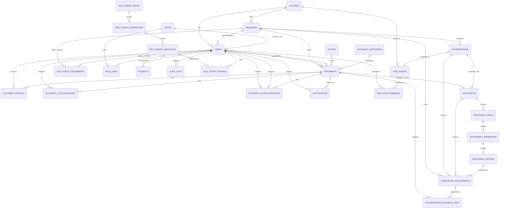

# IQArchive Database Schema Reference Specification

> **Specification Type:** Technical Reference Document  
> **Source Target:** Database Migrations (`database/migrations/`), Eloquent Models (`app/Models/`), Observers (`app/Providers/AppServiceProvider.php`), and Database Seeders (`database/seeders/`).  
> **Extraction Readiness:** 100% structured inventory formatted for ERD generation and automated validation.

---

## 1. Executive Summary & Structural Overview

The **IQArchive** relational database is structured around institutional quality assurance, document archiving, AACCUP accreditation lifecycle tracking, dynamic hierarchical compliance instruments, and role-based access management.

### Key Metrics
- **Total Migrated Tables:** 35
- **Eloquent Domain Models:** 22
- **Database Seeders:** 15
- **Subsystems Covered:** 8 (Authentication/Security, Organizational Hierarchy, Document Management, Accreditations & Task Forces, Dynamic Instruments & Compliance, System Auditing, Framework/Queue Infrastructure, Self-Survey Subsystem).

---

## 2. Discrepancies Found & Codebase Archaeology Notes

During direct cross-referencing between migrations (`database/migrations/`), Eloquent models (`app/Models/`), controllers (`app/Http/Controllers/`), and service providers (`app/Providers/`), the following schema and model discrepancies were identified:

### 2.1 `task_force_members` Schema vs Prompt Expectations
* **Prompt Assumption:** Expected columns `(user_id, accreditation_id, role_in_task_force, assigned_at)`.
* **Migration Reality (`2026_07_28_000000_create_task_forces_tables.php`):**
  * Foreign Key column is **`task_force_id`**, referencing `task_forces(id)`. There is **no `accreditation_id` column** on `task_force_members`.
  * Column name is **`role_in_team`** (varchar, default `'member'`), **not `role_in_task_force`**.
  * The model [`TaskForceMember.php`](file:///c:/Users/janss/Herd/iqarchive/app/Models/TaskForceMember.php) bridges this discrepancy using accessor/mutator methods:
    ```php
    public function getRoleInTaskForceAttribute(): string {
        return $this->role_in_team ?? 'member';
    }
    public function setRoleInTaskForceAttribute($value): void {
        $this->attributes['role_in_team'] = $value;
    }
    ```
  * Unique constraint is `UNIQUE(task_force_id, user_id)`.

### 2.2 Observer Auto-Assignment Mechanics for Task Force Lead
* **Location:** [`app/Providers/AppServiceProvider.php`](file:///c:/Users/janss/Herd/iqarchive/app/Providers/AppServiceProvider.php#L155-L176)
* **Lifecycle Trigger:** Eloquent `\App\Models\TaskForce::created(...)` event.
* **Execution Logic:**
  1. Checks if `$taskForce->college_id` is present.
  2. Resolves the `Role` record where `role_name = 'college-head'`.
  3. Queries all `User` records having `college_id = $taskForce->college_id` and holding the `college-head` role (via primary `users.role_id` or `role_user` pivot).
  4. Automatically creates a lead membership:
     ```php
     \App\Models\TaskForceMember::firstOrCreate(
         ['task_force_id' => $taskForce->id, 'user_id' => $dean->id],
         ['role_in_team' => 'lead', 'assigned_at' => now()]
     );
     ```

### 2.3 Legacy `task_force_assignments` vs Modern `task_forces` / `task_force_members`
* Migration `2026_07_19_000000_create_iqarchive_core_tables.php` created `task_force_assignments` (`user_id`, `program_id`, `assigned_at`, `status`) for 1:1 user-to-program mapping.
* Migration `2026_07_28_000000_create_task_forces_tables.php` introduced the multi-member `task_forces` and `task_force_members` structure with team roles (`lead`, `member`).
* Both tables coexist in the database. `Program` and `User` models maintain relationships to both.

### 2.4 Missing Model Files for `self_survey_*` Tables
* Migration `2026_08_07_090000_create_self_survey_tables.php` creates `self_survey_areas`, `self_survey_parameters`, `self_survey_indicators`, and `self_survey_ratings`.
* [`SelfSurveyController.php`](file:///c:/Users/janss/Herd/iqarchive/app/Http/Controllers/SelfSurveyController.php) imports `App\Models\SelfSurveyArea`, `App\Models\SelfSurveyIndicator`, and `App\Models\SelfSurveyRating`.
* **Discrepancy:** None of these model classes exist in `app/Models/`. They are superseded in newer features by the dynamic instrument hierarchy (`instruments`, `instrument_areas`, `instrument_parameters`, `instrument_criteria`, `compliance_requirements`).

### 2.5 Dual Role Architecture (`users.role_id` vs `role_user`)
* `users.role_id` is a non-nullable foreign key referencing `roles(id)` (`ON DELETE RESTRICT`) representing primary/fallback role.
* Migration `2026_07_30_000001_create_role_user_table_and_add_task_force_member_role.php` added the `role_user` pivot table.
* `User.php` supports both: `roleRelation()` (`belongsTo`) and `roles()` (`belongsToMany`), with `assignedRoles()` and `hasRole()` aggregating both sources.

### 2.6 `AuditLog` Timestamps Discrepancy
* Migration `2026_07_19_000000_create_iqarchive_core_tables.php` defines a single column `timestamp` with `useCurrent()`, and no `created_at`/`updated_at`.
* Model [`AuditLog.php`](file:///c:/Users/janss/Herd/iqarchive/app/Models/AuditLog.php) explicitly sets `public $timestamps = false;` and casts `'timestamp' => 'datetime'`.

---

## 3. Comprehensive Table-by-Table Schema Inventory

---

### 3.1 Authentication, Security & Roles

#### Table: `roles`
* **Purpose:** Stores predefined user access roles for system authorization, UI capability gates, and departmental access control.
* **Migration Sources:** `0001_01_01_000000_create_users_table.php`, `2026_07_20_171337_remove_faculty_member_role_and_users.php`, `2026_07_30_000001_create_role_user_table_and_add_task_force_member_role.php`, `2026_08_19_000000_refactor_roles_and_task_force_members.php`.
* **Model:** [`App\Models\Role`](file:///c:/Users/janss/Herd/iqarchive/app/Models/Role.php)

| Column | Type | Nullable | Default | Constraints & Key | Description |
| :--- | :--- | :--- | :--- | :--- | :--- |
| `id` | `BIGINT UNSIGNED` | No | Auto Increment | `PRIMARY KEY` | Unique role identifier. |
| `role_name` | `VARCHAR(255)` | No | None | `UNIQUE` | Machine slug (e.g., `system-administrator`, `iqa-staff`, `accreditor`, `university-administrator`, `college-head`, `task-force-member`). |
| `description` | `TEXT` | Yes | `NULL` | None | Human-readable role title and description. |
| `created_at` | `TIMESTAMP` | Yes | `NULL` | None | Record creation timestamp. |
| `updated_at` | `TIMESTAMP` | Yes | `NULL` | None | Record last modification timestamp. |

* **Primary Key:** `id`
* **Foreign Keys:** None
* **Indexes & Constraints:**
  * `PRIMARY` (`id`)
  * `UNIQUE` (`role_name`)
* **Eloquent Relationships:**
  * `users()`: `hasMany(User::class, 'role_id')` — Cross-referenced & matching.
  * `assignedUsers()`: `belongsToMany(User::class, 'role_user')` — Cross-referenced & matching.
* **Seeders:** `RoleSeeder` (`system-administrator`, `iqa-staff`, `accreditor`, `university-administrator`, `college-head`, `task-force-member`).

---

#### Table: `users`
* **Purpose:** Central entity for all authenticated accounts including faculty, deans, accreditors, IQA staff, and administrators.
* **Migration Sources:** `0001_01_01_000000_create_users_table.php`, `2025_08_14_170933_add_two_factor_columns_to_users_table.php`, `2026_07_27_175023_add_google_id_to_users_table.php`, `2026_08_04_000001_add_avatar_to_users_table.php`, `2026_08_08_000000_add_google_avatar_to_users_table.php`.
* **Model:** [`App\Models\User`](file:///c:/Users/janss/Herd/iqarchive/app/Models/User.php)

| Column | Type | Nullable | Default | Constraints & Key | Description |
| :--- | :--- | :--- | :--- | :--- | :--- |
| `id` | `BIGINT UNSIGNED` | No | Auto Increment | `PRIMARY KEY` | Unique user identifier. |
| `google_id` | `VARCHAR(255)` | Yes | `NULL` | `UNIQUE` | Google OAuth subject ID. |
| `google_avatar` | `VARCHAR(255)` | Yes | `NULL` | None | URL of Google account profile picture. |
| `role_id` | `BIGINT UNSIGNED` | No | None | `FOREIGN KEY` | Primary/default role referencing `roles(id)`. |
| `program_id` | `BIGINT UNSIGNED` | Yes | `NULL` | `FOREIGN KEY` | Departmental degree program assignment referencing `programs(id)`. |
| `college_id` | `BIGINT UNSIGNED` | Yes | `NULL` | `FOREIGN KEY` | College/academic unit assignment referencing `colleges(id)`. |
| `first_name` | `VARCHAR(255)` | No | None | None | User first name. |
| `middle_name` | `VARCHAR(255)` | Yes | `NULL` | None | User middle name. |
| `last_name` | `VARCHAR(255)` | No | None | None | User last name. |
| `email` | `VARCHAR(255)` | No | None | `UNIQUE` | Institutional/login email address. |
| `avatar` | `VARCHAR(255)` | Yes | `NULL` | None | Local storage avatar filepath. |
| `email_verified_at`| `TIMESTAMP` | Yes | `NULL` | None | Email verification timestamp. |
| `password` | `VARCHAR(255)` | Yes | `NULL` | None | Hashed user password (nullable for OAuth). |
| `two_factor_secret`| `TEXT` | Yes | `NULL` | None | Encrypted 2FA secret. |
| `two_factor_recovery_codes` | `TEXT` | Yes | `NULL` | None | Encrypted 2FA emergency backup recovery codes. |
| `two_factor_confirmed_at` | `TIMESTAMP` | Yes | `NULL` | None | 2FA confirmation timestamp. |
| `status` | `VARCHAR(255)` | No | `'active'` | None | Account status (`active`, `inactive`, `revoked`). |
| `remember_token` | `VARCHAR(100)` | Yes | `NULL` | None | Session remember token. |
| `created_at` | `TIMESTAMP` | Yes | `NULL` | None | Record creation timestamp. |
| `updated_at` | `TIMESTAMP` | Yes | `NULL` | None | Record last modification timestamp. |

* **Primary Key:** `id`
* **Foreign Keys:**
  * `role_id` $\rightarrow$ `roles(id)` `ON DELETE RESTRICT`
  * `program_id` $\rightarrow$ `programs(id)` `ON DELETE SET NULL`
  * `college_id` $\rightarrow$ `colleges(id)` `ON DELETE SET NULL`
* **Indexes & Constraints:**
  * `PRIMARY` (`id`)
  * `UNIQUE` (`email`)
  * `UNIQUE` (`google_id`)
* **Eloquent Relationships:**
  * `roleRelation()`: `belongsTo(Role::class, 'role_id')`
  * `roles()`: `belongsToMany(Role::class, 'role_user')`
  * `program()`: `belongsTo(Program::class)`
  * `college()`: `belongsTo(College::class)`
  * `uploadedDocuments()`: `hasMany(Document::class, 'uploaded_by')`
  * `confirmedDocuments()`: `hasMany(Document::class, 'confirmed_by')`
  * `ocrValidations()`: `hasMany(DocumentOCRValidation::class, 'validated_by')`
  * `documentReviews()`: `hasMany(DocumentReview::class, 'reviewed_by')`
  * `taskForceAssignments()`: `hasMany(TaskForceAssignment::class)`
  * `taskForces()`: `belongsToMany(TaskForce::class, 'task_force_members')->withPivot(['role_in_team', 'assigned_at'])->withTimestamps()`
  * `notifications()`: `hasMany(Notification::class)`
  * `auditLogs()`: `hasMany(AuditLog::class)`
  * `requestedAccesses()`: `hasMany(DocumentAccessRequest::class, 'requested_by')`
  * `approvedAccesses()`: `hasMany(DocumentAccessRequest::class, 'approved_by')`
* **Seeders:** `UserSeeder` (populates default institutional users, deans, faculty, accreditors, admins).

---

#### Table: `role_user`
* **Purpose:** Pivot table supporting multi-role assignment for users (e.g., faculty holding secondary Task Force Lead or Member roles).
* **Migration Sources:** `2026_07_30_000001_create_role_user_table_and_add_task_force_member_role.php`.
* **Model:** None (Pivot relationship in `User::roles()` and `Role::assignedUsers()`).

| Column | Type | Nullable | Default | Constraints & Key | Description |
| :--- | :--- | :--- | :--- | :--- | :--- |
| `id` | `BIGINT UNSIGNED` | No | Auto Increment | `PRIMARY KEY` | Unique pivot identifier. |
| `user_id` | `BIGINT UNSIGNED` | No | None | `FOREIGN KEY` | References `users(id)`. |
| `role_id` | `BIGINT UNSIGNED` | No | None | `FOREIGN KEY` | References `roles(id)`. |
| `created_at` | `TIMESTAMP` | Yes | `NULL` | None | Record creation timestamp. |
| `updated_at` | `TIMESTAMP` | Yes | `NULL` | None | Record last modification timestamp. |

* **Primary Key:** `id`
* **Foreign Keys:**
  * `user_id` $\rightarrow$ `users(id)` `ON DELETE CASCADE`
  * `role_id` $\rightarrow$ `roles(id)` `ON DELETE CASCADE`
* **Indexes & Constraints:**
  * `PRIMARY` (`id`)
  * `UNIQUE` (`user_id`, `role_id`)
* **Eloquent Relationships:**
  * Cross-referenced via `User::roles()` and `Role::assignedUsers()`.
* **Seeders:** `UserSeeder` (populates assigned roles via `$user->roles()->sync(...)`).

---

#### Table: `passkeys`
* **Purpose:** Stores WebAuthn / Passkey biometric and hardware credentials for passwordless authentication.
* **Migration Sources:** `2024_01_01_000000_create_passkeys_table.php`.
* **Model:** Managed via Laravel Fortify `PasskeyAuthenticatable` on [`User`](file:///c:/Users/janss/Herd/iqarchive/app/Models/User.php).

| Column | Type | Nullable | Default | Constraints & Key | Description |
| :--- | :--- | :--- | :--- | :--- | :--- |
| `id` | `BIGINT UNSIGNED` | No | Auto Increment | `PRIMARY KEY` | Unique passkey record identifier. |
| `user_id` | `BIGINT UNSIGNED` | No | None | `FOREIGN KEY`, `INDEX` | References `users(id)`. |
| `name` | `VARCHAR(255)` | No | None | None | Friendly credential name (e.g. "YubiKey 5C", "MacBook Touch ID"). |
| `credential_id` | `VARCHAR(255)` | No | None | `UNIQUE` | WebAuthn public key credential ID. |
| `credential` | `JSON` | No | None | None | WebAuthn credential public key payload & metadata. |
| `last_used_at` | `TIMESTAMP` | Yes | `NULL` | None | Timestamp of last successful authentication. |
| `created_at` | `TIMESTAMP` | Yes | `NULL` | None | Record creation timestamp. |
| `updated_at` | `TIMESTAMP` | Yes | `NULL` | None | Record last modification timestamp. |

* **Primary Key:** `id`
* **Foreign Keys:**
  * `user_id` $\rightarrow$ `users(id)` `ON DELETE CASCADE`
* **Indexes & Constraints:**
  * `PRIMARY` (`id`)
  * `UNIQUE` (`credential_id`)
  * `INDEX` (`user_id`)
* **Eloquent Relationships:** Managed by Laravel Fortify.
* **Seeders:** None (runtime registered).

---

#### Table: `password_reset_tokens`
* **Purpose:** Stores secure transient tokens for password reset operations.
* **Migration Sources:** `0001_01_01_000000_create_users_table.php`.
* **Model:** None (Managed by Laravel Fortify / PasswordBroker).

| Column | Type | Nullable | Default | Constraints & Key | Description |
| :--- | :--- | :--- | :--- | :--- | :--- |
| `email` | `VARCHAR(255)` | No | None | `PRIMARY KEY` | User account email. |
| `token` | `VARCHAR(255)` | No | None | None | Hashed reset token. |
| `created_at` | `TIMESTAMP` | Yes | `NULL` | None | Token generation timestamp. |

* **Primary Key:** `email`
* **Foreign Keys:** None
* **Indexes & Constraints:**
  * `PRIMARY` (`email`)
* **Seeders:** None.

---

#### Table: `sessions`
* **Purpose:** Stores session state and authenticated user payload for database session driver.
* **Migration Sources:** `0001_01_01_000000_create_users_table.php`.
* **Model:** None (Laravel core session management).

| Column | Type | Nullable | Default | Constraints & Key | Description |
| :--- | :--- | :--- | :--- | :--- | :--- |
| `id` | `VARCHAR(255)` | No | None | `PRIMARY KEY` | Session identifier. |
| `user_id` | `BIGINT UNSIGNED` | Yes | `NULL` | `INDEX` | Authenticated user ID. |
| `ip_address` | `VARCHAR(45)` | Yes | `NULL` | None | Client IP address. |
| `user_agent` | `TEXT` | Yes | `NULL` | None | Client browser user agent. |
| `payload` | `LONGTEXT` | No | None | None | Serialized session data. |
| `last_activity` | `INT` | No | None | `INDEX` | Unix timestamp of last activity. |

* **Primary Key:** `id`
* **Foreign Keys:** None
* **Indexes & Constraints:**
  * `PRIMARY` (`id`)
  * `INDEX` (`user_id`)
  * `INDEX` (`last_activity`)
* **Seeders:** None.

---

### 3.2 Organizational Hierarchy

#### Table: `colleges`
* **Purpose:** Represents academic units, colleges, and satellite campuses across Bicol University.
* **Migration Sources:** `0001_01_01_000000_create_users_table.php`, `2026_08_19_000001_add_soft_deletes_to_colleges_and_programs_tables.php`, `2026_08_19_000002_add_campus_column_to_colleges_table.php`.
* **Model:** [`App\Models\College`](file:///c:/Users/janss/Herd/iqarchive/app/Models/College.php)

| Column | Type | Nullable | Default | Constraints & Key | Description |
| :--- | :--- | :--- | :--- | :--- | :--- |
| `id` | `BIGINT UNSIGNED` | No | Auto Increment | `PRIMARY KEY` | Unique college identifier. |
| `name` | `VARCHAR(255)` | No | None | None | Full academic unit name (e.g. `College of Science`). |
| `code` | `VARCHAR(255)` | No | None | `UNIQUE` | Acronym / abbreviation code (e.g. `CS`, `CIT`, `CENG`). |
| `campus` | `VARCHAR(255)` | No | `'Main Campus'` | None | Campus grouping (e.g. `LEGAZPI EAST CAMPUS`, `LEGAZPI WEST CAMPUS`, `DARAGA CAMPUS`, `BU POLANGUI`). |
| `logo_image` | `VARCHAR(255)` | Yes | `NULL` | None | Logo image filename in `public/logos/`. |
| `created_at` | `TIMESTAMP` | Yes | `NULL` | None | Record creation timestamp. |
| `updated_at` | `TIMESTAMP` | Yes | `NULL` | None | Record last modification timestamp. |
| `deleted_at` | `TIMESTAMP` | Yes | `NULL` | None | Soft delete timestamp. |

* **Primary Key:** `id`
* **Foreign Keys:** None
* **Indexes & Constraints:**
  * `PRIMARY` (`id`)
  * `UNIQUE` (`code`)
* **Eloquent Relationships:**
  * `programs()`: `hasMany(Program::class)`
  * `users()`: `hasMany(User::class)`
  * `taskForces()`: `hasMany(TaskForce::class)`
* **Seeders:** `CollegeSeeder` (17 colleges & satellite campuses), `BUProgramsSeeder`.

---

#### Table: `programs`
* **Purpose:** Represents degree programs (undergraduate and graduate) offered within colleges, including current accreditation level.
* **Migration Sources:** `0001_01_01_000000_create_users_table.php`, `2026_08_04_000000_add_accreditation_level_to_programs_table.php`, `2026_08_19_000001_add_soft_deletes_to_colleges_and_programs_tables.php`.
* **Model:** [`App\Models\Program`](file:///c:/Users/janss/Herd/iqarchive/app/Models/Program.php)

| Column | Type | Nullable | Default | Constraints & Key | Description |
| :--- | :--- | :--- | :--- | :--- | :--- |
| `id` | `BIGINT UNSIGNED` | No | Auto Increment | `PRIMARY KEY` | Unique program identifier. |
| `college_id` | `BIGINT UNSIGNED` | No | None | `FOREIGN KEY` | Parent college referencing `colleges(id)`. |
| `name` | `VARCHAR(255)` | No | None | None | Full degree program title (e.g. `Bachelor of Science in Computer Science`). |
| `code` | `VARCHAR(255)` | No | None | `UNIQUE` | Program code (e.g. `BSCS`, `BSIT`, `BSCE`). |
| `accreditation_level` | `VARCHAR(255)` | No | `'Candidate Status'` | None | Current accreditation standing (`Candidate Status`, `Level I`, `Level II`, `Level III`, `Level IV`). |
| `created_at` | `TIMESTAMP` | Yes | `NULL` | None | Record creation timestamp. |
| `updated_at` | `TIMESTAMP` | Yes | `NULL` | None | Record last modification timestamp. |
| `deleted_at` | `TIMESTAMP` | Yes | `NULL` | None | Soft delete timestamp. |

* **Primary Key:** `id`
* **Foreign Keys:**
  * `college_id` $\rightarrow$ `colleges(id)` `ON DELETE CASCADE`
* **Indexes & Constraints:**
  * `PRIMARY` (`id`)
  * `UNIQUE` (`code`)
* **Eloquent Relationships:**
  * `college()`: `belongsTo(College::class)`
  * `users()`: `hasMany(User::class)`
  * `documents()`: `hasMany(Document::class)`
  * `complianceRequirements()`: `hasMany(ComplianceRequirement::class)`
  * `taskForceAssignments()`: `hasMany(TaskForceAssignment::class)`
  * `accreditations()`: `hasMany(Accreditation::class)`
* **Seeders:** `ProgramSeeder` (all standard BU undergraduate and graduate degree programs), `BUProgramsSeeder`.

---

#### Table: `offices`
* **Purpose:** Represents central university administrative offices responsible for uploading institution-wide compliance records and policies.
* **Migration Sources:** `2026_08_18_141902_create_offices_table.php`.
* **Model:** [`App\Models\Office`](file:///c:/Users/janss/Herd/iqarchive/app/Models/Office.php)

| Column | Type | Nullable | Default | Constraints & Key | Description |
| :--- | :--- | :--- | :--- | :--- | :--- |
| `id` | `BIGINT UNSIGNED` | No | Auto Increment | `PRIMARY KEY` | Unique office identifier. |
| `name` | `VARCHAR(255)` | No | None | `UNIQUE` | Office name (e.g. `General Administration`, `Research Office`, `University Library`, `Human Resource`, `Admissions Office`, `Quality Assurance Office`). |
| `description` | `TEXT` | Yes | `NULL` | None | Office description and mandate. |
| `created_at` | `TIMESTAMP` | Yes | `NULL` | None | Record creation timestamp. |
| `updated_at` | `TIMESTAMP` | Yes | `NULL` | None | Record last modification timestamp. |

* **Primary Key:** `id`
* **Foreign Keys:** None
* **Indexes & Constraints:**
  * `PRIMARY` (`id`)
  * `UNIQUE` (`name`)
* **Eloquent Relationships:**
  * `documents()`: `hasMany(Document::class)`
* **Seeders:** `OfficeSeeder`.

---

### 3.3 Document Management & Access Control

#### Table: `document_categories`
* **Purpose:** Classification taxonomy for institutional and accreditation evidence files.
* **Migration Sources:** `2026_07_19_000000_create_iqarchive_core_tables.php`.
* **Model:** [`App\Models\DocumentCategory`](file:///c:/Users/janss/Herd/iqarchive/app/Models/DocumentCategory.php)

| Column | Type | Nullable | Default | Constraints & Key | Description |
| :--- | :--- | :--- | :--- | :--- | :--- |
| `id` | `BIGINT UNSIGNED` | No | Auto Increment | `PRIMARY KEY` | Unique category identifier. |
| `name` | `VARCHAR(255)` | No | None | None | Category name (e.g. `Policies & Issuances`, `Instruments`, `Memoranda`, `Correspondences`, `Faculty Profile`, `Curriculum / Syllabus`, `Uncategorized Documents`). |
| `description` | `TEXT` | Yes | `NULL` | None | Category scope description. |
| `created_at` | `TIMESTAMP` | Yes | `NULL` | None | Record creation timestamp. |
| `updated_at` | `TIMESTAMP` | Yes | `NULL` | None | Record last modification timestamp. |

* **Primary Key:** `id`
* **Foreign Keys:** None
* **Indexes & Constraints:**
  * `PRIMARY` (`id`)
* **Eloquent Relationships:**
  * `documents()`: `hasMany(Document::class, 'category_id')`
* **Seeders:** `DocumentCategorySeeder`.

---

#### Table: `documents`
* **Purpose:** Core metadata record for all uploaded PDF documents, supporting evidence portfolios, and administrative records.
* **Migration Sources:** `2026_07_19_000000_create_iqarchive_core_tables.php`, `2026_08_18_141907_add_office_id_to_documents_table.php`.
* **Model:** [`App\Models\Document`](file:///c:/Users/janss/Herd/iqarchive/app/Models/Document.php)

| Column | Type | Nullable | Default | Constraints & Key | Description |
| :--- | :--- | :--- | :--- | :--- | :--- |
| `id` | `BIGINT UNSIGNED` | No | Auto Increment | `PRIMARY KEY` | Unique document identifier. |
| `uploaded_by` | `BIGINT UNSIGNED` | No | None | `FOREIGN KEY` | Uploader referencing `users(id)`. |
| `program_id` | `BIGINT UNSIGNED` | Yes | `NULL` | `FOREIGN KEY` | Associated degree program referencing `programs(id)`. |
| `office_id` | `BIGINT UNSIGNED` | Yes | `NULL` | `FOREIGN KEY` | Associated administrative office referencing `offices(id)`. |
| `category_id` | `BIGINT UNSIGNED` | No | None | `FOREIGN KEY` | Category referencing `document_categories(id)`. |
| `confirmed_by` | `BIGINT UNSIGNED` | Yes | `NULL` | `FOREIGN KEY` | Approving IQA user referencing `users(id)`. |
| `confirmed_at` | `TIMESTAMP` | Yes | `NULL` | None | Confirmation/approval timestamp. |
| `title` | `VARCHAR(255)` | No | None | None | Document display title. |
| `file_path` | `VARCHAR(255)` | No | None | None | File path on public storage disk. |
| `status` | `VARCHAR(255)` | No | `'pending'` | None | Workflow status (`pending`, `approved`, `rejected`). |
| `visibility` | `VARCHAR(255)` | No | `'restricted'` | None | Document access scope (`public`, `restricted`). |
| `created_at` | `TIMESTAMP` | Yes | `NULL` | None | Record creation timestamp. |
| `updated_at` | `TIMESTAMP` | Yes | `NULL` | None | Record last modification timestamp. |

* **Primary Key:** `id`
* **Foreign Keys:**
  * `uploaded_by` $\rightarrow$ `users(id)` `ON DELETE CASCADE`
  * `program_id` $\rightarrow$ `programs(id)` `ON DELETE SET NULL`
  * `office_id` $\rightarrow$ `offices(id)` `ON DELETE SET NULL`
  * `category_id` $\rightarrow$ `document_categories(id)` `ON DELETE RESTRICT`
  * `confirmed_by` $\rightarrow$ `users(id)` `ON DELETE SET NULL`
* **Indexes & Constraints:**
  * `PRIMARY` (`id`)
* **Eloquent Relationships:**
  * `uploader()`: `belongsTo(User::class, 'uploaded_by')`
  * `program()`: `belongsTo(Program::class)`
  * `office()`: `belongsTo(Office::class, 'office_id')`
  * `category()`: `belongsTo(DocumentCategory::class, 'category_id')`
  * `confirmer()`: `belongsTo(User::class, 'confirmed_by')`
  * `ocrValidation()`: `hasOne(DocumentOCRValidation::class)`
  * `reviews()`: `hasMany(DocumentReview::class)`
  * `accreditationLinks()`: `hasMany(AccreditationDocumentLink::class)`
  * `notifications()`: `hasMany(Notification::class, 'related_document_id')`
  * `accessRequests()`: `hasMany(DocumentAccessRequest::class)`
* **Seeders:** `DocumentSeeder`, `TestPdfSeeder`, `TestDocumentsSeeder`.

---

#### Table: `document_ocr_validations`
* **Purpose:** Stores optical character recognition (OCR) extraction results, full-text parsed strings, and automated validation status.
* **Migration Sources:** `2026_07_19_000000_create_iqarchive_core_tables.php`.
* **Model:** [`App\Models\DocumentOCRValidation`](file:///c:/Users/janss/Herd/iqarchive/app/Models/DocumentOCRValidation.php)

| Column | Type | Nullable | Default | Constraints & Key | Description |
| :--- | :--- | :--- | :--- | :--- | :--- |
| `id` | `BIGINT UNSIGNED` | No | Auto Increment | `PRIMARY KEY` | Unique OCR record identifier. |
| `document_id` | `BIGINT UNSIGNED` | No | None | `FOREIGN KEY` | Associated document referencing `documents(id)`. |
| `validated_by` | `BIGINT UNSIGNED` | Yes | `NULL` | `FOREIGN KEY` | Validator user referencing `users(id)`. |
| `extracted_data`| `LONGTEXT` | Yes | `NULL` | None | Extracted OCR text content. |
| `validated_at` | `TIMESTAMP` | Yes | `NULL` | None | Validation processing timestamp. |
| `validation_status` | `VARCHAR(255)` | No | `'pending'` | None | Status (`pending`, `validated`, `failed`). |
| `created_at` | `TIMESTAMP` | Yes | `NULL` | None | Record creation timestamp. |
| `updated_at` | `TIMESTAMP` | Yes | `NULL` | None | Record last modification timestamp. |

* **Primary Key:** `id`
* **Foreign Keys:**
  * `document_id` $\rightarrow$ `documents(id)` `ON DELETE CASCADE`
  * `validated_by` $\rightarrow$ `users(id)` `ON DELETE SET NULL`
* **Indexes & Constraints:**
  * `PRIMARY` (`id`)
* **Eloquent Relationships:**
  * `document()`: `belongsTo(Document::class)`
  * `validator()`: `belongsTo(User::class, 'validated_by')`
* **Seeders:** `DocumentSeeder`, `TestPdfSeeder`.

---

#### Table: `document_reviews`
* **Purpose:** Audit history of formal approval and rejection decisions on submitted documents.
* **Migration Sources:** `2026_07_19_000000_create_iqarchive_core_tables.php`.
* **Model:** [`App\Models\DocumentReview`](file:///c:/Users/janss/Herd/iqarchive/app/Models/DocumentReview.php)

| Column | Type | Nullable | Default | Constraints & Key | Description |
| :--- | :--- | :--- | :--- | :--- | :--- |
| `id` | `BIGINT UNSIGNED` | No | Auto Increment | `PRIMARY KEY` | Unique review identifier. |
| `document_id` | `BIGINT UNSIGNED` | No | None | `FOREIGN KEY` | Target document referencing `documents(id)`. |
| `reviewed_by` | `BIGINT UNSIGNED` | No | None | `FOREIGN KEY` | Reviewing IQA user referencing `users(id)`. |
| `decision` | `VARCHAR(255)` | No | None | None | Review decision (`approved`, `rejected`). |
| `remarks` | `TEXT` | Yes | `NULL` | None | Reviewer feedback and remarks. |
| `reviewed_at` | `TIMESTAMP` | No | `CURRENT_TIMESTAMP` | None | Review timestamp. |
| `created_at` | `TIMESTAMP` | Yes | `NULL` | None | Record creation timestamp. |
| `updated_at` | `TIMESTAMP` | Yes | `NULL` | None | Record last modification timestamp. |

* **Primary Key:** `id`
* **Foreign Keys:**
  * `document_id` $\rightarrow$ `documents(id)` `ON DELETE CASCADE`
  * `reviewed_by` $\rightarrow$ `users(id)` `ON DELETE CASCADE`
* **Indexes & Constraints:**
  * `PRIMARY` (`id`)
* **Eloquent Relationships:**
  * `document()`: `belongsTo(Document::class)`
  * `reviewer()`: `belongsTo(User::class, 'reviewed_by')`
* **Seeders:** `DocumentSeeder`, `TestPdfSeeder`.

---

#### Table: `document_access_requests`
* **Purpose:** Manages time-bounded access requests for restricted documents by external accreditors and internal reviewers.
* **Migration Sources:** `2026_07_19_000000_create_iqarchive_core_tables.php`.
* **Model:** [`App\Models\DocumentAccessRequest`](file:///c:/Users/janss/Herd/iqarchive/app/Models/DocumentAccessRequest.php)

| Column | Type | Nullable | Default | Constraints & Key | Description |
| :--- | :--- | :--- | :--- | :--- | :--- |
| `id` | `BIGINT UNSIGNED` | No | Auto Increment | `PRIMARY KEY` | Unique request identifier. |
| `document_id` | `BIGINT UNSIGNED` | No | None | `FOREIGN KEY` | Target restricted document referencing `documents(id)`. |
| `requested_by` | `BIGINT UNSIGNED` | No | None | `FOREIGN KEY` | Requesting user referencing `users(id)`. |
| `status` | `VARCHAR(255)` | No | `'pending'` | None | Status (`pending`, `approved`, `rejected`). |
| `remarks` | `TEXT` | Yes | `NULL` | None | Justification for requesting access. |
| `approved_by` | `BIGINT UNSIGNED` | Yes | `NULL` | `FOREIGN KEY` | Approving IQA user referencing `users(id)`. |
| `approved_at` | `TIMESTAMP` | Yes | `NULL` | None | Approval timestamp. |
| `expires_at` | `TIMESTAMP` | Yes | `NULL` | None | Expiration datetime of approved temporary access. |
| `created_at` | `TIMESTAMP` | Yes | `NULL` | None | Record creation timestamp. |
| `updated_at` | `TIMESTAMP` | Yes | `NULL` | None | Record last modification timestamp. |

* **Primary Key:** `id`
* **Foreign Keys:**
  * `document_id` $\rightarrow$ `documents(id)` `ON DELETE CASCADE`
  * `requested_by` $\rightarrow$ `users(id)` `ON DELETE CASCADE`
  * `approved_by` $\rightarrow$ `users(id)` `ON DELETE SET NULL`
* **Indexes & Constraints:**
  * `PRIMARY` (`id`)
* **Eloquent Relationships:**
  * `document()`: `belongsTo(Document::class)`
  * `requester()`: `belongsTo(User::class, 'requested_by')`
  * `approver()`: `belongsTo(User::class, 'approved_by')`
* **Seeders:** `DocumentSeeder`, `TestPdfSeeder`.

---

### 3.4 Accreditations & Task Forces

#### Table: `task_forces`
* **Purpose:** Represents official college or program quality assurance task force bodies organized for accreditation preparations.
* **Migration Sources:** `2026_07_28_000000_create_task_forces_tables.php`, `2026_08_23_150550_add_proposed_members_to_task_forces.php`.
* **Model:** [`App\Models\TaskForce`](file:///c:/Users/janss/Herd/iqarchive/app/Models/TaskForce.php)

| Column | Type | Nullable | Default | Constraints & Key | Description |
| :--- | :--- | :--- | :--- | :--- | :--- |
| `id` | `BIGINT UNSIGNED` | No | Auto Increment | `PRIMARY KEY` | Unique task force identifier. |
| `name` | `VARCHAR(150)` | No | None | `UNIQUE` | Unique task force team name. |
| `college_id` | `BIGINT UNSIGNED` | No | None | `FOREIGN KEY` | College unit referencing `colleges(id)`. |
| `program_id` | `BIGINT UNSIGNED` | Yes | `NULL` | `FOREIGN KEY` | Program referencing `programs(id)`. |
| `purpose` | `TEXT` | Yes | `NULL` | None | Description of scope and accreditation mandate. |
| `status` | `VARCHAR(255)` | No | `'active'` | None | Status (`active`, `completed`, `disbanded`). |
| `proposed_members` | `JSON` | Yes | `NULL` | None | Array of proposed member metadata before confirmation. |
| `created_by` | `BIGINT UNSIGNED` | Yes | `NULL` | `FOREIGN KEY` | Creator user referencing `users(id)`. |
| `created_at` | `TIMESTAMP` | Yes | `NULL` | None | Record creation timestamp. |
| `updated_at` | `TIMESTAMP` | Yes | `NULL` | None | Record last modification timestamp. |

* **Primary Key:** `id`
* **Foreign Keys:**
  * `college_id` $\rightarrow$ `colleges(id)` `ON DELETE CASCADE`
  * `program_id` $\rightarrow$ `programs(id)` `ON DELETE SET NULL`
  * `created_by` $\rightarrow$ `users(id)` `ON DELETE SET NULL`
* **Indexes & Constraints:**
  * `PRIMARY` (`id`)
  * `UNIQUE` (`name`)
* **Eloquent Relationships:**
  * `college()`: `belongsTo(College::class)`
  * `program()`: `belongsTo(Program::class)`
  * `members()`: `belongsToMany(User::class, 'task_force_members')->withPivot(['role_in_team', 'assigned_at'])->withTimestamps()`
  * `creator()`: `belongsTo(User::class, 'created_by')`
  * `accreditation()`: `hasOne(Accreditation::class)`
* **Observer Trigger:** `TaskForce::created` in [`AppServiceProvider.php`](file:///c:/Users/janss/Herd/iqarchive/app/Providers/AppServiceProvider.php#L156-L176) automatically assigns college Deans (`college-head`) to `task_force_members` as `role_in_team = 'lead'`.
* **Seeders:** `TaskForceSeeder` (blank; dynamically created in runtime).

---

#### Table: `task_force_members`
* **Purpose:** Pivot table linking users to specific task force bodies, designating leadership and membership roles.
* **Migration Sources:** `2026_07_28_000000_create_task_forces_tables.php`.
* **Model:** [`App\Models\TaskForceMember`](file:///c:/Users/janss/Herd/iqarchive/app/Models/TaskForceMember.php)

| Column | Type | Nullable | Default | Constraints & Key | Description |
| :--- | :--- | :--- | :--- | :--- | :--- |
| `id` | `BIGINT UNSIGNED` | No | Auto Increment | `PRIMARY KEY` | Unique member record identifier. |
| `task_force_id` | `BIGINT UNSIGNED` | No | None | `FOREIGN KEY` | References `task_forces(id)`. |
| `user_id` | `BIGINT UNSIGNED` | No | None | `FOREIGN KEY` | Assigned faculty/staff referencing `users(id)`. |
| `role_in_team` | `VARCHAR(255)` | No | `'member'` | None | Role within team (`lead`, `member`). |
| `assigned_at` | `TIMESTAMP` | No | `CURRENT_TIMESTAMP` | None | Assignment timestamp. |
| `created_at` | `TIMESTAMP` | Yes | `NULL` | None | Record creation timestamp. |
| `updated_at` | `TIMESTAMP` | Yes | `NULL` | None | Record last modification timestamp. |

* **Primary Key:** `id`
* **Foreign Keys:**
  * `task_force_id` $\rightarrow$ `task_forces(id)` `ON DELETE CASCADE`
  * `user_id` $\rightarrow$ `users(id)` `ON DELETE CASCADE`
* **Indexes & Constraints:**
  * `PRIMARY` (`id`)
  * `UNIQUE` (`task_force_id`, `user_id`)
* **Eloquent Relationships:**
  * `taskForce()`: `belongsTo(TaskForce::class)`
  * `user()`: `belongsTo(User::class)`
* **Accessor/Mutator Aliases:** `role_in_task_force` is an Eloquent alias for `role_in_team`.
* **Seeders:** Populated via Observer and UI member assignments.

---

#### Table: `task_force_assignments`
* **Purpose:** Legacy table supporting direct 1:1 user-to-program task force assignments.
* **Migration Sources:** `2026_07_19_000000_create_iqarchive_core_tables.php`.
* **Model:** [`App\Models\TaskForceAssignment`](file:///c:/Users/janss/Herd/iqarchive/app/Models/TaskForceAssignment.php)

| Column | Type | Nullable | Default | Constraints & Key | Description |
| :--- | :--- | :--- | :--- | :--- | :--- |
| `id` | `BIGINT UNSIGNED` | No | Auto Increment | `PRIMARY KEY` | Unique assignment identifier. |
| `user_id` | `BIGINT UNSIGNED` | No | None | `FOREIGN KEY` | Assigned user referencing `users(id)`. |
| `program_id` | `BIGINT UNSIGNED` | No | None | `FOREIGN KEY` | Program referencing `programs(id)`. |
| `assigned_at` | `TIMESTAMP` | No | `CURRENT_TIMESTAMP` | None | Timestamp of assignment. |
| `status` | `VARCHAR(255)` | No | `'active'` | None | Status (`active`, `completed`). |
| `created_at` | `TIMESTAMP` | Yes | `NULL` | None | Record creation timestamp. |
| `updated_at` | `TIMESTAMP` | Yes | `NULL` | None | Record last modification timestamp. |

* **Primary Key:** `id`
* **Foreign Keys:**
  * `user_id` $\rightarrow$ `users(id)` `ON DELETE CASCADE`
  * `program_id` $\rightarrow$ `programs(id)` `ON DELETE CASCADE`
* **Indexes & Constraints:**
  * `PRIMARY` (`id`)
* **Eloquent Relationships:**
  * `user()`: `belongsTo(User::class)`
  * `program()`: `belongsTo(Program::class)`
* **Seeders:** None.

---

#### Table: `accreditations`
* **Purpose:** Represents formal accreditation cycles / survey visits for degree programs, linking schedules, task forces, and cloned instruments.
* **Migration Sources:** `2026_08_23_141853_create_accreditations_table.php`, `2026_08_23_143657_add_proposed_members_to_accreditations.php`.
* **Model:** [`App\Models\Accreditation`](file:///c:/Users/janss/Herd/iqarchive/app/Models/Accreditation.php)

| Column | Type | Nullable | Default | Constraints & Key | Description |
| :--- | :--- | :--- | :--- | :--- | :--- |
| `id` | `BIGINT UNSIGNED` | No | Auto Increment | `PRIMARY KEY` | Unique accreditation cycle identifier. |
| `program_id` | `BIGINT UNSIGNED` | No | None | `FOREIGN KEY` | Degree program referencing `programs(id)`. |
| `task_force_id` | `BIGINT UNSIGNED` | Yes | `NULL` | `FOREIGN KEY` | Assigned task force referencing `task_forces(id)`. |
| `status` | `VARCHAR(255)` | No | `'scheduled'` | None | Cycle status (`scheduled`, `in_progress`, `completed`, `deferred`). |
| `proposed_members` | `JSON` | Yes | `NULL` | None | Proposed task force member IDs before confirmation. |
| `target_date` | `DATE` | Yes | `NULL` | None | Target evaluation date. |
| `created_by` | `BIGINT UNSIGNED` | Yes | `NULL` | `FOREIGN KEY` | Creator user referencing `users(id)`. |
| `created_at` | `TIMESTAMP` | Yes | `NULL` | None | Record creation timestamp. |
| `updated_at` | `TIMESTAMP` | Yes | `NULL` | None | Record last modification timestamp. |

* **Primary Key:** `id`
* **Foreign Keys:**
  * `program_id` $\rightarrow$ `programs(id)` `ON DELETE CASCADE`
  * `task_force_id` $\rightarrow$ `task_forces(id)` `ON DELETE SET NULL`
  * `created_by` $\rightarrow$ `users(id)` `ON DELETE SET NULL`
* **Indexes & Constraints:**
  * `PRIMARY` (`id`)
* **Eloquent Relationships:**
  * `program()`: `belongsTo(Program::class)`
  * `taskForce()`: `belongsTo(TaskForce::class)`
  * `creator()`: `belongsTo(User::class, 'created_by')`
  * `instrument()`: `hasOne(Instrument::class, 'accreditation_id')`
  * `complianceRequirements()`: `hasMany(ComplianceRequirement::class)`
* **Seeders:** Dynamically created via Accreditation Wizard.

---

### 3.5 Dynamic Accreditation Instruments & Compliance

#### Table: `instruments`
* **Purpose:** Stores AACCUP accreditation evaluation instruments, master templates, and program-tailored instrument instances.
* **Migration Sources:** `2026_07_19_000000_create_iqarchive_core_tables.php`, `2026_08_24_000001_create_dynamic_instrument_tables.php`.
* **Model:** [`App\Models\Instrument`](file:///c:/Users/janss/Herd/iqarchive/app/Models/Instrument.php)

| Column | Type | Nullable | Default | Constraints & Key | Description |
| :--- | :--- | :--- | :--- | :--- | :--- |
| `id` | `BIGINT UNSIGNED` | No | Auto Increment | `PRIMARY KEY` | Unique instrument identifier. |
| `document_id` | `BIGINT UNSIGNED` | Yes | `NULL` | `FOREIGN KEY` | Reference document referencing `documents(id)`. |
| `name` | `VARCHAR(255)` | No | None | None | Instrument title (e.g. `AACCUP Program Accreditation Supporting Evidence Instrument`). |
| `code` | `VARCHAR(255)` | No | None | `UNIQUE` | Unique instrument code (e.g. `INST-PROG-SUPPORTING-DOCS`). |
| `accreditation_type` | `VARCHAR(255)` | No | `'program'` | None | Scope (`program`, `institutional`). |
| `program_id` | `BIGINT UNSIGNED` | Yes | `NULL` | `FOREIGN KEY` | Associated program referencing `programs(id)`. |
| `accreditation_id` | `BIGINT UNSIGNED` | Yes | `NULL` | `FOREIGN KEY` | Associated cycle referencing `accreditations(id)`. |
| `is_template` | `TINYINT(1)` | No | `1` | None | Boolean flag (`true` = master template, `false` = active cycle instance). |
| `level` | `VARCHAR(255)` | Yes | `NULL` | None | Target accreditation level (e.g. `Level I`, `Level II`, `Level III`, `Level IV`). |
| `version` | `VARCHAR(255)` | No | `'2026.1'` | None | Version identifier. |
| `status` | `VARCHAR(255)` | No | `'active'` | None | Status (`draft`, `active`, `archived`). |
| `created_by` | `BIGINT UNSIGNED` | Yes | `NULL` | `FOREIGN KEY` | Creator user referencing `users(id)`. |
| `description` | `TEXT` | Yes | `NULL` | None | Scope description. |
| `created_at` | `TIMESTAMP` | Yes | `NULL` | None | Record creation timestamp. |
| `updated_at` | `TIMESTAMP` | Yes | `NULL` | None | Record last modification timestamp. |

* **Primary Key:** `id`
* **Foreign Keys:**
  * `document_id` $\rightarrow$ `documents(id)` `ON DELETE SET NULL`
  * `program_id` $\rightarrow$ `programs(id)` `ON DELETE SET NULL`
  * `accreditation_id` $\rightarrow$ `accreditations(id)` `ON DELETE SET NULL`
  * `created_by` $\rightarrow$ `users(id)` `ON DELETE SET NULL`
* **Indexes & Constraints:**
  * `PRIMARY` (`id`)
  * `UNIQUE` (`code`)
* **Eloquent Relationships:**
  * `referenceDocument()`: `belongsTo(Document::class, 'document_id')`
  * `program()`: `belongsTo(Program::class, 'program_id')`
  * `accreditation()`: `belongsTo(Accreditation::class, 'accreditation_id')`
  * `creator()`: `belongsTo(User::class, 'created_by')`
  * `areas()`: `hasMany(InstrumentArea::class)->orderBy('order', 'asc')`
  * `complianceRequirements()`: `hasMany(ComplianceRequirement::class)`
* **Special Method:** `cloneForProgram(Program $program, ?Accreditation $accreditation, ?User $actor)` executes deep-clone of areas, parameters, and criteria, simultaneously seeding `compliance_requirements`.
* **Seeders:** `AaccupMasterInstrumentSeeder`, `InstrumentSeeder`.

---

#### Table: `instrument_areas`
* **Purpose:** Represents major accreditation areas (e.g. Area I to Area X for programs, Area I to Area IX for institutional).
* **Migration Sources:** `2026_07_19_000000_create_iqarchive_core_tables.php`, `2026_08_24_000001_create_dynamic_instrument_tables.php`.
* **Model:** [`App\Models\InstrumentArea`](file:///c:/Users/janss/Herd/iqarchive/app/Models/InstrumentArea.php)

| Column | Type | Nullable | Default | Constraints & Key | Description |
| :--- | :--- | :--- | :--- | :--- | :--- |
| `id` | `BIGINT UNSIGNED` | No | Auto Increment | `PRIMARY KEY` | Unique area identifier. |
| `instrument_id` | `BIGINT UNSIGNED` | No | None | `FOREIGN KEY` | Parent instrument referencing `instruments(id)`. |
| `name` | `VARCHAR(255)` | No | None | None | Full area title (e.g. `Vision, Mission, Goals, and Objectives`). |
| `description` | `TEXT` | Yes | `NULL` | None | Area overview and scope. |
| `code` | `VARCHAR(255)` | No | None | None | Area code (e.g. `Area I`, `Area II`, `Area III`). |
| `order` | `INT` | No | `1` | None | Sequential display sort order. |
| `weight` | `DECIMAL(5,2)` | Yes | `NULL` | None | Numerical percentage weight in total rating. |
| `created_at` | `TIMESTAMP` | Yes | `NULL` | None | Record creation timestamp. |
| `updated_at` | `TIMESTAMP` | Yes | `NULL` | None | Record last modification timestamp. |

* **Primary Key:** `id`
* **Foreign Keys:**
  * `instrument_id` $\rightarrow$ `instruments(id)` `ON DELETE CASCADE`
* **Indexes & Constraints:**
  * `PRIMARY` (`id`)
* **Eloquent Relationships:**
  * `instrument()`: `belongsTo(Instrument::class)`
  * `parameters()`: `hasMany(InstrumentParameter::class, 'instrument_area_id')->orderBy('order', 'asc')`
* **Seeders:** `AaccupMasterInstrumentSeeder`.

---

#### Table: `instrument_parameters`
* **Purpose:** Represents discrete sub-areas / parameters under each accreditation area (e.g. Parameter A: Statement of VMGO).
* **Migration Sources:** `2026_08_24_000001_create_dynamic_instrument_tables.php`.
* **Model:** [`App\Models\InstrumentParameter`](file:///c:/Users/janss/Herd/iqarchive/app/Models/InstrumentParameter.php)

| Column | Type | Nullable | Default | Constraints & Key | Description |
| :--- | :--- | :--- | :--- | :--- | :--- |
| `id` | `BIGINT UNSIGNED` | No | Auto Increment | `PRIMARY KEY` | Unique parameter identifier. |
| `instrument_area_id` | `BIGINT UNSIGNED` | No | None | `FOREIGN KEY` | Parent area referencing `instrument_areas(id)`. |
| `code` | `VARCHAR(255)` | No | None | None | Parameter code (e.g. `Parameter A`, `Parameter B`). |
| `name` | `VARCHAR(255)` | No | None | None | Parameter title (e.g. `Statement of VMGO`). |
| `description` | `TEXT` | Yes | `NULL` | None | Parameter guidelines. |
| `order` | `INT` | No | `1` | None | Display sort order. |
| `weight` | `DECIMAL(5,2)` | Yes | `NULL` | None | Parameter relative weight. |
| `created_at` | `TIMESTAMP` | Yes | `NULL` | None | Record creation timestamp. |
| `updated_at` | `TIMESTAMP` | Yes | `NULL` | None | Record last modification timestamp. |

* **Primary Key:** `id`
* **Foreign Keys:**
  * `instrument_area_id` $\rightarrow$ `instrument_areas(id)` `ON DELETE CASCADE`
* **Indexes & Constraints:**
  * `PRIMARY` (`id`)
* **Eloquent Relationships:**
  * `area()`: `belongsTo(InstrumentArea::class, 'instrument_area_id')`
  * `criteria()`: `hasMany(InstrumentCriterion::class, 'instrument_parameter_id')->orderBy('order', 'asc')`
  * `systemsCriteria()`: `hasMany(InstrumentCriterion::class, 'instrument_parameter_id')->where('section', 'systems')`
  * `implementationCriteria()`: `hasMany(InstrumentCriterion::class, 'instrument_parameter_id')->where('section', 'implementation')`
  * `outcomesCriteria()`: `hasMany(InstrumentCriterion::class, 'instrument_parameter_id')->where('section', 'outcomes')`
  * `bestPracticesCriteria()`: `hasMany(InstrumentCriterion::class, 'instrument_parameter_id')->where('section', 'best_practices')`
* **Seeders:** `AaccupMasterInstrumentSeeder`.

---

#### Table: `instrument_criteria`
* **Purpose:** Individual criteria / checklist items across the four standard AACCUP sections (System, Implementation, Outcome, Best Practices).
* **Migration Sources:** `2026_08_24_000001_create_dynamic_instrument_tables.php`.
* **Model:** [`App\Models\InstrumentCriterion`](file:///c:/Users/janss/Herd/iqarchive/app/Models/InstrumentCriterion.php)

| Column | Type | Nullable | Default | Constraints & Key | Description |
| :--- | :--- | :--- | :--- | :--- | :--- |
| `id` | `BIGINT UNSIGNED` | No | Auto Increment | `PRIMARY KEY` | Unique criterion identifier. |
| `instrument_parameter_id` | `BIGINT UNSIGNED` | No | None | `FOREIGN KEY` | Parent parameter referencing `instrument_parameters(id)`. |
| `section` | `VARCHAR(255)` | No | `'systems'` | None | AACCUP section (`systems`, `implementation`, `outcomes`, `best_practices`). |
| `code` | `VARCHAR(255)` | No | None | None | Criterion item code (e.g. `S.1`, `I.1`, `O.1`, `BP.1`). |
| `statement` | `TEXT` | No | None | None | Requirement statement / evaluation guideline. |
| `description` | `TEXT` | Yes | `NULL` | None | Supplementary explanation. |
| `required_tags` | `JSON` | Yes | `NULL` | None | Array of required document tags (e.g. `["#UniversityManual", "#BoardResolution"]`). |
| `order` | `INT` | No | `1` | None | Display sort order. |
| `created_at` | `TIMESTAMP` | Yes | `NULL` | None | Record creation timestamp. |
| `updated_at` | `TIMESTAMP` | Yes | `NULL` | None | Record last modification timestamp. |

* **Primary Key:** `id`
* **Foreign Keys:**
  * `instrument_parameter_id` $\rightarrow$ `instrument_parameters(id)` `ON DELETE CASCADE`
* **Indexes & Constraints:**
  * `PRIMARY` (`id`)
* **Eloquent Relationships:**
  * `parameter()`: `belongsTo(InstrumentParameter::class, 'instrument_parameter_id')`
  * `complianceRequirements()`: `hasMany(ComplianceRequirement::class, 'instrument_criterion_id')`
* **Seeders:** `AaccupMasterInstrumentSeeder`.

---

#### Table: `compliance_requirements`
* **Purpose:** Represents actionable compliance tasks assigned to programs and accreditations, tracking document fulfillment against criteria.
* **Migration Sources:** `2026_07_19_000000_create_iqarchive_core_tables.php`, `2026_08_24_000001_create_dynamic_instrument_tables.php`.
* **Model:** [`App\Models\ComplianceRequirement`](file:///c:/Users/janss/Herd/iqarchive/app/Models/ComplianceRequirement.php)

| Column | Type | Nullable | Default | Constraints & Key | Description |
| :--- | :--- | :--- | :--- | :--- | :--- |
| `id` | `BIGINT UNSIGNED` | No | Auto Increment | `PRIMARY KEY` | Unique requirement identifier. |
| `instrument_id` | `BIGINT UNSIGNED` | No | None | `FOREIGN KEY` | Parent instrument referencing `instruments(id)`. |
| `instrument_criterion_id` | `BIGINT UNSIGNED` | Yes | `NULL` | `FOREIGN KEY` | Criterion referencing `instrument_criteria(id)`. |
| `program_id` | `BIGINT UNSIGNED` | No | None | `FOREIGN KEY` | Degree program referencing `programs(id)`. |
| `accreditation_id` | `BIGINT UNSIGNED` | Yes | `NULL` | `FOREIGN KEY` | Accreditation cycle referencing `accreditations(id)`. |
| `description` | `TEXT` | Yes | `NULL` | None | Requirement statement / description. |
| `due_date` | `DATETIME` | Yes | `NULL` | None | Task target deadline. |
| `status` | `VARCHAR(255)` | No | `'pending'` | None | Status (`pending`, `in_progress`, `complied`, `overdue`). |
| `created_at` | `TIMESTAMP` | Yes | `NULL` | None | Record creation timestamp. |
| `updated_at` | `TIMESTAMP` | Yes | `NULL` | None | Record last modification timestamp. |

* **Primary Key:** `id`
* **Foreign Keys:**
  * `instrument_id` $\rightarrow$ `instruments(id)` `ON DELETE CASCADE`
  * `instrument_criterion_id` $\rightarrow$ `instrument_criteria`(`id`) `ON DELETE SET NULL`
  * `program_id` $\rightarrow$ `programs(id)` `ON DELETE CASCADE`
  * `accreditation_id` $\rightarrow$ `accreditations(id)` `ON DELETE CASCADE`
* **Indexes & Constraints:**
  * `PRIMARY` (`id`)
* **Eloquent Relationships:**
  * `instrument()`: `belongsTo(Instrument::class)`
  * `program()`: `belongsTo(Program::class)`
  * `accreditation()`: `belongsTo(Accreditation::class)`
  * `criterion()`: `belongsTo(InstrumentCriterion::class, 'instrument_criterion_id')`
  * `documentLinks()`: `hasMany(AccreditationDocumentLink::class)`
* **Seeders:** `InstrumentSeeder`, dynamically populated when calling `Instrument::cloneForProgram()`.

---

#### Table: `accreditation_document_links`
* **Purpose:** Many-to-many pivot linking uploaded evidence documents to specific compliance requirements.
* **Migration Sources:** `2026_07_19_000000_create_iqarchive_core_tables.php`.
* **Model:** [`App\Models\AccreditationDocumentLink`](file:///c:/Users/janss/Herd/iqarchive/app/Models/AccreditationDocumentLink.php)

| Column | Type | Nullable | Default | Constraints & Key | Description |
| :--- | :--- | :--- | :--- | :--- | :--- |
| `id` | `BIGINT UNSIGNED` | No | Auto Increment | `PRIMARY KEY` | Unique link identifier. |
| `document_id` | `BIGINT UNSIGNED` | No | None | `FOREIGN KEY` | Evidence file referencing `documents(id)`. |
| `compliance_requirement_id` | `BIGINT UNSIGNED` | No | None | `FOREIGN KEY` | Requirement referencing `compliance_requirements(id)`. |
| `created_at` | `TIMESTAMP` | Yes | `NULL` | None | Record creation timestamp. |
| `updated_at` | `TIMESTAMP` | Yes | `NULL` | None | Record last modification timestamp. |

* **Primary Key:** `id`
* **Foreign Keys:**
  * `document_id` $\rightarrow$ `documents(id)` `ON DELETE CASCADE`
  * `compliance_requirement_id` $\rightarrow$ `compliance_requirements(id)` `ON DELETE CASCADE`
* **Indexes & Constraints:**
  * `PRIMARY` (`id`)
* **Eloquent Relationships:**
  * `document()`: `belongsTo(Document::class)`
  * `complianceRequirement()`: `belongsTo(ComplianceRequirement::class)`
* **Seeders:** `TestPdfSeeder`.

---

### 3.6 System Audit & Activity

#### Table: `audit_logs`
* **Purpose:** Comprehensive immutable audit trail tracking logins, logouts, user creation, document uploads, updates, approvals, and deletions.
* **Migration Sources:** `2026_07_19_000000_create_iqarchive_core_tables.php`.
* **Model:** [`App\Models\AuditLog`](file:///c:/Users/janss/Herd/iqarchive/app/Models/AuditLog.php)

| Column | Type | Nullable | Default | Constraints & Key | Description |
| :--- | :--- | :--- | :--- | :--- | :--- |
| `id` | `BIGINT UNSIGNED` | No | Auto Increment | `PRIMARY KEY` | Unique audit log entry identifier. |
| `user_id` | `BIGINT UNSIGNED` | Yes | `NULL` | `FOREIGN KEY` | Actor user referencing `users(id)`. |
| `action` | `VARCHAR(255)` | No | None | None | Event name (`login`, `logout`, `password_reset`, `CREATE_USER`, `document_upload`, `document_update`, `document_approve`, `document_reject`, `document_delete`). |
| `target_type` | `VARCHAR(255)` | Yes | `NULL` | None | Morph target class (e.g. `App\Models\User`, `App\Models\Document`). |
| `target_id` | `BIGINT UNSIGNED` | Yes | `NULL` | None | Morph target record ID. |
| `timestamp` | `TIMESTAMP` | No | `CURRENT_TIMESTAMP` | None | Occurrence datetime. |

* **Primary Key:** `id`
* **Foreign Keys:**
  * `user_id` $\rightarrow$ `users(id)` `ON DELETE SET NULL`
* **Indexes & Constraints:**
  * `PRIMARY` (`id`)
* **Eloquent Relationships:**
  * `user()`: `belongsTo(User::class)`
* **Automatic Listeners:** Configured in `AppServiceProvider::configureAuditTrails()`.
* **Seeders:** `AuditLogSeeder`.

---

#### Table: `notifications`
* **Purpose:** Stores user alerts, task updates, and document review status notifications.
* **Migration Sources:** `2026_07_19_000000_create_iqarchive_core_tables.php`.
* **Model:** [`App\Models\Notification`](file:///c:/Users/janss/Herd/iqarchive/app/Models/Notification.php)

| Column | Type | Nullable | Default | Constraints & Key | Description |
| :--- | :--- | :--- | :--- | :--- | :--- |
| `id` | `BIGINT UNSIGNED` | No | Auto Increment | `PRIMARY KEY` | Unique notification identifier. |
| `user_id` | `BIGINT UNSIGNED` | No | None | `FOREIGN KEY` | Recipient referencing `users(id)`. |
| `related_document_id` | `BIGINT UNSIGNED` | Yes | `NULL` | `FOREIGN KEY` | Document referencing `documents(id)`. |
| `type` | `VARCHAR(255)` | No | None | None | Notification type (`info`, `alert`, `document_status`). |
| `message` | `TEXT` | No | None | None | Notification body text. |
| `is_read` | `TINYINT(1)` | No | `0` | None | Read state boolean flag. |
| `created_at` | `TIMESTAMP` | Yes | `NULL` | None | Record creation timestamp. |
| `updated_at` | `TIMESTAMP` | Yes | `NULL` | None | Record last modification timestamp. |

* **Primary Key:** `id`
* **Foreign Keys:**
  * `user_id` $\rightarrow$ `users(id)` `ON DELETE CASCADE`
  * `related_document_id` $\rightarrow$ `documents(id)` `ON DELETE SET NULL`
* **Indexes & Constraints:**
  * `PRIMARY` (`id`)
* **Eloquent Relationships:**
  * `user()`: `belongsTo(User::class)`
  * `document()`: `belongsTo(Document::class, 'related_document_id')`
* **Seeders:** Cleaned/seeded via `TestPdfSeeder`.

---

### 3.7 Framework & Queue Infrastructure

#### Table: `cache`
* **Purpose:** Stores application key-value cache data.
* **Migration Sources:** `0001_01_01_000001_create_cache_table.php`.
* **Model:** None (Laravel Cache).

| Column | Type | Nullable | Default | Constraints & Key | Description |
| :--- | :--- | :--- | :--- | :--- | :--- |
| `key` | `VARCHAR(255)` | No | None | `PRIMARY KEY` | Cache key. |
| `value` | `MEDIUMTEXT` | No | None | None | Serialized value. |
| `expiration` | `BIGINT` | No | None | `INDEX` | Expiration unix timestamp. |

* **Primary Key:** `key`
* **Indexes & Constraints:** `PRIMARY` (`key`), `INDEX` (`expiration`).

---

#### Table: `cache_locks`
* **Purpose:** Manages atomic locks across distributed processes and background jobs.
* **Migration Sources:** `0001_01_01_000001_create_cache_table.php`.
* **Model:** None (Laravel Cache Locks).

| Column | Type | Nullable | Default | Constraints & Key | Description |
| :--- | :--- | :--- | :--- | :--- | :--- |
| `key` | `VARCHAR(255)` | No | None | `PRIMARY KEY` | Atomic lock key. |
| `owner` | `VARCHAR(255)` | No | None | None | Lock process owner ID. |
| `expiration` | `BIGINT` | No | None | `INDEX` | Expiration timestamp. |

* **Primary Key:** `key`
* **Indexes & Constraints:** `PRIMARY` (`key`), `INDEX` (`expiration`).

---

#### Table: `jobs`
* **Purpose:** Stores queued background jobs (e.g. OCR processing, PDF generation, notification delivery).
* **Migration Sources:** `0001_01_01_000002_create_jobs_table.php`.
* **Model:** None (Laravel Queue driver).

| Column | Type | Nullable | Default | Constraints & Key | Description |
| :--- | :--- | :--- | :--- | :--- | :--- |
| `id` | `BIGINT UNSIGNED` | No | Auto Increment | `PRIMARY KEY` | Unique job ID. |
| `queue` | `VARCHAR(255)` | No | None | `INDEX` | Queue channel name. |
| `payload` | `LONGTEXT` | No | None | None | Serialized job closure/command. |
| `attempts` | `SMALLINT UNSIGNED`| No | None | None | Retry attempt counter. |
| `reserved_at` | `INT UNSIGNED` | Yes | `NULL` | None | Timestamp when reserved by a worker. |
| `available_at`| `INT UNSIGNED` | No | None | None | Timestamp when job is available for processing. |
| `created_at` | `INT UNSIGNED` | No | None | None | Job enqueue timestamp. |

* **Primary Key:** `id`
* **Indexes & Constraints:** `PRIMARY` (`id`), `INDEX` (`queue`).

---

#### Table: `job_batches`
* **Purpose:** Tracks status and progress of batched asynchronous jobs.
* **Migration Sources:** `0001_01_01_000002_create_jobs_table.php`.
* **Model:** None (Laravel Bus Batching).

| Column | Type | Nullable | Default | Constraints & Key | Description |
| :--- | :--- | :--- | :--- | :--- | :--- |
| `id` | `VARCHAR(255)` | No | None | `PRIMARY KEY` | Unique batch UUID. |
| `name` | `VARCHAR(255)` | No | None | None | Batch job name. |
| `total_jobs` | `INT` | No | None | None | Total jobs count in batch. |
| `pending_jobs` | `INT` | No | None | None | Remaining pending jobs. |
| `failed_jobs` | `INT` | No | None | None | Count of failed jobs. |
| `failed_job_ids` | `LONGTEXT` | No | None | None | JSON/text list of failed job IDs. |
| `options` | `MEDIUMTEXT` | Yes | `NULL` | None | Serialized batch callbacks. |
| `cancelled_at` | `INT` | Yes | `NULL` | None | Batch cancellation timestamp. |
| `created_at` | `INT` | No | None | None | Batch creation timestamp. |
| `finished_at` | `INT` | Yes | `NULL` | None | Batch completion timestamp. |

* **Primary Key:** `id`
* **Indexes & Constraints:** `PRIMARY` (`id`).

---

#### Table: `failed_jobs`
* **Purpose:** Logs unrecoverable queue job exceptions and failure payloads for administrative diagnostics.
* **Migration Sources:** `0001_01_01_000002_create_jobs_table.php`.
* **Model:** None (Laravel Queue).

| Column | Type | Nullable | Default | Constraints & Key | Description |
| :--- | :--- | :--- | :--- | :--- | :--- |
| `id` | `BIGINT UNSIGNED` | No | Auto Increment | `PRIMARY KEY` | Unique failure record ID. |
| `uuid` | `VARCHAR(255)` | No | None | `UNIQUE` | Job unique UUID. |
| `connection` | `TEXT` | No | None | None | Queue connection name. |
| `queue` | `TEXT` | No | None | None | Queue name. |
| `payload` | `LONGTEXT` | No | None | None | Job payload data. |
| `exception` | `LONGTEXT` | No | None | None | Stack trace and exception details. |
| `failed_at` | `TIMESTAMP` | No | `CURRENT_TIMESTAMP` | None | Failure timestamp. |

* **Primary Key:** `id`
* **Indexes & Constraints:**
  * `PRIMARY` (`id`)
  * `UNIQUE` (`uuid`)
  * `INDEX` (`connection`(255), `queue`(255), `failed_at`)

---

### 3.8 Self-Survey Subsystem

#### Table: `self_survey_areas`
* **Purpose:** Stores top-level survey areas (Area I – IX) for institutional self-survey evaluations.
* **Migration Sources:** `2026_08_07_090000_create_self_survey_tables.php`.
* **Model:** [`App\Models\SelfSurveyArea`](file:///c:/Users/janss/Herd/iqarchive/app/Http/Controllers/SelfSurveyController.php) *(Class missing in `app/Models/`)*.

| Column | Type | Nullable | Default | Constraints & Key | Description |
| :--- | :--- | :--- | :--- | :--- | :--- |
| `id` | `BIGINT UNSIGNED` | No | Auto Increment | `PRIMARY KEY` | Unique area identifier. |
| `code` | `VARCHAR(255)` | No | None | None | Code identifier (`area_i1` ... `area_i9`). |
| `label` | `VARCHAR(255)` | No | None | None | Display label (e.g. `Area I`, `Area II`). |
| `title` | `VARCHAR(255)` | No | None | None | Area title (e.g. `Governance and Management`). |
| `type` | `VARCHAR(255)` | No | `'institutional'` | None | Scope (`institutional`, `program`). |
| `sort_order` | `INT` | No | `0` | None | Display sort order. |
| `created_at` | `TIMESTAMP` | Yes | `NULL` | None | Record creation timestamp. |
| `updated_at` | `TIMESTAMP` | Yes | `NULL` | None | Record last modification timestamp. |

* **Primary Key:** `id`
* **Foreign Keys:** None
* **Indexes & Constraints:** `PRIMARY` (`id`).

---

#### Table: `self_survey_parameters`
* **Purpose:** Stores parameters under self-survey areas with support for best-practice narratives.
* **Migration Sources:** `2026_08_07_090000_create_self_survey_tables.php`.
* **Model:** `App\Models\SelfSurveyParameter` *(Class missing in `app/Models/`)*.

| Column | Type | Nullable | Default | Constraints & Key | Description |
| :--- | :--- | :--- | :--- | :--- | :--- |
| `id` | `BIGINT UNSIGNED` | No | Auto Increment | `PRIMARY KEY` | Unique parameter identifier. |
| `area_id` | `BIGINT UNSIGNED` | No | None | `FOREIGN KEY` | Parent area referencing `self_survey_areas(id)`. |
| `code` | `VARCHAR(255)` | No | None | None | Parameter letter code (`A`, `B`, `C`). |
| `title` | `VARCHAR(255)` | No | None | None | Parameter title. |
| `best_practices` | `TEXT` | Yes | `NULL` | None | Narrative text for best practices. |
| `sort_order` | `INT` | No | `0` | None | Display sort order. |
| `created_at` | `TIMESTAMP` | Yes | `NULL` | None | Record creation timestamp. |
| `updated_at` | `TIMESTAMP` | Yes | `NULL` | None | Record last modification timestamp. |

* **Primary Key:** `id`
* **Foreign Keys:**
  * `area_id` $\rightarrow$ `self_survey_areas(id)` `ON DELETE CASCADE`
* **Indexes & Constraints:** `PRIMARY` (`id`).

---

#### Table: `self_survey_indicators`
* **Purpose:** Stores individual indicator rows per parameter grouped by section.
* **Migration Sources:** `2026_08_07_090000_create_self_survey_tables.php`.
* **Model:** [`App\Models\SelfSurveyIndicator`](file:///c:/Users/janss/Herd/iqarchive/app/Http/Controllers/SelfSurveyController.php) *(Class missing in `app/Models/`)*.

| Column | Type | Nullable | Default | Constraints & Key | Description |
| :--- | :--- | :--- | :--- | :--- | :--- |
| `id` | `BIGINT UNSIGNED` | No | Auto Increment | `PRIMARY KEY` | Unique indicator identifier. |
| `parameter_id` | `BIGINT UNSIGNED` | No | None | `FOREIGN KEY` | Parent parameter referencing `self_survey_parameters(id)`. |
| `section` | `VARCHAR(255)` | No | None | None | Section name (`system`, `implementation`, `outcome`). |
| `code` | `VARCHAR(255)` | No | None | None | Item code (`S.1`, `I.1`, `O.1`). |
| `statement` | `TEXT` | No | None | None | Indicator evaluation statement. |
| `sort_order` | `INT` | No | `0` | None | Display sort order. |
| `created_at` | `TIMESTAMP` | Yes | `NULL` | None | Record creation timestamp. |
| `updated_at` | `TIMESTAMP` | Yes | `NULL` | None | Record last modification timestamp. |

* **Primary Key:** `id`
* **Foreign Keys:**
  * `parameter_id` $\rightarrow$ `self_survey_parameters(id)` `ON DELETE CASCADE`
* **Indexes & Constraints:** `PRIMARY` (`id`).

---

#### Table: `self_survey_ratings`
* **Purpose:** Stores evaluator rating values (0 to 5) per indicator per authenticated user.
* **Migration Sources:** `2026_08_07_090000_create_self_survey_tables.php`.
* **Model:** [`App\Models\SelfSurveyRating`](file:///c:/Users/janss/Herd/iqarchive/app/Http/Controllers/SelfSurveyController.php) *(Class missing in `app/Models/`)*.

| Column | Type | Nullable | Default | Constraints & Key | Description |
| :--- | :--- | :--- | :--- | :--- | :--- |
| `id` | `BIGINT UNSIGNED` | No | Auto Increment | `PRIMARY KEY` | Unique rating identifier. |
| `indicator_id` | `BIGINT UNSIGNED` | No | None | `FOREIGN KEY` | Indicator referencing `self_survey_indicators(id)`. |
| `rated_by` | `BIGINT UNSIGNED` | No | None | `FOREIGN KEY` | Evaluator referencing `users(id)`. |
| `rating` | `TINYINT UNSIGNED`| Yes | `NULL` | None | Rating score `0` to `5` (`null` = Not Applicable). |
| `created_at` | `TIMESTAMP` | Yes | `NULL` | None | Record creation timestamp. |
| `updated_at` | `TIMESTAMP` | Yes | `NULL` | None | Record last modification timestamp. |

* **Primary Key:** `id`
* **Foreign Keys:**
  * `indicator_id` $\rightarrow$ `self_survey_indicators(id)` `ON DELETE CASCADE`
  * `rated_by` $\rightarrow$ `users(id)` `ON DELETE CASCADE`
* **Indexes & Constraints:**
  * `PRIMARY` (`id`)
  * `UNIQUE` (`indicator_id`, `rated_by`)

---

## 4. Seeder Inventory & Population Matrix

The database is seeded via `DatabaseSeeder`, invoking individual seeders in sequence:

```
DatabaseSeeder
 ├── RoleSeeder
 ├── OfficeSeeder
 ├── CollegeSeeder
 ├── ProgramSeeder
 ├── DocumentCategorySeeder
 ├── UserSeeder
 ├── AaccupMasterInstrumentSeeder
 ├── DocumentSeeder
 ├── AuditLogSeeder
 └── TestPdfSeeder
```

| Seeder Class | Target Table(s) Populated | Data Description & Volume |
| :--- | :--- | :--- |
| [`RoleSeeder`](file:///c:/Users/janss/Herd/iqarchive/database/seeders/RoleSeeder.php) | `roles` | Seeds 6 standardized roles (`system-administrator`, `iqa-staff`, `accreditor`, `university-administrator`, `college-head`, `task-force-member`). |
| [`OfficeSeeder`](file:///c:/Users/janss/Herd/iqarchive/database/seeders/OfficeSeeder.php) | `offices` | Seeds 6 core administrative units (`General Administration`, `Research Office`, `University Library`, `Human Resource`, `Admissions Office`, `Quality Assurance Office`). |
| [`CollegeSeeder`](file:///c:/Users/janss/Herd/iqarchive/database/seeders/CollegeSeeder.php) | `colleges` | Seeds 17 official Bicol University colleges and satellite campuses (`IDA`, `CIT`, `CENG`, `CED`, `CAL`, `IPESR`, `CN`, `CS`, `JMRIGD`, `CM`, `CDM`, `CBEM`, `CSSP`, `BUG`, `BUP`, `BUTC`, `BUGC`). |
| [`ProgramSeeder`](file:///c:/Users/janss/Herd/iqarchive/database/seeders/ProgramSeeder.php) | `programs` | Seeds complete catalogue of undergraduate and graduate degree programs mapped to their respective colleges, defaulting to `'Candidate Status'`. |
| [`DocumentCategorySeeder`](file:///c:/Users/janss/Herd/iqarchive/database/seeders/DocumentCategorySeeder.php) | `document_categories` | Seeds standard document categories (`Policies & Issuances`, `Instruments`, `Memoranda`, `Correspondences`, `Faculty Profile`, `Curriculum / Syllabus`, `Uncategorized Documents`). |
| [`UserSeeder`](file:///c:/Users/janss/Herd/iqarchive/database/seeders/UserSeeder.php) | `users`, `role_user` | Seeds default accounts for sysadmin (`sysadmin@example.com`), IQA staff (`iqastaff@example.com`), accreditors (`accreditor@example.com`, `rbautista@example.com`), BU executives (`buadmin@example.com`), college deans (`dean@example.com`, `cmendoza@example.com`), and task force members. Synchronizes `role_user` pivot table. |
| [`AaccupMasterInstrumentSeeder`](file:///c:/Users/janss/Herd/iqarchive/database/seeders/AaccupMasterInstrumentSeeder.php) | `instruments`, `instrument_areas`, `instrument_parameters`, `instrument_criteria` | Seeds complete master AACCUP instrument templates (`INST-PROG-SUPPORTING-DOCS`, `INST-PROG-SELF-SURVEY`, `INST-PROG-COMPLIANCE-REPORT`, etc.) containing 10 Areas (Area I to Area X), nested parameters (A, B, C), and criteria with required tags (`#UniversityManual`, `#BoardResolution`, etc.). |
| [`DocumentSeeder`](file:///c:/Users/janss/Herd/iqarchive/database/seeders/DocumentSeeder.php) | `documents`, `document_ocr_validations`, `document_reviews`, `document_access_requests` | Seeds 150 simulated accreditation portfolio items across programs and categories with corresponding OCR status, review outcomes, and access requests. |
| [`AuditLogSeeder`](file:///c:/Users/janss/Herd/iqarchive/database/seeders/AuditLogSeeder.php) | `audit_logs` | Seeds realistic user access trails (paired login/logout sessions), user creation logs, and document upload/review modification events. |
| [`TestPdfSeeder`](file:///c:/Users/janss/Herd/iqarchive/database/seeders/TestPdfSeeder.php) | `documents`, `document_categories`, `accreditation_document_links`, `document_ocr_validations`, `document_reviews`, `document_access_requests`, `notifications` | Wipes `storage/app/public/documents`, cleans test records across tables, generates physical valid PDF files (`test1.pdf` through `test5.pdf`), and seeds fresh test document records. |
| [`TestDocumentsSeeder`](file:///c:/Users/janss/Herd/iqarchive/database/seeders/TestDocumentsSeeder.php) | `documents`, `document_categories` | Lightweight fallback seeder creating 5 raw PDF documents with mock byte content. |
| [`InstrumentSeeder`](file:///c:/Users/janss/Herd/iqarchive/database/seeders/InstrumentSeeder.php) | `instruments`, `compliance_requirements` | Legacy seeder populating basic Level I – Level IV instruments and compliance requirements per program. |
| [`BUProgramsSeeder`](file:///c:/Users/janss/Herd/iqarchive/database/seeders/BUProgramsSeeder.php) | `colleges`, `programs` | Auxiliary file-parser seeder reading `List-of-Programs.txt`. |
| [`TaskForceSeeder`](file:///c:/Users/janss/Herd/iqarchive/database/seeders/TaskForceSeeder.php) | None | Intentionally blank (Task Forces are instantiated dynamically during accreditation creation). |

---

## 5. Quality Review & ERD Extraction Guidelines

### 5.1 ERD Entity Relationship Summary


### 5.2 Extraction Checklist
- [x] All 35 tables mapped with primary and foreign key constraints.
- [x] Nullability and default values cross-checked with raw migrations.
- [x] Eloquent models cross-referenced for relationship parity.
- [x] Observer auto-assignment mechanics verified in `AppServiceProvider.php`.
- [x] Discrepancies and legacy tables explicitly documented.
