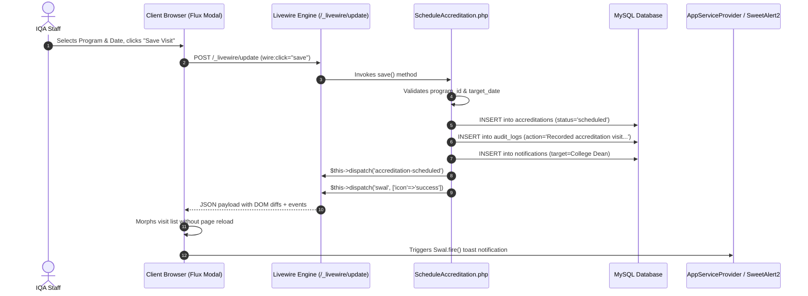
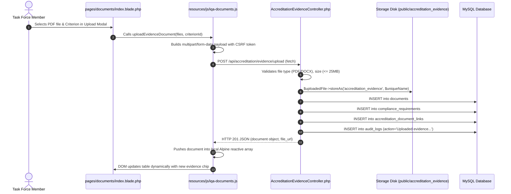
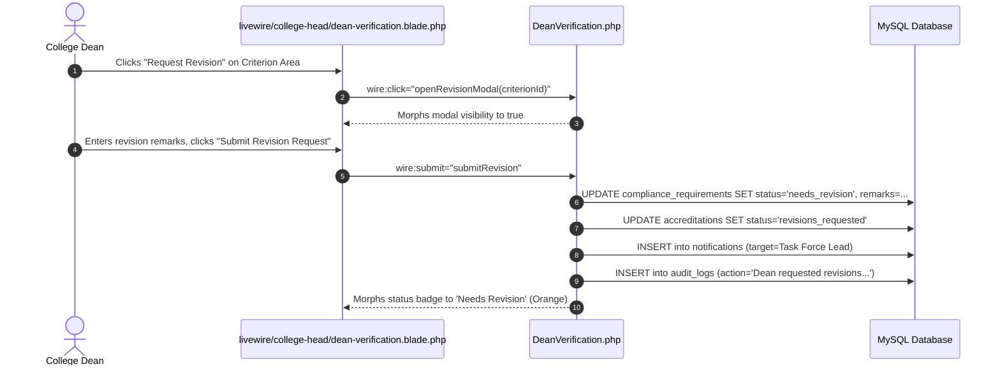

# IQArchive — Frontend & Backend Interaction & File Structure Architecture Guide

**Date:** 2026-09-03  
**System:** IQArchive (Bicol University Institutional Quality Assurance Automation)  
**Stack:** Laravel 12 + Livewire 4 + Flux UI + Alpine.js + Tailwind CSS v4 + MySQL  

---

## 1. System Architecture Overview

IQArchive does not follow a single monolithic pattern or a decoupled Single-Page App (SPA) pattern. Instead, it operates on a **Hybrid TALL Stack Architecture** that blends four distinct request-response paradigms across different functional modules:

```
+---------------------------------------------------------------------------------------+
|                                    IQArchive Client                                   |
|   Desktop Browser (>= 1024px) | Tailwind v4 @theme Tokens | Flux UI | SweetAlert2      |
+---------------------------------------------------------------------------------------+
        |                                   |                              |
  (Pattern A: Livewire RPC)        (Pattern B: Fetch AJAX)      (Pattern C: Full Page)
        |                                   |                              |
        v                                   v                              v
+-----------------------+          +-----------------------+      +---------------------+
| Livewire 4 Components |          | Internal Controllers  |      | Blade Controllers & |
| (app/Livewire/*)      |          | (app/Http/Controllers)|      | Web Route Closures  |
| State in PHP Server   |          | JSON Endpoints        |      | HTML Response       |
| Morphing DOM Diffs    |          | Session Cookie Auth   |      | Session Handshake   |
+-----------------------+          +-----------------------+      +---------------------+
        \                                   /                              /
         \                                 /                              /
          +-------------------------------+------------------------------+
                                          |
                                          v
                              +-----------------------+
                              | Eloquent ORM & Events |
                              | (app/Models/*)        |
                              | AppServiceProvider    |
                              +-----------------------+
                                          |
                                          v
                              +-----------------------+
                              | MySQL Database Layer  |
                              | (36 Migrated Tables)  |
                              +-----------------------+
```

---

## 2. The Four Frontend-Backend Interaction Patterns

### Pattern A: Livewire 4 Reactive RPC Flow (Accreditation, Instruments, Admin)
Used by:
- `Accreditation/ScheduleAccreditation.php` & `VisitsIndex.php`
- `Configuration/Instruments.php` (Master AACCUP Builder)
- `CollegeHead/DeanVerification.php` (Stage 6 Review) & `InstrumentCustomization.php`
- `IqaAdmin/Accounts.php` & `SystemAdministrator/Accounts.php`
- `TaskForce/TaskForceOverview.php` & `TaskForceDashboard.php`

#### How It Works:
1. The user visits a URL (e.g. `/visits` or `/configuration/instruments`).
2. The route invokes the Livewire component class (e.g. `VisitsIndex::class`).
3. The component executes `mount()`, loads data via Eloquent, and renders the paired Blade template (`livewire/accreditation/visits-index.blade.php`).
4. Interactive actions (clicking a tab, submitting a modal, typing in search) bind directly to PHP component properties via `wire:model.live` or trigger server methods via `wire:click="save"`.
5. Under the hood, Livewire makes an asynchronous HTTP POST to `/_livewire/update`.
6. The PHP server mutates the component state, runs validations, executes database writes, and re-renders the Blade view.
7. The server sends back a minimal JSON payload containing DOM morph diffs and dispatched browser events:
   ```php
   $this->dispatch('accreditation-scheduled');
   $this->dispatch('swal', ['icon' => 'success', 'title' => 'Saved']);
   ```
8. The client-side Livewire runtime morphs only the changed DOM nodes without a full-page reload and triggers browser listeners (e.g. SweetAlert2).

---

### Pattern B: Alpine.js + Internal REST/AJAX Flow (Documents Subsystem)
Used by:
- `resources/views/pages/documents/index.blade.php`
- `resources/views/pages/documents/partials/common-documents/*`
- `resources/views/pages/documents/partials/program-accreditation/*`
- `resources/views/pages/documents/partials/institutional-accreditation/*`
- `resources/js/iqa-documents.js` (3,905 lines of Alpine store logic)

#### How It Works:
1. The route `Route::get('roles/{role}/documents')` serves the Blade view `pages.documents.index`.
2. The blade template initializes an Alpine.js component:
   ```html
   <div x-data="documentWorkspace({
       userId: {{ auth()->id() }},
       userRole: '{{ auth()->user()->role }}',
       userCollege: {{ auth()->user()->college_id ?? 'null' }},
       userProgram: {{ auth()->user()->program_id ?? 'null' }}
   })">
   ```
3. Alpine.js initializes state defined in `resources/js/iqa-documents.js` (current tab, selected program, upload queue, active area filter).
4. When a user uploads evidence, changes self-survey ratings, or searches documents, **Alpine.js uses native browser `fetch()`** to call endpoints defined in `routes/web.php` prefixed with `api/`:
   - `POST /api/accreditation/evidence/upload` $\rightarrow$ [`AccreditationEvidenceController@upload`](file:///c:/Users/janss/Herd/iqarchive/app/Http/Controllers/AccreditationEvidenceController.php#L28)
   - `GET /api/accreditation/evidence/{programId}` $\rightarrow$ [`AccreditationEvidenceController@getProgramEvidence`](file:///c:/Users/janss/Herd/iqarchive/app/Http/Controllers/AccreditationEvidenceController.php#L220)
   - `POST /api/self-survey/ratings` $\rightarrow$ [`SelfSurveyController@saveRating`](file:///c:/Users/janss/Herd/iqarchive/app/Http/Controllers/SelfSurveyController.php)
   - `POST /api/common-documents` $\rightarrow$ [`DocumentCategoryController@storeDocument`](file:///c:/Users/janss/Herd/iqarchive/app/Http/Controllers/DocumentCategoryController.php)
5. **Authentication Mechanism:** Although these routes have an `api/` prefix, they are declared in `routes/web.php` inside `Route::middleware(['auth', 'verified'])`. They authenticate using standard **session cookies and Laravel CSRF tokens (`X-CSRF-TOKEN`)**, NOT Bearer tokens.
6. The controller stores the file in `storage/app/public/accreditation_evidence`, inserts rows in `documents`, `compliance_requirements`, and `accreditation_document_links`, writes an `audit_logs` record, and returns a JSON payload.
7. Alpine.js receives the JSON response and reactively pushes the new document into the local Alpine document array, immediately updating the UI table.

---

### Pattern C: Livewire Volt Single-File Components (Account Settings)
Used by:
- `resources/views/pages/settings/⚡profile.blade.php`
- `resources/views/pages/settings/⚡delete-user-form.blade.php`
- `resources/views/pages/settings/⚡delete-user-modal.blade.php`
- `resources/views/pages/settings/⚡two-factor-setup-modal.blade.php`
- `resources/views/pages/settings/two-factor/⚡recovery-codes.blade.php`

#### How It Works:
- Volt single-file components combine the PHP component logic and Blade template into a single `.blade.php` file prefixed with `⚡` (the UTF-8 lightning bolt `\xE2\x9A\xA1`).
- Registered in `routes/settings.php` via:
  ```php
  Route::livewire('settings/profile', 'pages::settings.profile')->name('profile.edit');
  ```
- Component state (e.g. updating profile info, enabling 2FA, generating passkeys) is executed in the top PHP block of the file and rendered directly below it.

---

### Pattern D: Traditional Server-Rendered Full Pages
Used by:
- Public Landing: [`resources/views/welcome.blade.php`](file:///c:/Users/janss/Herd/iqarchive/resources/views/welcome.blade.php) (aggregates live DB counts of accredited programs)
- Google OAuth Redirect & Callback: [`GoogleAuthController.php`](file:///c:/Users/janss/Herd/iqarchive/app/Http/Controllers/GoogleAuthController.php)
- Developer Instant Role Login: [`dev-login.blade.php`](file:///c:/Users/janss/Herd/iqarchive/resources/views/dev-login.blade.php) (local/testing environment only)
- Stub Workspace Placeholders: [`resources/views/pages/workspace/placeholder.blade.php`](file:///c:/Users/janss/Herd/iqarchive/resources/views/pages/workspace/placeholder.blade.php)

---

## 3. End-to-End File Structure & Component Mapping

### 3.1 Backend Architecture Directory (`app/`)

```
app/
├── Actions/
│   └── Fortify/
│       ├── CreateNewUser.php             # Fortify user creation
│       └── ResetUserPassword.php         # Fortify password reset
├── Concerns/
│   ├── PasswordValidationRules.php       # Password complexity rules
│   └── ProfileValidationRules.php        # Profile email/name rules
├── Http/
│   └── Controllers/
│       ├── AccreditationEvidenceController.php  # Handles evidence upload & JSON queries
│       ├── CollegeController.php                # Academic colleges REST endpoints
│       ├── DocumentCategoryController.php       # Common document taxonomy endpoints
│       ├── GoogleAuthController.php             # Google Workspace SSO callback & auto-provision
│       ├── ProgramController.php                # Academic degree programs REST endpoints
│       ├── SelfSurveyController.php             # Institutional self-survey ratings endpoints
│       └── SubmissionController.php             # Submission file serving & review actions
├── Livewire/
│   ├── Accreditation/
│   │   ├── ScheduleAccreditation.php     # Visit scheduling modal & Dean notification dispatch
│   │   └── VisitsIndex.php               # Accreditation visit timeline & cancellation
│   ├── Actions/
│   │   └── Logout.php                    # User logout livewire action
│   ├── CollegeHead/
│   │   ├── Dashboard.php                 # Dean oversight, task force approvals, visit metrics
│   │   ├── DeanVerification.php          # Step 6 evidence review & revision flagging
│   │   ├── InstrumentCustomization.php   # Stage 4 program parameter customization
│   │   └── TaskForceSetup.php            # Dean task force member nomination
│   ├── Configuration/
│   │   ├── CollegesPrograms.php          # Academic units management (soft deletes/campuses)
│   │   └── Instruments.php               # Module 4 Master AACCUP Instrument Builder (10 Areas)
│   ├── IqaAdmin/
│   │   ├── Accounts.php                  # IQA Staff user accounts manager (hides sysadmins)
│   │   ├── AuditTrail.php                # IQA Staff audit trail inspection
│   │   └── MatrixBuilder.php             # [Orphaned] Unused prototype stub
│   ├── Monitoring/
│   │   └── MonitoringOverview.php        # University-wide accreditation monitoring portal
│   ├── SystemAdministrator/
│   │   ├── Accounts.php                  # SysAdmin user accounts manager (all roles)
│   │   └── AuditTrail.php                # SysAdmin audit trail inspection
│   └── TaskForce/
│       ├── TaskForceDashboard.php        # Member area workspace, criteria progress & submission
│       └── TaskForceOverview.php         # Task force team creation and member management
├── Models/                               # 22 Eloquent models (Accreditation, Document, User, etc.)
└── Providers/
    ├── AppServiceProvider.php            # Gates, event listeners (Login/Logout/Document), Date defaults
    └── FortifyServiceProvider.php        # Fortify 2FA, password reset bindings
```

---

### 3.2 Frontend Architecture Directory (`resources/`)

```
resources/
├── css/
│   ├── app.css                           # Tailwind v4 @theme tokens (primary navy, brand orange, zinc)
│   └── token-mapping.md                  # Design token rules & utility mapping specification
├── js/
│   ├── app.js                            # Imports SweetAlert2 and attaches iqa-documents to Alpine
│   ├── bootstrap.js                      # Axios & HTTP headers configuration
│   ├── iqa-documents.js                  # Document Workspace Alpine store (3,905 lines)
│   ├── iqa-submissions.js                # Submissions Workspace Alpine store
│   └── passkeys.js                       # Passkey WebAuthn registration & login handler
└── views/
    ├── components/                       # Shared Blade components
    │   ├── accreditation/                # Status badges & visit timeline chips
    │   ├── layouts/                      # Layout wrappers
    │   ├── monitoring/                   # Metrics indicators
    │   └── mobile-unsupported.blade.php  # Global mobile block guard (< 1024px)
    ├── flux/                             # Flux UI component overrides (icon, navlist)
    ├── layouts/
    │   ├── app/                          # Main authenticated application shell (header, sidebar)
    │   └── auth/                         # Guest authentication layout
    ├── livewire/                         # Paired Livewire Component Blade Templates
    │   ├── accreditation/                # schedule-accreditation.blade.php, visits-index.blade.php
    │   ├── admin/                        # accounts.blade.php (shared by both Accounts components)
    │   ├── college-head/                 # dashboard.blade.php, dean-verification.blade.php, etc.
    │   ├── configuration/                # colleges-programs.blade.php, instruments.blade.php
    │   ├── iqa-admin/                    # audit-trail.blade.php, matrix-builder.blade.php
    │   ├── monitoring/                   # monitoring-overview.blade.php
    │   ├── system-administrator/         # audit-trail.blade.php
    │   └── task-force/                   # task-force-dashboard.blade.php, task-force-overview.blade.php
    ├── pages/
    │   ├── auth/login.blade.php          # Google SSO login page
    │   ├── documents/                    # Document management system (Alpine documentWorkspace)
    │   ├── roles/                        # Role landing dashboards (iqa-staff, accreditor, etc.)
    │   ├── settings/                     # Volt Single-File Components (⚡profile.blade.php, etc.)
    │   └── workspace/placeholder.blade.php # Under-development route placeholder
    └── partials/                         # Header, footer, head metadata
```

---

### 3.3 Component-to-View Pairing Reference Table

| Functional Area | Backend Handler | Paired Blade View | Interaction Type |
| :--- | :--- | :--- | :--- |
| **Accreditation Visits** | `App\Livewire\Accreditation\VisitsIndex` | `livewire/accreditation/visits-index.blade.php` | Livewire 4 RPC |
| **Schedule Visit Modal** | `App\Livewire\Accreditation\ScheduleAccreditation` | `livewire/accreditation/schedule-accreditation.blade.php` | Livewire 4 RPC |
| **AACCUP Master Builder** | `App\Livewire\Configuration\Instruments` | `livewire/configuration/instruments.blade.php` | Livewire 4 RPC |
| **Academic Units CRUD** | `App\Livewire\Configuration\CollegesPrograms` | `livewire/configuration/colleges-programs.blade.php` | Livewire 4 RPC |
| **Dean Oversight** | `App\Livewire\CollegeHead\Dashboard` | `livewire/college-head/dashboard.blade.php` | Livewire 4 RPC |
| **Dean Step 6 Review** | `App\Livewire\CollegeHead\DeanVerification` | `livewire/college-head/dean-verification.blade.php` | Livewire 4 RPC |
| **Dean Customization** | `App\Livewire\CollegeHead\InstrumentCustomization` | `livewire/college-head/instrument-customization.blade.php` | Livewire 4 RPC |
| **Task Force Workspace** | `App\Livewire\TaskForce\TaskForceDashboard` | `livewire/task-force/task-force-dashboard.blade.php` | Livewire 4 RPC |
| **Task Force Teams** | `App\Livewire\TaskForce\TaskForceOverview` | `livewire/task-force/task-force-overview.blade.php` | Livewire 4 RPC |
| **IQA Accounts Manager** | `App\Livewire\IqaAdmin\Accounts` | `livewire/admin/accounts.blade.php` | Livewire 4 RPC |
| **SysAdmin Accounts** | `App\Livewire\SystemAdministrator\Accounts` | `livewire/admin/accounts.blade.php` | Livewire 4 RPC |
| **IQA Audit Trail** | `App\Livewire\IqaAdmin\AuditTrail` | `livewire/iqa-admin/audit-trail.blade.php` | Livewire 4 RPC |
| **SysAdmin Audit Trail** | `App\Livewire\SystemAdministrator\AuditTrail` | `livewire/system-administrator/audit-trail.blade.php` | Livewire 4 RPC |
| **Accreditation Monitoring**| `App\Livewire\Monitoring\MonitoringOverview` | `livewire/monitoring/monitoring-overview.blade.php` | Livewire 4 RPC |
| **Document Management** | `DocumentCategoryController` & `AccreditationEvidenceController` | `pages/documents/index.blade.php` | Alpine.js `documentWorkspace` + Fetch AJAX |
| **User Profile & 2FA** | Volt Component Engine | `pages/settings/⚡profile.blade.php` | Livewire Volt |
| **Role Dashboard Gate** | `routes/web.php` (Dashboard closure) | `pages/roles/{role}/dashboard.blade.php` | Server-Rendered Blade |

---

## 4. Key Data Flow Sequence Diagrams

### Flow 1: Livewire Visit Scheduling (Reactive RPC Flow)



---

### Flow 2: Evidence Document Upload (Alpine.js + AJAX Flow)



---

### Flow 3: Dean Step 6 Quality Review & Return-for-Revision Flow



---

## 5. Architectural Gotchas & Critical Rules to Remember

1. **Desktop-Only Viewport Policy:**
   IQArchive is built solely for desktop workstations ($\ge$ 1024px). Smaller viewports trigger the global guard `<x-mobile-unsupported />`, preventing rendering on mobile devices.
2. **Two Instrument Subsystems in the Database:**
   - Subsystem A: `instruments`, `instrument_areas`, `instrument_parameters`, `instrument_criteria` (Module 4 Dynamic AACCUP hierarchy).
   - Subsystem B: `self_survey_areas`, `self_survey_parameters`, `self_survey_indicators`, `self_survey_ratings` (Legacy institutional self-survey).
   *Do not confuse these two table sets when writing queries.*
3. **Multi-Role Session Precedence:**
   Users can hold multiple roles through `role_user`. The active role is stored in `session('active_role')`. Always check permissions using `$user->hasRole('...')` rather than comparing against `$user->role`.
4. **Session-Cookie Protected "API" Endpoints:**
   Endpoints starting with `api/` in `routes/web.php` are internal AJAX endpoints protected by web session cookies and CSRF tokens. They are not accessible via third-party API clients or bearer tokens.
5. **Tailwind v4 Token Exclusivity:**
   Design tokens live in `resources/css/app.css` under `@theme`. Always use tokens like `text-primary-dark`, `bg-brand-orange`, and semantic surfaces instead of arbitrary raw colors (`blue-500`, `orange-500`).
