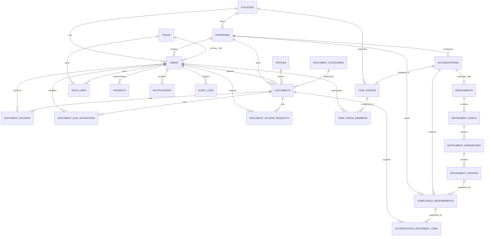

# Database Schema: Entity Relationship Diagram & Seeders

This reference document summarizes the global Entity Relationship Diagram (ERD) and seeder execution sequence for IQArchive.

---

## 1. Global Entity Relationship Diagram (ERD)



---

## 2. Seeder Execution Sequence

The default database state is populated by running `php artisan db:seed`:

```
DatabaseSeeder
 ├── RoleSeeder                  (System Administrator, IQA Staff, Accreditor, etc.)
 ├── OfficeSeeder                (General Admin, Research Office, HR, etc.)
 ├── CollegeSeeder               (17 BU Colleges & Satellite Campuses)
 ├── ProgramSeeder               (BU Degree Programs)
 ├── DocumentCategorySeeder      (Policies, Memoranda, Syllabi, etc.)
 ├── UserSeeder                  (Default institutional users & syncs role_user)
 ├── AaccupMasterInstrumentSeeder (10-Area AACCUP Instrument Templates)
 ├── DocumentSeeder              (Sample simulated documents & reviews)
 ├── AuditLogSeeder              (Paired logins, document event history)
 └── TestPdfSeeder               (Creates physical PDF files in storage)
```

---

## 3. Subsystem Schema References

- [Authentication & Security Schema](file:///c:/Users/janss/Herd/iqarchive/docs/reference/database-schema-auth-security.md)
- [Organizational Hierarchy Schema](file:///c:/Users/janss/Herd/iqarchive/docs/reference/database-schema-organizational-hierarchy.md)
- [Document Management Schema](file:///c:/Users/janss/Herd/iqarchive/docs/reference/database-schema-document-management.md)
- [Accreditations & Task Forces Schema](file:///c:/Users/janss/Herd/iqarchive/docs/reference/database-schema-task-forces.md)
- [Dynamic Instruments Schema](file:///c:/Users/janss/Herd/iqarchive/docs/reference/database-schema-dynamic-instruments.md)
- [System Auditing Schema](file:///c:/Users/janss/Herd/iqarchive/docs/reference/database-schema-system-audit.md)
- [Framework & Queue Infrastructure Schema](file:///c:/Users/janss/Herd/iqarchive/docs/reference/database-schema-infrastructure-queues.md)
- [Self-Survey Subsystem Schema](file:///c:/Users/janss/Herd/iqarchive/docs/reference/database-schema-self-survey.md)
