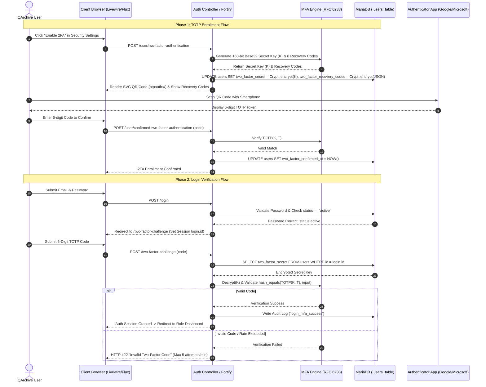
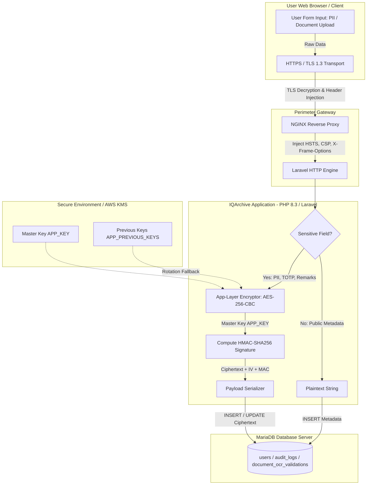

# IQArchive — Security Architecture Design Document
**System Name:** IQArchive (Institutional Quality Assurance Document Archive System)  
**Framework & Tech Stack:** PHP 8.3 / Laravel 12 (Livewire 3, Fortify, Flux UI, Tailwind CSS 4, MariaDB/MySQL)  
**Institutional Context:** Bicol University Quality Assurance & AACCUP Accreditation Subsystem  
**Document Purpose:** System-Specific Security Controls & Architectural Design Specification  

---

## Executive Summary

IQArchive is an Institutional Quality Assurance Document Archive System designed to store, manage, validate, and audit sensitive university accreditation materials, faculty submissions, compliance reports, and AACCUP evaluation instruments. Given the high confidentiality, integrity, and availability requirements of institutional accreditation records, this document outlines a defense-in-depth security architecture spanning **Identity & Access Fortification (Module A)**, **Cryptographic Data Protection (Module B)**, and **API & Perimeter Defense (Module C)**.

---

# Module A: Identity & Access Fortification

## 1. Multi-Factor Authentication (MFA) Design using TOTP

### 1.1 Technical Specification & Provisioning Architecture
IQArchive enforces Time-based One-Time Password (TOTP) authentication conforming to **RFC 6238** (extension of RFC 4226 HOTP) using Laravel Fortify integrated with the `TwoFactorAuthenticatable` trait on the `User` model.

1. **Secret Provisioning Flow:**
   - **Secret Generation:** Upon user request in `settings.iqa-admin` or user profile security settings, the backend generates a cryptographically secure, 160-bit (20-byte) pseudo-random secret string encoded in Base32 (264 bits formatted as 32 uppercase characters).
   - **Secret Encryption:** The raw Base32 secret string is encrypted prior to database persistence using Laravel's `Crypt::encryptString()` (AES-256-CBC with HMAC-SHA256 payload integrity check) and stored in the `users.two_factor_secret` text column.
   - **QR Code & Provisioning URI:** The server constructs an `otpauth://` URI:
     $$\text{otpauth://totp/IQArchive:user@bicol-u.edu.ph?secret=JBSWY3DPEHPK3PXP\&issuer=IQArchive\&algorithm=SHA1\&digits=6\&period=30}$$
     This URI is rendered client-side as an inline SVG QR code using `BaconQrCode`. The secret key is never sent unencrypted or stored in client-side cookies.
   - **Recovery Code Generation:** 8 single-use recovery codes (10-character random alphanumeric strings) are generated, hashed/encrypted via `Crypt::encryptString()`, and stored in `users.two_factor_recovery_codes` as an encrypted JSON array.

2. **Validation & Verification Flow:**
   - **Time Step Calculation:** The 6-digit passcode $C$ is generated based on a 30-second time window $X$:
     $$T = \left\lfloor \frac{\text{Current Unix Timestamp} - T_0}{X} \right\rfloor \quad \text{where } T_0 = 0, \, X = 30$$
     $$C = \text{HOTP}(K, T) = \text{Truncate}(\text{HMAC-SHA-1}(K, T)) \pmod{10^6}$$
   - **Verification Algorithm:** When a user submits a 6-digit code during authentication via `pages.auth.two-factor-challenge`, the backend decrypts `two_factor_secret` and computes expected TOTP codes across a drift window $W \in [T-1, T, T+1]$ (to account for $\pm 30\text{s}$ client-server clock skew).
   - **Constant-Time Comparison:** The submitted code is compared against calculated valid codes using `hash_equals()` to prevent timing side-channel attacks.
   - **State Persistence & Replay Protection:** Upon successful verification, `two_factor_confirmed_at` timestamp is updated in `users`, and the session key `auth.two_factor_confirmed_at` is set. Replay attacks within the 30-second window are blocked by logging verified counter timestamps in Redis cache (`mfa_used_counter:{user_id}:{timestamp}`).

### 1.2 TOTP Enrollment and Verification Sequence Diagram



---

## 2. Complete Role-Based Access Control (RBAC) Matrix

IQArchive defines **8 explicit system roles** to uphold Separation of Duties across Bicol University quality assurance workflows:
1. `system-administrator` (SysAdmin)
2. `iqa-admin` (IQA Administrator)
3. `iqa-member` (IQA Member / Verification Staff)
4. `accreditor` (External/Internal AACCUP Accreditor)
5. `university-administrator` (BU Executive / VP Academic Affairs)
6. `task-force` (College Task Force Lead)
7. `college-head` (Dean of College)
8. `program-chair` (Academic Program Chair)

### RBAC Permission Matrix (Roles $\times$ Resources $\times$ Permitted Actions)

| Resource Domain | Specific Entity / Feature | SysAdmin | IQA Admin | IQA Member | Accreditor | Univ Admin | Task Force | College Head | Program Chair |
| :--- | :--- | :---: | :---: | :---: | :---: | :---: | :---: | :---: | :---: |
| **User & Role Management** | User Accounts (`users`) | CRUD (Global) | CRUD (Dept) | Read | Denied | Read | Denied | Read (Dept) | Denied |
| | Role Assignment (`roles`) | C, U | C, U (Restricted) | Read | Denied | Read | Denied | Denied | Denied |
| | Session Mgmt (`sessions`) | Full Control | Revoke Dept | Self Only | Self Only | Self Only | Self Only | Self Only | Self Only |
| **QA Documents** | Document Upload (`documents`) | Denied | Create | Create | Denied | Denied | Create | Create | Create |
| | Document View/Read | Read (All) | Read (All) | Read (All) | Read (Assigned) | Read (Summary) | Read (Dept) | Read (College) | Read (Program) |
| | Document Update/Delete | Denied | C, U, D | U (Drafts) | Denied | Denied | U (Drafts) | U (College) | U (Program) |
| | Document Review & Approval | Denied | Approve | Verify | Evaluate | Denied | Review | Approve | Submit/Review |
| | OCR Validation (`document_ocr_validations`) | Denied | Manage | Perform/Verify | Read | Read | Read | Read | Read |
| | Access Request (`document_access_requests`) | Denied | Approve/Deny | Read | Request/View | Denied | Request/View | Approve (College) | Request/View |
| **Accreditation Engine** | Instruments (`instruments`, `instrument_areas`) | Read | CRUD | Read | Read | Read | Read | Read | Read |
| | Compliance Requirements (`compliance_requirements`) | Read | Create/Assign | Read | Read | Read | Comply/Update | Read | Comply/Update |
| | Doc Linking (`accreditation_document_links`) | Denied | Manage | Manage | Read | Read | Link/Unlink | Read | Link/Unlink |
| | Task Force Assignments | Denied | Assign | Read | Denied | Read | Self View | Assign Dept | Assign Member |
| **Audit & Monitoring** | Audit Trail (`audit_logs`) | Read (Full) | Read (Dept) | Denied | Denied | Read (Summary) | Denied | Denied | Denied |
| | System Diagnostics & Environment | Full | Denied | Denied | Denied | Denied | Denied | Denied | Denied |

*Legend: **C** = Create, **R** = Read, **U** = Update, **D** = Delete, **CRUD** = Full Lifecycle Management.*

---

## 3. Design Rationale: Cryptographic Primitives & Privilege Management

### Cryptographic Foundation (Hashing & MAC Connections)
The MFA and session architecture directly implements Week 3 cryptographic primitives:
- **HMAC (Hash-based Message Authentication Code):** TOTP generation uses $\text{HMAC-SHA1}$ / $\text{HMAC-SHA256}$ to bind the shared secret $K$ with moving time factor $T$. HMAC guarantees message authenticity and non-forgeability; without knowing $K$, an attacker cannot calculate $C = \text{HMAC}(K, T)$ even if $T$ is publicly known.
- **Timing Attack Resistance:** Verification uses PHP’s constant-time string comparison function `hash_equals($calculated_totp, $user_input)`. Standard string comparison (`==`) terminates early upon the first mismatched byte, creating a timing side-channel that allows attackers to iteratively guess 6-digit codes. `hash_equals` executes in constant time regardless of match correctness, eliminating timing leak vulnerabilities.
- **Password & Secret Storage Integrity:** Passwords are hashed using `bcrypt` (adaptive key-derivation function based on Blowfish cipher with cost factor 12), ensuring pre-image resistance and slow computation against brute-force attacks. MFA secrets stored at rest use AES-256-CBC cipher with HMAC-SHA256 authenticated encryption (Encrypt-then-MAC), preventing ciphertext tampering.

### Privilege Management & Defense-in-Depth
- **Principle of Least Privilege (PoLP):** Role permissions are tightly scoped. For instance, `accreditor` accounts have read-only access strictly restricted to documents explicitly linked to their assigned compliance requirements via `document_access_requests`. System Administrators can inspect system audit logs but are explicitly barred from approving or altering QA document contents, enforcing strict Separation of Duties (SoD).
- **Defense-in-Depth Enforcement:** Authorization is enforced across three distinct software layers:
  1. *Route Middleware Layer:* `Route::middleware(['auth', 'verified'])` and custom role-check closures in `routes/web.php`.
  2. *Livewire Component Mount Layer:* Component execution guards (`if (auth()->user()->role !== 'iqa-admin') abort(403);`) inside `mount()` methods.
  3. *Database Domain Layer:* Eloquent Policies (`DocumentPolicy`, `AccessRequestPolicy`) restricting query results by `college_id` and `program_id`.

---

## 4. Architectural Synthesis (Module A)

By coupling RFC 6238 TOTP authentication with triple-layer RBAC enforcement, IQArchive fortifies its identity perimeter against credential stuffing, session hijacking, and privilege escalation attacks. MFA ensures that stolen passwords alone cannot grant system access, while strict RBAC boundaries guarantee that compromised user accounts cannot execute unauthorized administrative, approval, or deletion operations across Bicol University quality assurance repositories.

---

# Module B: Cryptographic Data Protection

## 1. AES-256 Encryption-at-Rest Design

### 1.1 Sensitive Data Identification & Scheme Selection
IQArchive processes sensitive personal identifiers (PII), evaluator remarks, OCR-extracted accreditation contents, and MFA credentials. To ensure data privacy even in the event of database backup exposure or storage medium theft, sensitive schema fields are encrypted at the application layer using **AES-256-CBC with HMAC-SHA256 signature verification** (Laravel `Crypt` / Encrypted Eloquent Casting).

### Encrypted Database Fields Specification

| Database Table | Column Name | Sensitive Data Classification | Plaintext Sample | Ciphertext Storage Format |
| :--- | :--- | :--- | :--- | :--- |
| `users` | `two_factor_secret` | High Security Credential | `JBSWY3DPEHPK3PXP` | `eyJpdiI6Il...` (Base64 Encrypted Payload) |
| `users` | `two_factor_recovery_codes` | Backup Credential | `["a1b2-c3d4", ...]` | `eyJpdiI6Il...` (Base64 Encrypted JSON) |
| `users` | `first_name`, `last_name` | Personally Identifiable (PII) | `Juan`, `Dela Cruz` | `eyJpdiI6Il...` (Encrypted String) |
| `users` | `email` | Login PII / Identifier | `juan@bicol-u.edu.ph` | `eyJpdiI6Il...` (Encrypted + Blind Index) |
| `document_ocr_validations` | `extracted_data` | Confidential QA Text | `{"score": 98.5, ...}` | `eyJpdiI6Il...` (Encrypted LongText) |
| `document_access_requests` | `remarks` | Sensitive Evaluator Notes | `Granted for AACCUP survey` | `eyJpdiI6Il...` (Encrypted Text) |
| `document_reviews` | `remarks` | Internal Review Feedback | `Deficiencies in Criterion 3` | `eyJpdiI6Il...` (Encrypted Text) |

*Note on Email Searching:* To support exact-match database queries on encrypted emails without decrypting the entire table, a HMAC-SHA256 blind index (`email_bindex = HMAC-SHA256(email, blind_index_key)`) is stored alongside the encrypted email field.

---

## 2. Key Management Approach (Lifecycle & Rotation)

### 2.1 Storage Architecture
- **Master Encryption Key (MEK):** Stored outside the web root and database within host environment variables (`APP_KEY=base64:32_byte_random_string`) or managed via an external Key Management Service (e.g., AWS KMS / HashiCorp Vault).
- **Envelope Encryption (Design for Scalability):** The Master Key (MEK) encrypts individual Data Encryption Keys (DEK). The DEK encrypts table rows. The encrypted DEK is stored alongside dataset metadata.

### 2.2 Key Rotation & Zeroization Policy
- **Automated 90-Day Key Rotation:** Key rotation executes without application downtime using Laravel 12's multi-key re-encryption mechanism (`APP_PREVIOUS_KEYS`):
  1. A new primary key $K_{\text{new}}$ is generated and added to `APP_KEY`.
  2. The retired key $K_{\text{old}}$ is appended to `APP_PREVIOUS_KEYS` in `.env`.
  3. Decryption requests fall back to `APP_PREVIOUS_KEYS` if $K_{\text{new}}$ fails MAC verification.
  4. An asynchronous console job (`php artisan reencrypt:database-fields`) reads records encrypted with $K_{\text{old}}$, decrypts them, re-encrypts with $K_{\text{new}}$, and updates the records.
- **Zeroization & Memory Hygiene:** In-memory key handles are un-set and cleared upon script termination to prevent memory dump extraction.

---

## 3. TLS/HTTPS & Security Header Configuration Plan

To protect data-in-transit and defend against Client-Side Injection, Clickjacking, and Cross-Site Scripting (XSS), the NGINX web server hosting IQArchive enforces TLS 1.3 encryption and injects HTTP response security headers.

### Security Headers Specification Table

| Response Header Name | Configured Header Value | Security Purpose & Technical Rationale |
| :--- | :--- | :--- |
| `Strict-Transport-Security` | `max-age=63072000; includeSubDomains; preload` | Forces HTTPS for 2 years (63,072,000s). Prevents SSL Stripping attacks (e.g., Moxie Marlinspike's sslstrip) and MITM downgrades. |
| `Content-Security-Policy` | `default-src 'self'; script-src 'self' 'nonce-rAnd0m123' https://cdn.jsdelivr.net; style-src 'self' 'unsafe-inline' https://fonts.googleapis.com; font-src 'self' https://fonts.gstatic.com; img-src 'self' data: blob:; object-src 'none'; frame-ancestors 'none';` | Restricts resources (scripts, styles, images) to trusted origins. Disallows inline script execution without valid nonces, mitigating Reflected and Stored XSS vectors. |
| `X-Frame-Options` | `DENY` | Completely blocks framing of IQArchive in `<iframe>`, `<frame>`, or `<object>` elements, eliminating Clickjacking and UI Redressing attacks. |
| `X-Content-Type-Options` | `nosniff` | Disables MIME-type sniffing. Forces browsers to strictly adhere to declared `Content-Type` headers, preventing executable script execution disguised as images/PDFs. |
| `Referrer-Policy` | `strict-origin-when-cross-origin` | Limits cross-origin request referrer information to the origin domain only, preventing sensitive document URL leakages in HTTP Referer headers. |
| `Permissions-Policy` | `camera=(), microphone=(), geolocation=(), payment=()` | Disables browser hardware APIs (camera, mic, GPS) within the IQArchive web application context, reducing browser attack surface. |
| `X-Permitted-Cross-Domain-Policies` | `none` | Prevents Adobe Flash and PDF documents from loading cross-domain data from IQArchive. |

---

## 4. Cryptographic Data-Flow Diagram



---

## 5. Architectural Synthesis (Module B)

By pairing application-layer AES-256-CBC authenticated encryption at rest with strict TLS 1.3 and HSTS/CSP security header enforcement in transit, IQArchive guarantees confidentiality and integrity across the complete data lifecycle. Stolen database backups yield unreadable ciphertext without the out-of-band `APP_KEY`, while web application security headers insulate clients from MITM interception and browser-side code injection.

---

# Module C: API & Perimeter Defense

## 1. API Rate Limiting & Session Token Rotation/Blacklisting Design

### 1.1 Throttling & Rate Limiting Architecture
IQArchive implements dynamic rate limiting powered by Laravel’s `RateLimiter` facade (backed by Redis cache) to prevent denial-of-service (DoS), brute-force password attacks, and credential stuffing.

- **Authentication Rate Limiter (`login`):**
  - *Throttle Key:* `Str::transliterate(Str::lower($email) . '|' . $request->ip())`
  - *Limit:* 5 attempts per minute. Upon exceeding, HTTP 429 (Too Many Requests) is returned with a `Retry-After` header.
- **Two-Factor Challenge Limiter (`two-factor`):**
  - *Throttle Key:* `session()->get('login.id')`
  - *Limit:* 5 attempts per minute.
- **RESTful API Rate Limiter (`api`):**
  - *Throttle Key:* `auth:api` user ID or client IP address.
  - *Limit:* 60 requests per minute.

### 1.2 JWT / Sanctum Token Lifecycle & Blacklisting Strategy
For mobile or external system integration (e.g., AACCUP API syncing), IQArchive utilizes Laravel Sanctum / JWT tokens:
1. **Short-Lived Access Tokens:** Access tokens expire after 15 minutes (`TTL = 900s`).
2. **Long-Lived Refresh Tokens with Single-Use Rotation:** Refresh tokens expire after 7 days (`TTL = 604800s`). Using a refresh token invalidates it immediately and issues a new pair (Refresh Token Rotation).
3. **Instant Redis Token Blacklisting:** Upon logout, password reset, or admin revocation, token signatures (`jti` or Sanctum `tokenable_id`) are pushed to a Redis Blacklist cluster with an expiration matching the token's remaining TTL. Middleware checks Redis before granting API route access:
   $$\text{IsBlacklisted}(T_{\text{id}}) = \text{Redis::exists("token_blacklist:"} \cdot T_{\text{id}})$$

---

## 2. Input Sanitization & Parameterized Query Strategy

### 2.1 Parameterized Query Protection against SQL Injection
1. **Eloquent ORM & PDO Binding:** All database interactions in IQArchive utilize Laravel’s Eloquent ORM or DB Query Builder, which construct PDO prepared statements under the hood:
   ```php
   // Secure Parameterized Execution
   $documents = Document::where('program_id', '=', $programId)
       ->where('status', '=', $status)
       ->get();
   ```
   *Low-level PDO Execution:* `SELECT * FROM documents WHERE program_id = ? AND status = ?` (Parameters passed separately in binary transport protocol, preventing query structure alteration).

### 2.2 Server-Side Input Sanitization & XSS Mitigation
1. **Sanitizer Pipeline:** Request data passes through custom sanitization middleware prior to validation:
   - `FILTER_SANITIZE_EMAIL` and `trim()` for email fields.
   - HTML Purifier / `strip_tags()` for rich-text document descriptions.
2. **Auto-Escaped Templating:** Blade templates exclusively use `{{ $variable }}` which invokes `htmlspecialchars($var, ENT_QUOTES, 'UTF-8')`.

---

## 3. Extended Network ACL Rule Set with Wildcard Masks

### 3.1 Network Architecture & Subnet Planning
To establish network perimeter security, IQArchive backend infrastructure is partitioned across distinct VLANs:

| Network Zone | Subnet Prefix / CIDR | Subnet Mask | Wildcard Mask Calculation | Wildcard Mask |
| :--- | :--- | :--- | :--- | :--- |
| **Public / Web Ingress Subnet** | `192.168.10.0/24` | `255.255.255.0` | `255.255.255.255 - 255.255.255.0` | `0.0.0.255` |
| **App Server Subnet (Laravel)** | `10.0.1.0/28` | `255.255.255.240` | `255.255.255.255 - 255.255.255.240` | `0.0.0.15` |
| **Database Subnet (MariaDB)** | `10.0.2.0/28` | `255.255.255.240` | `255.255.255.255 - 255.255.255.240` | `0.0.0.15` |
| **Admin / Management Subnet** | `172.16.50.0/27` | `255.255.255.224` | `255.255.255.255 - 255.255.255.224` | `0.0.0.31` |

---

### 3.2 Cisco IOS Extended ACL Table (`ACL 150 - IQArchive_Perimeter_Rules`)

```text
! Extended Access Control List 150 Configuration
ip access-list extended IQArchive_Perimeter_Rules
 10 permit tcp 192.168.10.0 0.0.0.255 10.0.1.0 0.0.0.15 eq 80
 20 permit tcp 192.168.10.0 0.0.0.255 10.0.1.0 0.0.0.15 eq 443
 30 permit tcp 10.0.1.0 0.0.0.15 10.0.2.0 0.0.0.15 eq 3306
 40 permit tcp 10.0.1.0 0.0.0.15 10.0.2.0 0.0.0.15 eq 6379
 50 permit tcp 172.16.50.0 0.0.0.31 10.0.1.0 0.0.0.15 eq 22
 60 permit tcp 172.16.50.0 0.0.0.31 10.0.2.0 0.0.0.15 eq 22
 70 deny ip any any log
```

### Rule-by-Rule Technical Breakdown

| Rule # | Action | Protocol | Source Address & Wildcard Mask | Destination Address & Wildcard Mask | Dest Port | Technical Purpose & Rationale |
| :---: | :---: | :---: | :--- | :--- | :---: | :--- |
| **10** | `PERMIT` | `tcp` | `192.168.10.0 0.0.0.255` (Web Ingress) | `10.0.1.0 0.0.0.15` (App Server) | `80` (HTTP) | Allows HTTP ingress traffic from web clients to application reverse proxy for initial redirect to HTTPS. |
| **20** | `PERMIT` | `tcp` | `192.168.10.0 0.0.0.255` (Web Ingress) | `10.0.1.0 0.0.0.15` (App Server) | `443` (HTTPS) | Allows encrypted HTTPS web traffic from public user subnet to IQArchive application cluster. |
| **30** | `PERMIT` | `tcp` | `10.0.1.0 0.0.0.15` (App Server) | `10.0.2.0 0.0.0.15` (Database Subnet) | `3306` (MariaDB) | Permits application servers to execute SQL queries on the isolated database server. Public access to 3306 is explicitly blocked. |
| **40** | `PERMIT` | `tcp` | `10.0.1.0 0.0.0.15` (App Server) | `10.0.2.0 0.0.0.15` (Database Subnet) | `6379` (Redis) | Allows app servers to access Redis cache for session management, token blacklisting, and rate limiting. |
| **50** | `PERMIT` | `tcp` | `172.16.50.0 0.0.0.31` (Admin Subnet) | `10.0.1.0 0.0.0.15` (App Server) | `22` (SSH) | Restricts Secure Shell (SSH) administrative access to app servers strictly to authorized SysAdmin management workstations. |
| **60** | `PERMIT` | `tcp` | `172.16.50.0 0.0.0.31` (Admin Subnet) | `10.0.2.0 0.0.0.15` (Database Subnet) | `22` (SSH) | Restricts SSH administrative access to database servers strictly to SysAdmin subnet. |
| **70** | `DENY` | `ip` | `0.0.0.0 255.255.255.255` (`any`) | `0.0.0.0 255.255.255.255` (`any`) | `any` | Implicit Deny All: drops and logs all unauthorized cross-subnet IP traffic violating perimeter rules. |

---

## 4. Endpoint-by-Endpoint Control Matrix

| Endpoint Route | HTTP Method | Primary Threat / Risk Category | Security Controls Applied |
| :--- | :---: | :--- | :--- |
| `/login` | `POST` | Brute-force attacks, Credential Stuffing, User Enumeration | Rate Limiting (5 req/min per IP+Email), Generic Error Messaging, Input Sanitization (`FILTER_SANITIZE_EMAIL`), Audit Logging (`login_failed`/`login_success`). |
| `/two-factor-challenge` | `POST` | TOTP Brute-Force, Replay Attacks | Session Rate Limiting (5 req/min), Constant-Time Comparison (`hash_equals`), Redis Replay Prevention, Short-Lived Challenge Session. |
| `/roles/iqa-admin/accounts` | `POST / PUT` | Unauthorized Account Provisioning, Privilege Escalation | RBAC Middleware (`role:iqa-admin`), Component Guard in `mount()`, Server-side `FormRequest` Validation, Bcrypt Hashing, Soft Deactivation. |
| `/roles/{role}/documents` | `POST` | Malicious File Upload, Unrestricted File Type Execution | MIME-Type Validation (`pdf,docx,xlsx`), Strict File Extension Checking, Disassembly in Isolated Directory outside Web Root, Parameterized PDO Queries. |
| `/roles/{role}/audit-trail` | `GET` | Audit Log Tampering, Unauthorized Information Disclosure | Strict RBAC Guard (`role:system-administrator` / `iqa-admin`), Read-Only Livewire Component, Immutability Guarantee (`onDelete('set null')`). |
| `/api/v1/documents/ocr` | `POST` | API Flooding, Stolen Token Exploitation | Rate Limiting (60 req/min), Short-Lived Sanctum Access Token (15 min), Redis Token Blacklisting check, Automated AES-256 Encryption on extracted text. |

---

## 5. Design Rationale: OWASP Top 10 Risk Mapping

The controls specified in Module C map directly to the **OWASP Top 10 (2021)** security risks:

1. **A01:2021 – Broken Access Control:** Addressed by enforcing multi-layered RBAC middleware, Livewire component guards, policy restrictions on document visibility, and Extended ACL subnet isolation.
2. **A02:2021 – Cryptographic Failures:** Mitigated through TLS 1.3 in transit, HSTS preloading, application-layer AES-256-CBC encryption for PII/MFA keys, and key rotation policies.
3. **A03:2021 – Injection:** Eradicated across all endpoints via PDO parameterized queries in Eloquent ORM, HTML Purifier sanitization, and Blade output auto-escaping.
4. **A07:2021 – Identification and Authentication Failures:** Neutralized using RFC 6238 TOTP MFA, strict login throttling (5 req/min), short-lived JWT token rotation, and single-use refresh tokens with Redis blacklisting.

---

## 6. Architectural Synthesis (Module C)

By coupling network perimeter ACL isolation with strict API rate limiting, JWT token rotation/blacklisting, and parameterized input validation, IQArchive forms a hardened defensive boundary. Malicious traffic is filtered at the network layer before reaching backend hosts, while application-layer sanitization and token management neutralize injection and session hijacking attacks before sensitive accreditation data can be accessed.
