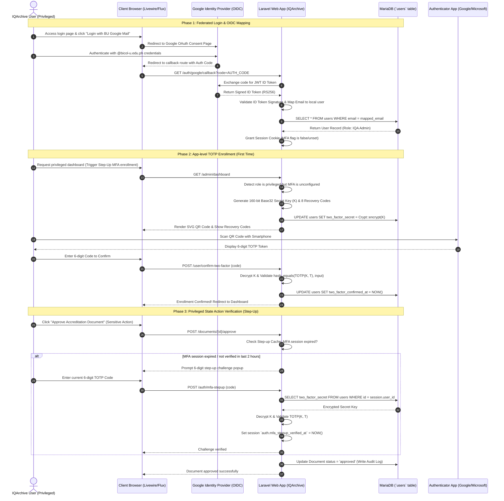
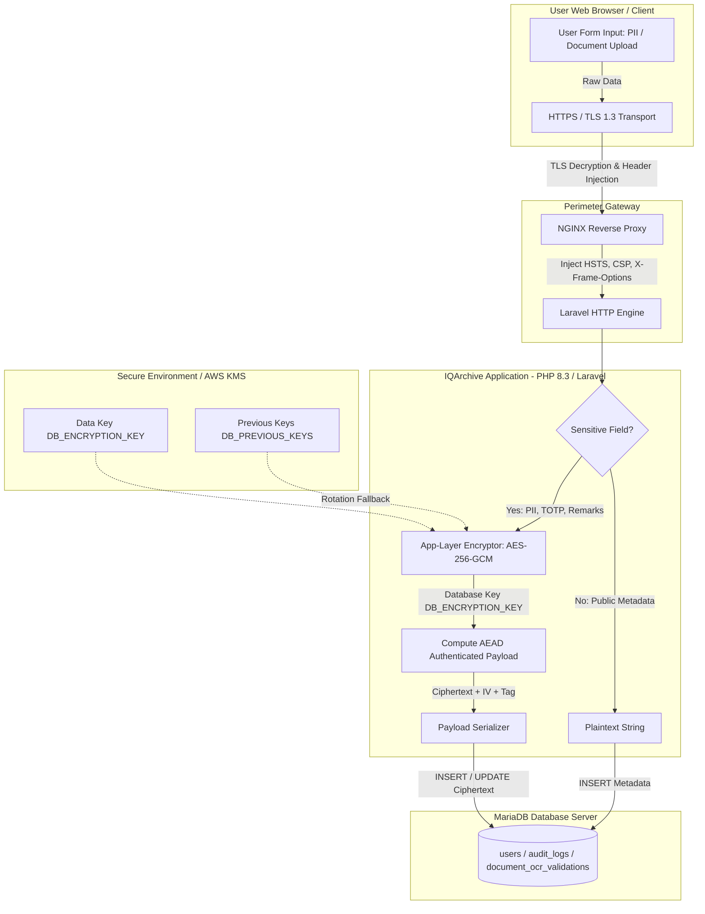

# IQArchive — Security Architecture Design & VAPT Verification Document

**System Name:** IQArchive (Institutional Quality Assurance Document Archive System)  
**Framework & Tech Stack:** PHP 8.3+ / Laravel 12 (Vite, Livewire 3, Fortify, Flux UI, Tailwind CSS, MariaDB/MySQL)  
**Institutional Context:** Bicol University Quality Assurance & AACCUP Accreditation Subsystem  
**Document Purpose:** System-Specific Security Controls, Architectural Design & VAPT Specification  

---

## Executive Summary

IQArchive is an Institutional Quality Assurance Document Archive System designed to store, manage, validate, and audit sensitive university accreditation materials, faculty submissions, compliance reports, and AACCUP evaluation instruments. Given the high confidentiality, integrity, and availability requirements of institutional accreditation records, this document outlines a defense-in-depth security architecture spanning **Identity & Access Fortification (Module A)** and **Cryptographic Data Protection (Module B)**, followed by a corresponding **Vulnerability Assessment and Penetration Testing (VAPT) Plan (Part 2)**. 

*Note: The database schema of IQArchive is currently under development and is subject to change. The fields and tables designed for cryptographic protections in this document represent the planned architectural baseline and will be adapted as the schema is finalized.*

---

# Part 1 - Security Architecture Design

# Module A: Identity & Access Fortification

## 1. Multi-Factor Authentication (MFA) Design using Google OAuth + App-level TOTP

To satisfy both federated identity requirements (Bicol University Workspace login) and security rubrics (direct control over MFA secret provisioning and validation), IQArchive implements a **two-layer identity model**.

```
+-----------------------------------------------------------------------+
| Layer 1: Google OAuth 2.0 / OIDC Federated Login                      |
| (BU email validation, passwordless local account mapping)             |
+------------------------------------+----------------------------------+
                                     |
                                     v
+------------------------------------+----------------------------------+
| Layer 2: App-Level Step-Up TOTP Multi-Factor Authentication           |
| (Required for IQA Admin/SysAdmin & sensitive state-changing actions)  |
+-----------------------------------------------------------------------+
```

### 1.1 Layer 1: Federated Identity via Google OAuth 2.0 / OIDC
IQArchive delegates primary authentication to the Bicol University Google Workspace identity provider. 
1. **Identity Provider Delegation:** IQArchive never handles or stores user passwords for Bicol University accounts.
2. **OIDC Validation Flow:**
   - The user requests login and is redirected to Google's OIDC gateway.
   - Upon successful login, Google returns an encrypted authorization code.
   - The IQArchive backend exchanges the code for a JWT ID Token (signed via RS256 by Google's public keys: `https://www.googleapis.com/oauth2/v3/certs`).
   - The server verifies the token signature, audience (`aud` matches IQArchive's client ID), issuer (`iss` is `https://accounts.google.com`), and expiration.
   - If valid, the verified email is extracted and mapped to a local database `users` record (retaining `role_id`, `college_id`, and `program_id` foreign keys).
   - If no record exists, the system rejects access or creates a pending account for authorization.

### 1.2 Layer 2: App-level TOTP Step-Up MFA
To maintain strict administrative oversight and meet strict compliance rules, IQArchive enforces a secondary, independent TOTP-based MFA factor controlled directly by the application (using `pragmarx/google2fa-laravel`). 

1. **Step-Up Execution Boundaries:**
   - App-level TOTP is mandatory for users assigned to privileged administrative roles: `System Administrator` and `IQA Admin`.
   - In addition, any user attempting a **sensitive, state-changing action** (such as approving accreditation submissions, modifying RBAC matrices, executing database exports, or granting access requests) must complete a step-up challenge if they haven't verified their TOTP within the current session window (e.g., last 2 hours).

2. **Secret Provisioning Flow:**
   - **Secret Generation:** The server generates a cryptographically secure 160-bit (20-byte) pseudo-random secret string encoded in Base32 (264 bits formatted as 32 uppercase characters).
   - **Secret Encryption:** The raw Base32 secret string is encrypted prior to database persistence using Laravel's `Crypt::encryptString()` (AES-256-GCM under the hood with a separate `DB_ENCRYPTION_KEY`) and stored in the `users.two_factor_secret` text column.
   - **QR Code & Provisioning URI:** The server constructs an `otpauth://` URI:
     $$\text{otpauth://totp/IQArchive:user@bicol-u.edu.ph?secret=JBSWY3DPEHPK3PXP&issuer=IQArchive&algorithm=SHA256&digits=6&period=30}$$
     This URI is rendered client-side as an inline SVG QR code. The raw secret is never exposed in client cookies or local storage.
   - **Recovery Code Generation:** 8 single-use recovery codes (10-character alphanumeric strings) are generated, hashed using `bcrypt` (cost factor 12), and stored in `users.two_factor_recovery_codes` as a JSON array.

3. **Validation & Verification Flow:**
   - **Time Step Calculation:** The 6-digit passcode $C$ is generated based on a 30-second time window $X$:
     $$T = \left\lfloor \frac{\text{Current Unix Timestamp} - T_0}{X} \right\rfloor \quad \text{where } T_0 = 0, \, X = 30$$
     $$C = \text{HOTP}(K, T) = \text{Truncate}(\text{HMAC-SHA-256}(K, T)) \pmod{10^6}$$
   - **Verification Algorithm:** When a user submits a 6-digit code, the backend decrypts `two_factor_secret` and computes the expected TOTP codes across a drift window $W \in [T-1, T, T+1]$ (to account for $\pm 30\text{s}$ client-server clock skew).
   - **Constant-Time Comparison:** The submitted code is compared against calculated valid codes using `hash_equals()` to prevent timing side-channel attacks.
   - **State Persistence & Replay Protection:** Upon validation, the timestamp `two_factor_confirmed_at` is updated in the database. Replay attacks are blocked by caching verified tokens in Redis (`mfa_used_tokens:{user_id}:{token}`) for 30 seconds.

---

### 1.3 TOTP Enrollment and Verification Sequence Diagram



---

## 2. Complete Role-Based Access Control (RBAC) Matrix

IQArchive defines **7 explicit system roles** to uphold Separation of Duties across Bicol University quality assurance workflows, matching the system's Context Flow Diagram (CFD).

1. **System Administrator:** Full administrative rights. Manages user provisioning, system configurations, and views the global audit log. Does not participate in document workflows or review actions.
2. **IQA Admin:** The IQA Office Director/Lead. Full functional control over document categories, document requests, accreditation deadlines, template generation, and overall document approval.
3. **IQA Member:** IQA Office staff. Performs OCR validations, reviews uploaded documents (verification status), and monitors college submissions.
4. **Accreditor:** External or internal AACCUP evaluator. Granted temporary, read-only access to specific compliance items and documents linked to their assigned areas.
5. **University Administrator/Executive:** Bicol University officials (e.g., VP of Academic Affairs, University President). Granted read-only access to high-level compliance dashboards, compliance reports, and system-wide audit statistics.
6. **Task Force:** Members of the College Accreditation Committee. Responsible for compiling and linking files to specific accreditation areas.
7. **College/Department Head and Program Chair:** Deans, Department Heads, and Program Chairs. They upload documents, submit requests for department files, assign task forces, and monitor the compliance status of their respective academic programs.

### RBAC Permission Matrix (Roles $\times$ Resources $\times$ Permitted Actions)

| Resource Domain | Specific Entity / Feature | System Admin | IQA Admin | IQA Member | Accreditor | Univ Admin / Executive | Task Force | College/Dept Head & Program Chair |
| :--- | :--- | :---: | :---: | :---: | :---: | :---: | :---: | :---: |
| **Identity & Access** | User Accounts (`users`) | CRUD | CRU (Dept) | Read | Denied | Read | Denied | Read (Dept) |
| | Roles & Perms (`roles`) | C, U | Read | Read | Denied | Read | Denied | Denied |
| | Sessions (`sessions`) | Full Control | Revoke Dept | Self Only | Self Only | Self Only | Self Only | Self Only |
| **QA Documents** | Document Upload (`documents`) | Denied | Create | Create | Denied | Denied | Create | Create |
| | Document View/Read | Read (Audit) | Read (All) | Read (All) | Read (Assigned) | Read (Summary) | Read (Dept) | Read (College) |
| | Document Update/Delete | Denied | C, U, D | U (Drafts) | Denied | Denied | U (Drafts) | U (College) |
| | Document Verification | Denied | Approve | Verify | Evaluate | Denied | Review | Approve |
| | OCR Validation (`ocr_validations`)| Denied | Manage | Perform/Verify| Read | Read | Read | Read |
| | Access Request (`access_requests`)| Denied | Approve/Deny | Read | Request/View | Denied | Request/View | Approve (College) |
| **Accreditation Engine**| Instruments (`instruments`) | Read | CRUD | Read | Read | Read | Read | Read |
| | Requirements (`compliance_reqs`)| Read | Create/Assign | Read | Read | Read | Comply/Update | Read |
| | Document Linkage (`doc_links`) | Denied | Manage | Manage | Read | Read | Link/Unlink | Link/Unlink |
| | Task Force Assignments | Denied | Assign | Read | Denied | Read | Self View | Assign Dept |
| **Audit & Logs** | System Audit Logs (`audit_logs`) | Read (Full) | Read (Dept) | Denied | Denied | Read (Summary) | Denied | Denied |
| | Configuration & Diagnostics | Full Control | Denied | Denied | Denied | Denied | Denied | Denied |

*Legend: **C** = Create, **R** = Read, **U** = Update, **D** = Delete, **CRUD** = Full Lifecycle Management.*

---

## 3. Design Rationale: Cryptographic Primitives & Privilege Management

### 3.1 Cryptographic Foundation (Hashing & MAC Connections)
The two-layer identity architecture implements core cryptographic primitives:
- **Asymmetric Signature Verification (OIDC):** Google OIDC authentication uses asymmetric cryptography. Google signs its ID token payloads with its private key (using RS256 - RSA Signature with SHA-256). IQArchive downloads Google's JSON Web Key Set (JWKS), computes the signature hash, and verifies it with the corresponding public key. This validates the identity claim without exposing credentials to the network.
- **HMAC (Hash-based Message Authentication Code):** The step-up TOTP generation utilizes $\text{HMAC-SHA-256}$ to bind the Base32 shared key $K$ to the moving counter $T$ (30-second increments). Because HMAC is one-way and collision-resistant, an attacker cannot forge $C = \text{HMAC}(K, T)$ without knowledge of $K$.
- **Timing Attack Resistance:** During step-up authentication, the submitted 6-digit passcode is checked using a constant-time comparison algorithm (`hash_equals`). Standard string comparison (`==`) terminates execution immediately upon finding a mismatched character, allowing attackers to measure microsecond timing discrepancies and guess digits. `hash_equals` processes strings completely regardless of value matches, neutralizing timing side-channel attacks.

### 3.2 Privilege Management & Defense-in-Depth
- **Separation of Duties (SoD):** System Administrators manage accounts and system backups but are programmatically blocked from reading document contents or approving compliance submissions. Conversely, IQA Admins manage quality assurance records but lack database management permissions.
- **Three-Layer Authorization:** RBAC is enforced at multiple check-points:
  1. *Routing Middleware:* Gates incoming requests based on user role assignments.
  2. *Livewire Component Mounting:* Checks authorization rules during the component lifecycle.
  3. *Eloquent Policies:* Restricts raw query results using user attributes (e.g., scoping document retrievals based on a user's `college_id`).

---

# Module B: Cryptographic Data Protection

## 1. Application-Layer AES-256 Encryption-at-Rest Design

To secure personally identifiable information (PII) and sensitive quality assurance data against unauthorized database access, server breaches, or backup theft, IQArchive designs application-layer encryption. 

### 1.1 Sensitive Data Identification & Scheme Selection
*Note: Due to the database schema not being finalized and subject to change, this field list represents the current planned schema baseline.*

| Database Table | Column Name | Sensitive Data Classification | Plaintext Sample | Ciphertext Storage Format (Base64 JSON) |
| :--- | :--- | :--- | :--- | :--- |
| `users` | `first_name`, `last_name` | PII (Personally Identifiable) | `Juan`, `Dela Cruz` | `{"iv":"...", "value":"...", "mac":"..."}` |
| `users` | `email` | Unique login identifier (PII) | `juan@bicol-u.edu.ph` | `{"iv":"...", "value":"...", "mac":"..."}` + Local Blind Index |
| `users` | `two_factor_secret` | High-Security MFA Secret | `JBSWY3DPEHPK3PXP` | `{"iv":"...", "value":"...", "mac":"..."}` |
| `documents` | `title` | Confidential Institutional Data | `CS BSIT Board Review Data` | `{"iv":"...", "value":"...", "mac":"..."}` |
| `documents` | `file_path` | Target File storage reference | `uploads/CS_BSIT_Report.pdf`| `{"iv":"...", "value":"...", "mac":"..."}` |
| `document_ocr_validations` | `extracted_data` | Extracted Text Data (PII/Scores) | `{"faculty_load": 18, ...}` | `{"iv":"...", "value":"...", "mac":"..."}` |
| `document_reviews` | `remarks` | Evaluator feedback notes | `Failed to meet BSIT Area 3` | `{"iv":"...", "value":"...", "mac":"..."}` |
| `document_access_requests` | `remarks` | Reason for document requests | `Required for AACCUP Level IV` | `{"iv":"...", "value":"...", "mac":"..."}` |
| `compliance_requirements` | `description` | Specific compliance requirements | `Submit faculty qualifications` | `{"iv":"...", "value":"...", "mac":"..."}` |

### 1.2 Cryptographic Execution
- **Algorithm:** **AES-256-GCM** (Galois/Counter Mode). This authenticated encryption cipher ensures both confidentiality and plaintext integrity check (providing built-in tag validation, making separate HMAC calculations redundant).
- **Laravel casting:** Eloquent cast classes use Laravel's default cryptor:
  ```php
  protected function casts(): array {
      return [
          'first_name' => 'encrypted',
          'last_name' => 'encrypted',
          'email' => 'encrypted',
          'extracted_data' => 'encrypted:json',
      ];
  }
  ```
- **Blind Index Strategy for Querying Encrypted Emails:** Because `email` fields are encrypted and store dynamic Initialization Vectors (IVs) yielding distinct ciphertext outputs, raw database indexing is blocked. To allow exact-match queries (e.g., `WHERE email = ?` on login lookup), IQArchive stores a **blind index** value in the database alongside the ciphertext:
  $$\text{email\_bindex} = \text{HMAC-SHA-256}(\text{plaintext\_email}, \text{BLIND\_INDEX\_KEY})$$
  The database queries match the computed blind index hash instead of the encrypted string, enabling high-performance searches while keeping raw email strings unreadable.
- **Uploaded Document Encryption:** When files are uploaded, their raw binary payloads are encrypted using Laravel's file system wrapper with `AES-256-GCM` streams before being written to private storage disks.

---

## 2. Key Management Approach (Lifecycle & Rotation)

To prevent a single server leak from compromising all system secrets, IQArchive isolates database encryption keys and details a lifecycle plan.

### 2.1 Key Separation & Storage Architecture
- **Isolated Key Store:** The encryption key for database data (`DB_ENCRYPTION_KEY`) is isolated from the application runner key (`APP_KEY` which is used for session cookies).
- **Environment Separation:** In the initial phase, `DB_ENCRYPTION_KEY` is loaded from a system-level environment variable.
- **Key Management Service (KMS) Integration Path:** For production deployments, key storage will transition to an external key server (such as HashiCorp Vault or AWS KMS). The application will request data encryption keys dynamically over an internal, TLS-validated loopback API, keeping the master key off the application host memory space.

### 2.2 Key Rotation Policies
- **Scheduled Rotation:** Keys are rotated automatically every 90 days.
- **Multi-Key Fallback Decryption:** To avoid service interruptions during database re-encryption, the backend utilizes Laravel's fallback array configuration (`DB_PREVIOUS_ENCRYPTION_KEYS`). If decryption using the active key fails signature/integrity checks, the system attempts decryption sequentially using legacy keys.
- **Emergency Key Rotation & Re-encryption Plan:**
  If the `DB_ENCRYPTION_KEY` is compromised:
  1. A security incident triggers the generation of a new key $K_{\text{new}}$ and pushes the leaked key $K_{\text{leaked}}$ to the fallback array.
  2. The system triggers an asynchronous queue command: `php artisan iqarchive:rekey`.
  3. The task worker reads database rows using fallback keys, decrypts data in-memory, re-encrypts using $K_{\text{new}}$, and writes updated rows back to disk.

---

## 3. TLS/HTTPS & Security Header Configuration Plan

To protect quality assurance documents in transit and defend web clients against Clickjacking, UI Redressing, and Cross-Site Scripting (XSS) injections, NGINX is configured to enforce TLS 1.3 encryption and inject security headers.

### Security Headers Specification Table

| Response Header Name | Configured Header Value | Security Purpose & Technical Rationale |
| :--- | :--- | :--- |
| `Strict-Transport-Security` | `max-age=63072000; includeSubDomains; preload` | Forces HTTPS for 2 years (63,072,000s). Prevents SSL Stripping attacks (e.g., Moxie Marlinspike's sslstrip) and MITM downgrades. |
| `Content-Security-Policy` | `default-src 'self'; script-src 'self' 'nonce-rAnd0m123' https://cdn.jsdelivr.net; style-src 'self' 'unsafe-inline' https://fonts.googleapis.com; font-src 'self' https://fonts.gstatic.com; img-src 'self' data: blob:; object-src 'none'; frame-ancestors 'none';` | Restricts resources (scripts, styles, images) to trusted origins. Disallows inline script execution without valid nonces, mitigating Reflected and Stored XSS vectors. *Note: The CSP nonce 'nonce-rAnd0m123' is a placeholder; it must be dynamically generated on every request lifecycle.* |
| `X-Frame-Options` | `DENY` | Completely blocks framing of IQArchive in `<iframe>`, `<frame>`, or `<object>` elements, eliminating Clickjacking and UI Redressing attacks. |
| `X-Content-Type-Options` | `nosniff` | Disables MIME-type sniffing. Forces browsers to strictly adhere to declared `Content-Type` headers, preventing executable script execution disguised as images/PDFs. |
| `Referrer-Policy` | `strict-origin-when-cross-origin` | Limits cross-origin request referrer information to the origin domain only, preventing sensitive document URL leakages in HTTP Referer headers. |
| `Permissions-Policy` | `camera=(), microphone=(), geolocation=(), payment=()` | Disables browser hardware APIs (camera, mic, GPS) within the IQArchive web application context, reducing browser attack surface. |
| `X-Permitted-Cross-Domain-Policies` | `none` | Prevents Adobe Flash and PDF documents from loading cross-domain data from IQArchive. |

---

## 4. Cryptographic Data-Flow Diagram

The diagram below shows the data-flow lifecycle for sensitive data inputs from client entry to database persistence, highlighting the application-layer encryption boundary.



---

# Part 2 - VAPT Verification Plan

This Vulnerability Assessment and Penetration Testing (VAPT) plan specifically targets the security controls designed in **Module A (Identity & Access Fortification)** and **Module B (Cryptographic Data Protection)** for the IQArchive system.

---

## 1. VAPT Test Plan

### 1.1 Scanners and Justification
- **Burp Suite Professional:** The primary HTTP interception proxy and manual penetration testing tool. Essential for testing the enforcement of Google OIDC validations, attempting Step-Up TOTP bypasses, swapping session identifiers to test RBAC parameters, and checking parameterized SQL queries.
- **OWASP ZAP:** Used as an automated application scanner to identify missing or misconfigured security headers (HSTS, CSP) and flag session attributes.
- **testssl.sh:** A command-line tool used to verify server TLS configurations, verifying the exclusion of legacy TLS versions (1.0, 1.1, 1.2) and validating proper cipher suite matching.

### 1.2 Scope
- **Target Components:** The web entry point (`port 443`), including authentication routes (`/auth/google/callback`, `/user/confirm-two-factor`, `/auth/mfa-stepup`), role-restricted routes, document upload pipelines, and database encryption boundaries.
- **Tested Scenarios:** Federated token signature verification, privilege check scopes, data decryption routines, key rotation fallbacks, and security header compliance.

### 1.3 Expected Finding Categories
- **Broken Object/Function Level Authorization (BOLA/BFLA):** Bypassing role-based routing or Eloquent policies to view/modify other college/program documents.
- **Authentication & Identification Failures:** Missing JWT validation checks, session expiration issues, or TOTP challenge bypasses.
- **Cryptographic Failures:** Leaked encryption keys, SQL error messages exposing unencrypted fields, or missing security response headers.

---

## 2. Manual Test-Case Write-Ups

### Test Case 1: Bypass of Step-up App-level TOTP on Privileged Action
*   **Objective:** Verify that a user authenticated via Google OAuth cannot bypass the secondary App-level step-up TOTP verification to execute a restricted action (e.g., approving an accreditation submission or modifying RBAC).
*   **Method:**
    1. Log into the system using a valid Bicol University Google Workspace account mapped to an `IQA Admin` role.
    2. Do NOT perform the secondary app-level TOTP enrollment or login challenge.
    3. Construct a raw HTTP request targeting a restricted action endpoint:
       `POST /documents/12/approve`
    4. Attach the active Google-authenticated session cookie (`laravel_session`) to the request headers.
    5. Submit the request using Burp Suite Repeater.
*   **Tools:** Burp Suite (Proxy and Repeater).
*   **Success Criteria:** The server must intercept the request, recognize that the step-up TOTP flag is unset in the session context, reject the transaction with an `HTTP 403 Forbidden` status code, and redirect the browser to `/auth/mfa-stepup`. The document state must remain unchanged.

### Test Case 2: SQL Injection & Plaintext Leakage Verification on Encrypted Database Fields
*   **Objective:** Verify that potential SQL injection points do not expose plaintext sensitive data, and confirm that direct access to the database (e.g., raw backups or table dumps) yields only encrypted values.
*   **Method:**
    1. Identify input fields that interact with encrypted columns (such as the document search queries).
    2. Inject standard SQL injection payloads (e.g., `' OR '1'='1`) into the search interface.
    3. Analyze the application responses to verify if raw SQL exceptions reveal plaintext records.
    4. Execute a direct SQL query against the database using a database terminal:
       `SELECT first_name, email, two_factor_secret FROM users;`
       `SELECT title, file_path FROM documents;`
    5. Examine the printed outputs to verify encryption status.
*   **Tools:** Burp Suite, sqlmap, MariaDB Database CLI.
*   **Success Criteria:**
    - Any SQL exceptions triggered by input validation errors must be generic and fail to leak database variables.
    - Direct database queries must yield only base64-encoded encrypted JSON strings containing `iv`, `value`, and `mac` attributes for the targeted fields, proving that the encryption-at-rest design is fully functional and isolated at the application layer.

---

## 3. Risk Matrix

This matrix maps anticipated system vulnerabilities to their likelihood, impact, and corresponding Module A & B controls.

| Anticipated Vulnerability | Likelihood | Impact | Risk Level | Mitigating Control Designed (Part 1) |
| :--- | :--- | :--- | :--- | :--- |
| **Authentication bypass via forged Google ID Tokens** | Low | High | **High** | **Module A:** Cryptographic signature verification using Google's public key certificate set (RS256). |
| **Bypass of Step-Up TOTP validation on administrative endpoints** | Medium | High | **High** | **Module A:** Endpoint step-up authentication checks at route and controller layers. |
| **Horizontal privilege escalation (reading documents of another college)** | Medium | High | **High** | **Module A:** RBAC matric structures enforced by Eloquent policies and scoped query boundaries. |
| **Exposure of faculty PII or OCR data via SQL injection leak** | Low | High | **High** | **Module B:** Application-layer AES-256-GCM encryption ensures database data remains encrypted. |
| **Exposure of sensitive QA files via raw DB backups or backup leakage** | Low | High | **High** | **Module B:** AES-256-GCM encryption-at-rest for file paths and native binary payload encryption. |
| **Session Hijacking via Man-in-the-Middle (MITM) Downgrade** | Medium | Medium | **Medium** | **Module B:** NGINX Strict-Transport-Security (HSTS) header rules forcing TLS 1.3 connections. |
| **Session Cookie stealing via Cross-Site Scripting (XSS) vectors** | High | High | **Critical** | **Module B:** Content-Security-Policy (CSP) headers restricting inline scripts and using random nonces. |
