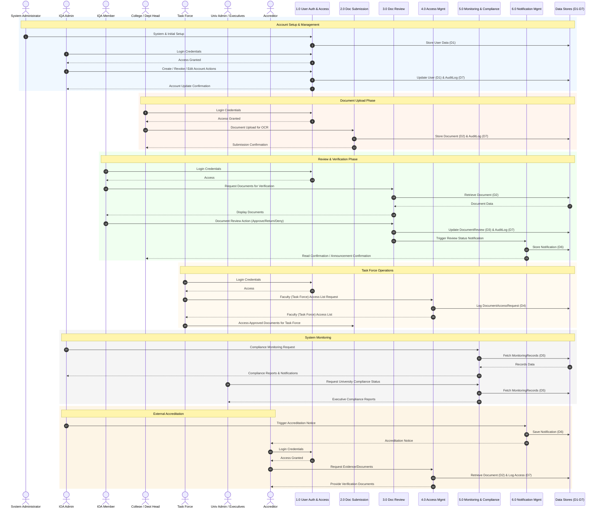

# IQArchive System Sequence Diagram

This sequence diagram incorporates all the entities, processes, and data stores identified in the DFD Level 1 you provided. Due to the scale of the system, all interactions are represented in a unified flow, grouped by typical user actions.

