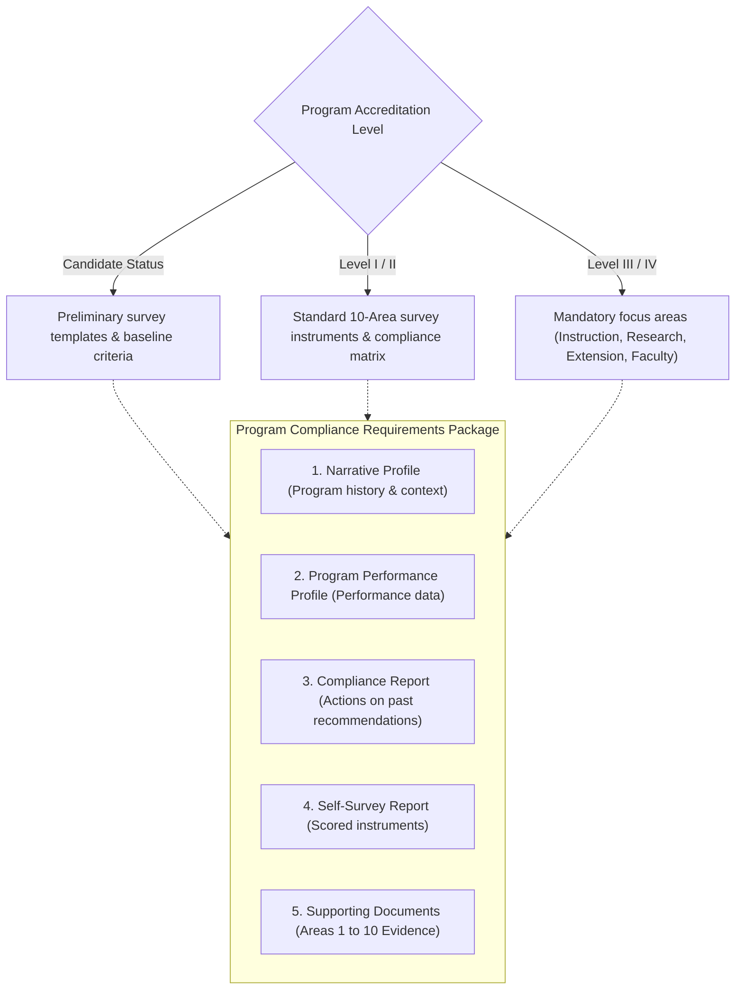
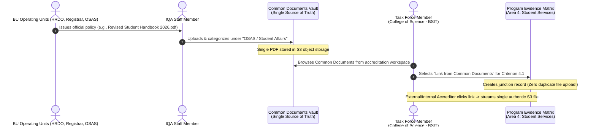
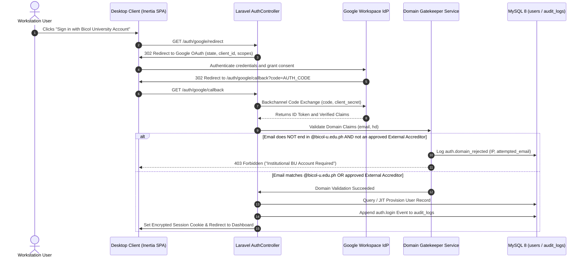
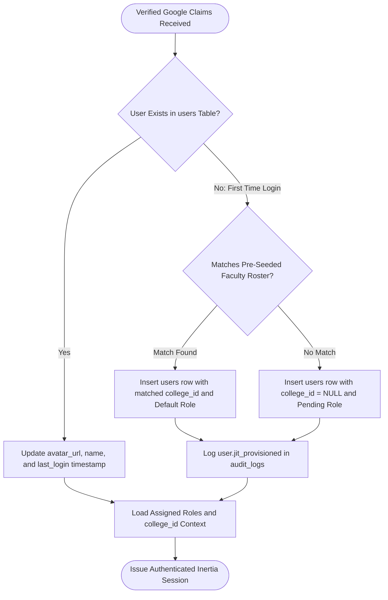
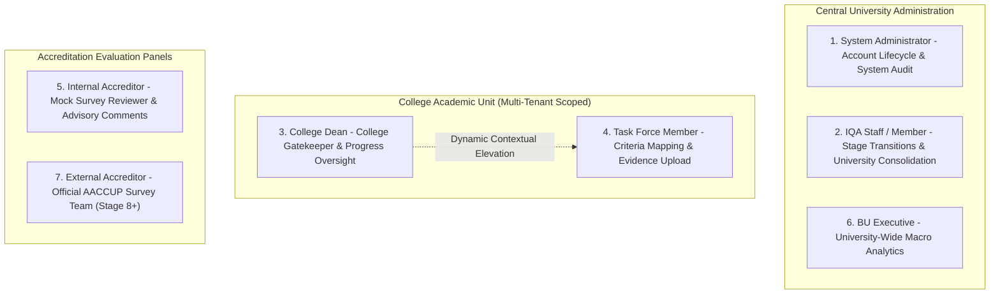
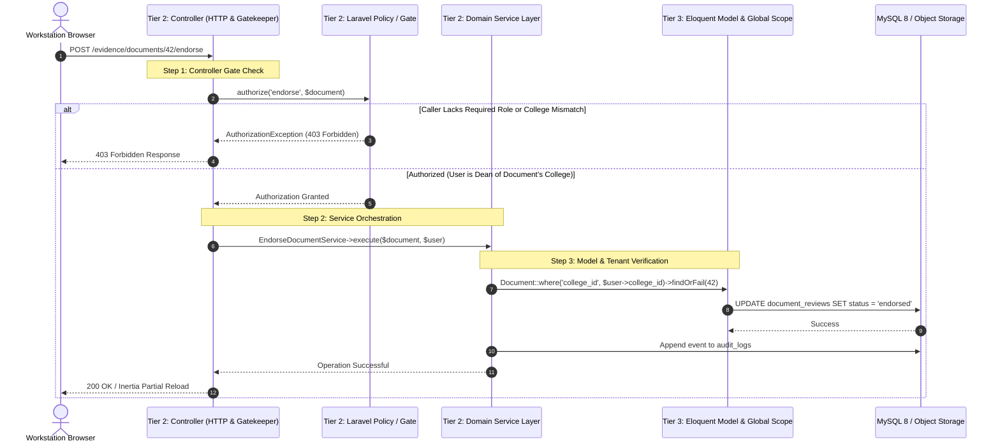

<!--
================================================================================
IQArchive v2 — System Modules Specification
================================================================================
File: v2/docs/MODULES.md
Purpose: Comprehensive functional breakdown and domain specification for all
         subsystem modules within IQArchive v2.
Architecture: Modern Monolithic 3-Tier Architecture (Inertia.js + Laravel 13 + MySQL 8 + S3)
Security Context: Multi-tenant college isolation (college_id scoping), 
                  RBAC gatekeeper across 7 institutional roles, private S3 object
                  storage with 15-minute temporary pre-signed URLs.
Target Institution: Bicol University — Internal Quality Assurance (IQA) Office
================================================================================
-->

# IQArchive v2 — System Modules Specification

This document provides the authoritative functional breakdown of the modular subsystems comprising **IQArchive: A Document Management and Monitoring System for Bicol University (tailored for AACCUP Accreditation)**. 

Each module represents a dedicated operational domain designed to replace fragmented physical paper binders, scattered Google Drive folders, and unmonitored spreadsheet tracking with an auditable, institutional accreditation platform.

---

## High-Level Modules Roadmap

| Module Code | Module Name | Functional Scope | Status |
| :--- | :--- | :--- | :--- |
| **MOD-01** | **Document Management & Evidence Repository** | 3-tier evidence taxonomy (Program, Institutional, Common), dynamic compliance requirements, level-based templates, and shared office reference vaults. | **Detailed & Active** |
| **MOD-02** | **Accreditation Lifecycle & Compliance Monitoring** | Program accreditation cycles, multi-stage state machine tracking, instrument checklists, and compliance progress gauges. | *Upcoming Specification* |
| **MOD-03** | **Review, Verification & Advisory Workflow** | Two-tier approval chain (College Dean gatekeeper $\rightarrow$ IQA consolidation) and Internal Accreditor mock review advisory feedback. | *Upcoming Specification* |
| **MOD-04** | **OCR-Assisted Accreditation Results Processing** | Text and score extraction from physical/scanned accreditation result certificates with mandatory IQA human-in-the-loop verification. | *Upcoming Specification* |
| **MOD-05** | **Notification & Deadline Management** | Automated milestone alerts, missing requirement warnings, dean review triggers, and impending visit countdowns. | *Upcoming Specification* |
| **MOD-06** | **Executive Analytics & Regulatory Audit** | University-wide compliance dashboards, college performance comparisons, and immutable regulatory audit trail exports. | *Upcoming Specification* |
| **MOD-07** | **Authentication, Multi-Tenancy & Access Control** | Google Workspace SSO (`@bicol-u.edu.ph` domain gate), `college_id` multi-tenant scoping, and Dean Lead contextual elevation. | **Detailed & Active** |

---

# MOD-01: Document Management & Evidence Repository Module

The **Document Management and Evidence Repository Module** serves as the foundational data layer and evidence organizer for IQArchive. It is structured around the specific organizational hierarchy and operational workflows of Bicol University and the Accrediting Agency of Chartered Colleges and Universities in the Philippines (AACCUP).

```
MOD-01: DOCUMENT MANAGEMENT & EVIDENCE REPOSITORY
├── 1. Program Documents (College & Academic Program Scoped)
│   ├── Narrative Profile (Program overview & historical development)
│   ├── Program Performance Profile (PPP)
│   ├── Compliance Report (Resolution of previous survey recommendations)
│   ├── Self-Survey Report (SSR / Completed AACCUP evaluation instruments)
│   └── Supporting Documents / Evidence (Granular evidence mapped to AACCUP Areas 1–10)
│       └── *Scope and criteria dynamically adjust based on Program Level (Candidate, Levels I–IV)
│
├── 2. Institutional Documents (University / College-Wide Institutional Evaluation)
│   ├── Portfolio (Comprehensive institutional narrative & strategic profile)
│   ├── Institutional Performance Profile (PPP)
│   ├── Compliance Report (Institutional-level resolutions to recommendations)
│   ├── Self-Survey Report (Institutional accreditation instrument)
│   └── Supporting Documents / Evidence (University-wide policies, facilities, and records)
│
└── 3. Common Documents (Shared University-Wide Reference Vault)
    ├── Managed & Uploaded By: IQA Staff / Members exclusively
    ├── Origin: Specific BU Operating Units (HRDO, Registrar, OSAS, VPAA, BOR, Budget, Planning)
    ├── Content: University Code, Student Handbook, Faculty Manual, BOR Resolutions, General Policies
    ├── Access Rights: Read-only access for ALL Task Forces across all 10+ colleges
    └── Capability: Direct Evidence Linking into Program & Institutional Criteria (Zero duplicate re-uploads)
```

---

## 1. Program Documents Tier

### 1.1 Overview & Scope
Program Documents encapsulate all official submissions, instruments, and supporting evidence created for a **specific academic program** within a given college (e.g., *Bachelor of Science in Information Technology* under the College of Science; *Bachelor of Science in Civil Engineering* under the College of Engineering).

### 1.2 Multi-Tenant Access & Ownership
- **Owner Unit:** The specific College and Department offering the academic program.
- **Access Boundary:** Scoped strictly by `college_id` and `program_id`. 
  - Assigned **Task Force Members** (Program Chairs, Area Chairs, and faculty) have upload, edit, and organizational permissions for their assigned areas.
  - The **College Dean** has supervisory and verification authority over all programs within their college.
  - Users from other colleges are strictly prohibited from viewing or modifying these records.
  - **IQA Staff** and **BU Executives** retain university-wide monitoring access.

### 1.3 Compliance Requirements Structure
Each academic program undergoing accreditation must satisfy five core compliance requirement categories. The specific templates, instruments, and depth of evidence required **dynamically adjust based on the accreditation level** sought (Candidate Status, Level I, Level II, Level III, or Level IV):



1. **Narrative Profile:**  
   A comprehensive narrative overview detailing the program's history, objectives, administrative structure, faculty roster summary, student profile, and physical resources. It establishes the contextual baseline for accreditors before inspecting granular evidence.
2. **Program Performance Profile (PPP):**  
   The structured quantitative and qualitative performance datasheet required by AACCUP, compiling enrollment trends, graduation rates, faculty credentials, board exam passing percentages, and research/extension outputs over the relevant evaluation period.
3. **Compliance Report:**  
   A formal, point-by-point compliance matrix addressing the specific recommendations, weaknesses, and non-conformities noted by the AACCUP survey team during the program's previous accreditation visit. Each prior recommendation must be paired with concrete actions taken, institutional improvements made, and direct links to supporting evidence.
4. **Self-Survey Report (SSR):**  
   The completed, scored AACCUP self-survey instrument. Task Force Area Chairs evaluate their own program against established AACCUP parameters and benchmarks, assigning initial self-survey ratings across all applicable areas.
5. **Supporting Documents / Evidence (Areas 1–10):**  
   The primary digital archive containing the granular PDF artifacts that substantiate the ratings claimed in the Self-Survey Report. Evidence files are organized strictly according to the **10 AACCUP Survey Areas**:
   - **Area 1:** Vision, Mission, Goals, and Objectives (VMGO)
   - **Area 2:** Faculty (Credentials, appointments, teaching loads, publications)
   - **Area 3:** Curriculum and Instruction (Syllabi, curriculum sheets, instructional materials)
   - **Area 4:** Support to Students (Guidance, student organizations, scholarships)
   - **Area 5:** Research (Research outputs, funding, citations, patents)
   - **Area 6:** Extension and Community Involvement (Adopted communities, outreach programs, MOAs)
   - **Area 7:** Library (Holdings, digital subscriptions, library utilization)
   - **Area 8:** Physical Plant and Facilities (Classrooms, campus grounds, maintenance logs)
   - **Area 9:** Laboratories (Equipment inventory, lab manuals, safety compliance)
   - **Area 10:** Administration (Organizational chart, financial resources, records management)

---

## 2. Institutional Documents Tier

### 2.1 Overview & Scope
Institutional Documents encompass evidence and evaluation instruments for **Institutional Accreditation** or holistic college/university-wide assessments. Unlike Program Documents which focus on an isolated curriculum, Institutional Documents evaluate Bicol University as an integrated higher education institution.

### 2.2 Access & Management
- **Managed By:** Central IQA Office Staff in coordination with the University Institutional Accreditation Committee.
- **Access Scope:** University-wide leadership, BU Executives, College Deans, and institutional accreditors.

### 2.3 Compliance Requirements Structure
Institutional Documents mirror the rigorous architecture of Program Documents, with one essential terminological and conceptual replacement: **Portfolio** replaces the Narrative Profile:

1. **Portfolio (Institutional Comprehensive Overview):**  
   The holistic institutional self-portrait of Bicol University. It integrates university governance, charter mandates, long-term strategic plans, financial stability reports, quality management systems (QMS), and macro development milestones.
2. **Institutional Performance Profile (PPP):**  
   Aggregated institution-wide metrics spanning total university enrollment, faculty-to-student ratios across all campuses, aggregate board examination performance, university-wide research grants, and internationalization rankings.
3. **Compliance Report (Institutional Level):**  
   The institutional response matrix resolving overarching recommendations delivered by previous institutional survey teams, such as administrative decentralization, campus infrastructure upgrades, or university-wide digital transformation initiatives.
4. **Self-Survey Report (Institutional):**  
   The macro institutional evaluation instrument scored across university-wide governance, educational quality, research culture, and community engagement.
5. **Supporting Documents / Evidence:**  
   University-level evidence assets, including Board of Regents (BOR) charter policies, audited financial statements, master campus development blueprints, institutional linkages, and legal accreditations.

---

## 3. Common Documents Tier (The Shared University-Wide Reference Vault)

### 3.1 Problem Statement & Architectural Rationale
In traditional accreditation setups (e.g., Google Drive folders or paper binders), every academic program task force independently gathers and re-uploads identical institutional reference files:
- The *Bicol University Code* (~300 pages)
- The *Faculty Manual* (~150 pages)
- The *Student Handbook* (~120 pages)
- Campus safety manuals, BOR resolutions, and university-wide guidelines

Across 50+ academic programs undergoing accreditation across 10 colleges, this redundant practice causes:
1. **Severe Storage Waste:** Redundant copies of massive PDF files consume cloud storage.
2. **Version Divergence:** One program uploads an outdated 2018 Student Handbook, while another uploads the 2023 revision, leading to compliance flags.
3. **Task Force Burnout:** Faculty members waste hours searching for and scanning official university policies that already exist elsewhere.

### 3.2 Operating Architecture & Workflow
The **Common Documents** vault is a centralized, single-source-of-truth repository of official university issuances originating from specific administrative offices:



### 3.3 Administrative Origin & Categorization
Common Documents are classified by their issuing institutional operating unit:
- **Human Resource Development Office (HRDO):** Faculty Merit Promotion System, Staff Manual, Faculty Hiring Guidelines, Performance Evaluation System (SPMS).
- **University Registrar:** Academic Calendar, University Grading System, Enrollment & Graduation Guidelines.
- **Office of Student Affairs and Services (OSAS):** Bicol University Student Handbook, Student Organization Charters, Scholarship and Financial Assistance Guidelines, Student Disciplinary Code.
- **Office of the Vice President for Academic Affairs (VPAA):** Academic Policies, Curriculum Revision Manuals, Transdisciplinary Guidelines.
- **Board of Regents (BOR) Secretariat:** Official BOR Resolutions, University Charters, Reorganization Orders.
- **Budget & Finance Management Office:** Annual Institutional Budget Allocations, Procurement Guidelines.
- **General Services & Physical Plant:** Campus Disaster Risk Reduction & Management Plan (DRRM), Environmental & Safety Protocols.

### 3.4 Governance & Access Rules
- **Upload & Management Authority:** **Strictly restricted to IQA Staff / Members.** Only IQA personnel can upload, tag, update, or archive records in the Common Documents vault. This guarantees that all shared documents are authentic, officially issued, and current.
- **Universal Read Access:** **Accessible to ALL Task Forces across ALL colleges.** Any authenticated faculty member or task force chair can search, view, and inspect common documents regardless of their assigned `college_id`.
- **Direct Evidence Linking:** Task Force members compiling evidence for Program Documents can directly **link** an existing Common Document to any AACCUP criterion without uploading a new file. The system records a junction reference, preventing file duplication while ensuring full compliance coverage.

---

## 4. Document Storage & Security Specifications

All files processed within MOD-01 adhere strictly to the IQArchive security and storage baseline:

1. **Split-Storage Model:**
   - Relational metadata, categorization tags, compliance requirement junctions, and audit entries are stored in **MySQL 8 (3NF)**.
   - Binary PDF files reside in private, encrypted cloud object storage (S3-compatible) using the structured key convention:
     - Program Documents: `evidence/programs/{college_id}/{program_id}/{file_hash}.pdf`
     - Institutional Documents: `evidence/institutional/{institution_id}/{file_hash}.pdf`
     - Common Documents: `evidence/common/{office_code}/{file_hash}.pdf`
2. **Access Security (15-Minute Pre-Signed URLs):**
   - Direct public access to S3 URLs is strictly blocked.
   - All document views require server-side authorization through `DocumentController`. Upon policy verification, the system mints a temporary, cryptographically signed pre-signed URL with a **15-minute expiration**.
3. **Multi-Tenant Isolation:**
   - Database queries for Program Documents automatically enforce the user's `college_id` boundary.
   - Cross-college document access is forbidden except for Common Documents, which are explicitly marked with a public tenant scope across Bicol University.

---

# MOD-07: Authentication, Multi-Tenancy & Access Control Module

The **Authentication, Multi-Tenancy & Access Control Module** constitutes the identity boundary, multi-tenant data isolation layer, and role-based access control (RBAC) enforcement backbone of IQArchive. It guarantees that all administrative interactions, document operations, and compliance evaluations within Bicol University's AACCUP accreditation ecosystem are strictly authenticated, cryptographically verifiable, and partitioned across institutional academic units.

```
MOD-07: AUTHENTICATION, MULTI-TENANCY & ACCESS CONTROL
├── 1. Institutional Single Sign-On (Google Workspace OAuth 2.0 & Domain Gate)
│   ├── Protocol & Handshake (OAuth 2.0 Authorization Code Grant)
│   ├── Strict Institutional Domain Gatekeeper (@bicol-u.edu.ph Enforcement)
│   └── External Accreditor Identity & Domain Exception Handling (AACCUP Panel Access)
│
├── 2. Just-In-Time (JIT) Provisioning & Profile Resolution
│   ├── Automated Account Initialization & Profile Claims Extraction
│   ├── College Affiliation Resolution & Tenant Anchoring
│   └── Open Design Decision: Pre-Seeded Faculty Roster vs. Dynamic Provisioning
│
├── 3. Multi-Tenant Scoping & Logical Data Isolation
│   ├── Mandatory College Tenant Scoping (college_id Constraint Matrix)
│   ├── Global Tenant Exception: Common Documents Reference Vault
│   └── University-Wide Administrative Visibility (IQA Staff, BU Executive, SysAdmin)
│
├── 4. Dynamic Role Resolution & Contextual Elevation
│   ├── The 7 Institutional Roles Matrix & Privilege Boundaries
│   ├── College Dean Contextual Elevation to Task Force Lead Engine
│   └── Session State Serialization & Inertia Shared Props Transmission
│
├── 5. Layered RBAC Enforcement Pattern (Three-Tier Pipeline)
│   ├── Request Pipeline: Controller -> Service -> Eloquent Model / Policy
│   ├── Server-Side Policy Implementation & Gate Evaluation
│   └── Desktop Workstation Viewport & Client-Side UI Reflection
│
└── 6. Storage, Security & Regulatory Compliance Specifications
    ├── Session Security, Lifetime (120 min) & Sliding Inactivity Lock
    ├── Integration with 15-Minute Pre-Signed S3 Object Storage Model
    ├── Republic Act No. 10173 (Data Privacy Act of 2012) Compliance Touchpoint
    └── Immutable Authentication & Authorization Audit Trail Logging
```

---

## 1. Institutional Single Sign-On (SSO) & Domain Gatekeeper

### 1.1 Overview & Scope
IQArchive mandates institutional identity federation to eliminate password sprawl, credential stuffing vulnerabilities, and administrative credential maintenance overhead. The authentication workflow leverages Bicol University's enterprise **Google Workspace Identity Provider (IdP)** via the OAuth 2.0 Authorization Code Grant protocol. All inbound authentication attempts must pass a strict domain-filtering gatekeeper prior to account initialization or session issuance.

### 1.2 OAuth 2.0 Handshake & Claim Extraction
Authentication operates through an OpenID Connect (OIDC) / OAuth 2.0 flow orchestrated by Laravel Socialite:
1. **Challenge Initiation:** The unauthenticated user requests access from the desktop workstation and is redirected to Google Workspace's authorization endpoint with scopes `openid`, `email`, and `profile`, along with a cryptographically generated, single-use `state` token stored in the session to thwart Cross-Site Request Forgery (CSRF).
2. **Token Exchange:** Upon successful authentication at Google, Google redirects back to IQArchive's callback URI (`/auth/google/callback`) with an authorization code and the state token.
3. **Claim Parsing:** The backend server exchanges the authorization code over backchannel TLS 1.3 for an ID Token and Access Token. The server decrypts and verifies the ID Token payload, extracting standard claims:
   - `sub` (Google Subject ID, persisted as `users.google_id`)
   - `email` (Institutional email address)
   - `hd` (Hosted domain claim, where Google asserts the organizational domain)
   - `name` (Full name)
   - `picture` (Profile photo URL, persisted as `users.avatar_url`)
   - `email_verified` (Boolean verification status)

### 1.3 Strict Institutional Domain Gatekeeper
To ensure that only legitimate Bicol University stakeholders gain access, the gatekeeper performs dual-layer validation before any database query:
- **Rule 1 (Hosted Domain Check):** The `hd` token claim must strictly equal `bicol-u.edu.ph`.
- **Rule 2 (Canonical Suffix Check):** The normalized `email` claim must end with the exact institutional suffix `@bicol-u.edu.ph`.
- **Enforcement & Rejection:** Any authentication payload originating from public providers (e.g., `@gmail.com`, `@yahoo.com`) or unauthorized domains is halted immediately at the callback handler. The system discards the authorization token, records a security warning in `audit_logs`, and aborts with an HTTP 403 Forbidden response rendering an unauthorized domain notification.

### 1.4 External Accreditor Domain Exception Handling
Official AACCUP accreditors evaluate academic programs during formal surveys but originate from external state colleges and universities across the Philippines; consequently, they do not possess `@bicol-u.edu.ph` institutional accounts.

To accommodate this operational reality without compromising institutional domain security:
1. **Restricted Lifecycle Gate:** External Accreditor accounts cannot authenticate during early preparation stages. Their access is locked until an accreditation cycle reaches **Stage 8 (Submitted)**.
2. **Provisioning Model:** Accounts are explicitly provisioned and approved by the IQA Director or System Administrator rather than via public self-service.
3. **Access Control & Time-Boxing:** Access permissions are strictly read-only and confined to the specific academic program under survey. Their access window automatically expires upon conclusion of the survey visit.
4. **Open Design Decision — Identity Reconciliation:**
   > [!NOTE]
   > **Open Design Decision — Confirm with Capstone Adviser:**  
   > Reconciling external accreditor authentication with the Google SSO domain restriction can be accomplished via one of two architectural strategies:
   > - *Strategy A (Google OAuth Whitelist / Multi-Tenant Exception):* Permit Google OAuth logins from non-institutional emails *only* if the email address has been pre-registered in an `external_accreditor_whitelist` table by IQA Staff, bypassing the `@bicol-u.edu.ph` domain gate.
   > - *Strategy B (Time-Limited Magic Link / Local Credential Vault):* Issue temporary, time-boxed cryptographically signed magic access tokens sent directly to the accreditor's registered email address for the duration of Stage 8.

### 1.5 Authentication & Gatekeeper Process Flow



---

## 2. Just-In-Time (JIT) Provisioning & Profile Resolution

### 2.1 Overview & Scope
IQArchive eliminates manual user pre-registration barriers by implementing **Just-In-Time (JIT) Provisioning**. When an employee or faculty member authenticates via Google SSO for the first time, the platform dynamically provisions their local database record, establishes initial profile attributes, and assigns them to the appropriate college tenant context.

### 2.2 Baseline Profile Attributes & Schema Mapping
During the initial authentication callback, the system queries the `users` table using the unique `google_id` (sub) and `email`. If no record exists, the system initializes a new row in `users` with normalized baseline metadata extracted from the validated OAuth claims:

| Field | Source Claim / Value | Purpose & Architectural Context |
| :--- | :--- | :--- |
| `name` | `claims.name` | Display name for audit trails and workspace headers. |
| `email` | `claims.email` | Verified institutional email address (`@bicol-u.edu.ph`). |
| `google_id` | `claims.sub` | Immutable subject identifier from Google OAuth. |
| `avatar_url` | `claims.picture` | Profile photo URL rendered in top-right user menu. |
| `status` | `'active'` | Account operational status (`active` or `inactive`). |
| `email_verified_at` | `now()` | Automatically verified via Google Workspace assertions. |
| `college_id` | Resolved via Tenancy Engine | Multi-tenant anchor (`NULL` for university-wide roles). |

### 2.3 College Affiliation & Tenant Anchoring
Because Google OAuth claims only provide identity credentials and do not convey university organizational placement, the JIT engine must anchor the user to a specific `college_id` to establish their multi-tenant boundary. 

### 2.4 Open Design Decision: Provisioning Resolution Models
The method for resolving organizational units and role assignments during first-time login involves trade-offs between administrative automation and access governance:

> [!IMPORTANT]
> **Open Design Decision — Confirm with Capstone Adviser:**  
> - **Option 1: Pre-Seeded Institutional Faculty Roster (Recommended):**  
>   Prior to onboarding, the System Administrator or IQA Office seeds the database with a reference table (`faculty_rosters`) containing institutional emails, designated colleges (`college_id`), and official designations (e.g., Dean, Area Chair). Upon JIT authentication, the system matches `claims.email` against the roster, assigns the pre-configured `college_id` and initial role (`college_dean` or `task_force_member`), and activates the account immediately.  
> - **Option 2: Self-Selection with Dean / Admin Approval:**  
>   First-time users are prompted to select their college affiliation from a controlled dropdown. The account is created with `status = 'pending_verification'` and constrained to a read-only landing view until the College Dean or System Administrator approves the affiliation.  
> - **Option 3: Default Task Force Assignment with Manual Role Escalation:**  
>   All newly authenticated institutional users default to `task_force_member` with an unassigned `college_id`, requiring the College Dean or System Administrator to link them to an active college and program.

### 2.5 JIT Provisioning Flowchart



---

## 3. Multi-Tenant Scoping & Logical Data Isolation

### 3.1 Overview & Scope
Bicol University operates more than ten academic colleges and autonomous campuses (e.g., College of Science, College of Engineering, College of Arts and Letters, BU Polangui). To safeguard academic integrity, prevent premature data leaks, and ensure institutional confidentiality, IQArchive enforces strict **logical multi-tenancy** scoped by `college_id`. Academic units are barred from viewing, modifying, or inspecting other colleges' draft evidence, preliminary scores, or internal reviews.

### 3.2 Relational Tenant Scoping (`college_id` Enforcement)
Multi-tenancy is enforced at the database abstraction layer using Laravel Eloquent Global Scopes and explicit query filters. The primary scoping key is `college_id`:

1. **Automatic Query Filtration:** For college-scoped roles (`college_dean`, `task_force_member`), all queries touching tenant tables automatically inject `WHERE college_id = ?`:
   - `programs` (Academic degree programs belonging to the college)
   - `documents` (Evidence files uploaded by college faculty)
   - `task_forces` (Accreditation committees within the college)
   - `compliance_requirements` (Mapped criteria for college programs)
   - `document_reviews` (Internal review notes and dean endorsement states)
2. **Object Storage Path Partitioning:** Storage keys in the private S3 bucket strictly isolate files by tenant: `evidence/{college_id}/{program_id}/{file_hash}.pdf`. A user cannot stream or download a file if their authorized session does not match the target document's `college_id`.

### 3.3 Universal Scope Exception: Common Documents Vault
As detailed in MOD-01, the **Common Documents** reference vault constitutes the sole architectural exception to college multi-tenancy:
- **Shared Reference Access:** Institutional policies, handbooks, and manuals issued by university operating units (HRDO, Registrar, OSAS, VPAA, BOR) carry a universal scope (`college_id = NULL` or flagged `is_common = true`).
- **Cross-College Readability:** All authenticated faculty across all colleges can search, read, and link Common Documents into their program compliance matrices without duplicating files.
- **Write Restriction:** Only central **IQA Staff** possess permission to upload, modify, or archive documents in the Common Documents vault.

### 3.4 University-Wide Administrative Visibility
Certain institutional roles require macro oversight and bypass college tenant scoping:
- **IQA Staff / Member:** Needs unrestricted university-wide read and consolidation access across all colleges to manage the 9-stage accreditation pipeline.
- **BU Executive:** Holds university-wide read-only visibility to inspect macro progress gauges, comparative college metrics, and accreditation level distributions.
- **System Administrator:** Holds system-wide access to manage user accounts, assign roles, and inspect university-wide audit logs.

### 3.5 Data Entity Tenant Isolation Matrix

| Entity / Database Table | Scoping Column | College User Access (`college_dean`, `task_force_member`) | University-Wide Access (`iqa_staff`, `bu_executive`, `system_admin`) |
| :--- | :--- | :--- | :--- |
| `programs` | `college_id` | Strictly constrained to user's assigned `college_id`. | Full read-only access (BU Exec) or full management (IQA, Admin). |
| `documents` (Program Evidence) | `college_id` | Read/Write/Review scoped strictly to user's college. | Read/Consolidate across all colleges (IQA). Read-only (BU Exec). |
| `documents` (Common Documents) | `is_common = 1` | Universal Read-Only access across all colleges. | Managed exclusively by IQA Staff. |
| `task_forces` & `task_force_members` | `college_id` (via program) | Scoped strictly to college programs and committees. | University-wide visibility across all task forces. |
| `compliance_requirements` | `college_id` (via program) | View and map evidence for own college programs. | University-wide compliance progress tracking. |
| `document_reviews` | `college_id` (via document) | Endorse and view reviews for own college programs. | View review trails across all colleges. |
| `audit_logs` | `college_id` | Deans view college-scoped events; Task Force restricted. | System Administrator and IQA inspect university-wide logs. |

---

## 4. Dynamic Role Resolution & Contextual Elevation

### 4.1 Overview & Scope
IQArchive establishes an access model structured around **seven distinct institutional roles**. Authorization is not static; the system implements **Dynamic Role Resolution**, where user privileges adapt dynamically based on institutional hierarchy and accreditation stage context.

### 4.2 The 7 Institutional Roles Matrix



| Role Code | Role Name | Tenancy Boundary | Core Responsibilities & Authority |
| :--- | :--- | :--- | :--- |
| `system_admin` | **System Administrator** | Global (`college_id = NULL`) | Configures system parameters, provisions institutional accounts, audits logs. Zero authority over accreditation evidence approval. |
| `iqa_staff` | **IQA Staff / Member** | Global (`college_id = NULL`) | Exclusively initiates and authorizes all 9 stage transitions; manages Common Documents vault; consolidates university-wide packages; validates OCR results. |
| `college_dean` | **College Dean** | College-Scoped (`college_id`) | Acts as Tier-1 approval gatekeeper for college evidence; monitors college-wide progress; automatically elevated to Task Force Lead. |
| `task_force_member`| **Task Force Member** | Program-Scoped (`college_id`, `program_id`) | Program Chairs, Area Chairs, and faculty who compile evidence, map documents to AACCUP Areas 1–10, and address advisory findings. |
| `internal_accreditor`| **Internal Accreditor** | Assigned Programs | Senior faculty conducting mock reviews; provides non-blocking advisory notes and deficit flags during Stages 5–7. No approval or veto authority. |
| `bu_executive` | **BU Executive** | Global (`college_id = NULL`) | University President and VPs; possesses read-only access to macro compliance dashboards and institutional analytics. |
| `external_accreditor`| **External Accreditor** | Assigned Programs (Stage 8+) | Official AACCUP survey panel; granted read-only document streaming access strictly after Stage 8 formal submission. |

### 4.3 Dean Contextual Elevation Mechanic
In Bicol University academic operations, College Deans serve as the executive heads of their respective colleges and simultaneously lead the college-level accreditation steering committee.

Rather than creating redundant user records or maintaining conflicting static roles in `user_roles`, IQArchive implements **Dynamic Contextual Elevation**:
1. **Single Role Assignment:** In the database, the user is assigned the role `college_dean` with their specific `college_id`.
2. **Contextual Evaluation:** Whenever an authorization check evaluates whether a user can perform a Task Force action (e.g., editing AACCUP area criteria, uploading supplementary evidence, or organizing criteria binders for programs in their college), the authorization policy resolves:
   ```php
   // Conceptual Policy Logic
   public function updateCriteria(User $user, Program $program): bool
   {
       // Direct Task Force Member of the program
       if ($user->hasRole('task_force_member') && $user->isAssignedTo($program)) {
           return true;
       }

       // College Dean Contextual Elevation: automatically leads all task forces in their college
       if ($user->hasRole('college_dean') && $user->college_id === $program->college_id) {
           return true;
       }

       return false;
   }
   ```
3. **Dual Operational Perspectives:** In the frontend SPA, the College Dean can toggle between two operational modes without re-authenticating:
   - *Executive Gatekeeper View:* Reviewing and endorsing evidence submitted by faculty before IQA consolidation.
   - *Lead Workspace View:* Directly inspecting and working within the AACCUP criteria tree alongside area chairs.

### 4.4 Multi-Role Coexistence & State Serialization
Faculty members frequently hold dual responsibilities (e.g., a Professor who is a Task Force Member for their own program and simultaneously an Internal Accreditor for another college's program).
- The `user_roles` junction table supports multiple simultaneous role assignments per user.
- On each Inertia page request, `HandleInertiaRequests` middleware serializes the user's active roles, permissions array, and assigned college context into the shared props object (`$page.props.auth`), allowing the desktop UI to dynamically render accessible modules.

---

## 5. Layered RBAC Enforcement Pattern

### 5.1 Overview & Scope
Security in IQArchive adheres to a defense-in-depth architecture. Permission checks are enforced across all three tiers of the monolithic application stack (`Controller -> Service -> Eloquent Model / Policy`), ensuring that authorization gates cannot be bypassed by manipulating client-side state or crafting raw HTTP requests.

### 5.2 Three-Tier Enforcement Pipeline



### 5.3 Detailed Enforcement Responsibilities per Architectural Layer

1. **Layer 1: HTTP Controller Gates (`$this->authorize`)**
   - Every controller action must invoke `$this->authorize('ability', $resource)` prior to executing any input handling or business logic.
   - Rejects unauthorized invocations immediately at the perimeter with an HTTP 403 Forbidden response.
2. **Layer 2: Domain Service Business Rules**
   - Domain services encapsulate state-machine guards and pre-condition validation rules.
   - For example, `EndorseDocumentService` validates that a document cannot be endorsed unless it has already passed mandatory OCR confidence verification (MOD-04).
3. **Layer 3: Eloquent Policies & Scoped Query Execution**
   - Laravel Policy classes (`DocumentPolicy`, `AccreditationPolicy`, `StagePolicy`) encapsulate fine-grained permission logic and tenant checks:
     - `view(User $user, Document $doc)`: Enforces `user->college_id === doc->college_id` or `doc->is_common` or user has global role (`iqa_staff`, `bu_executive`).
     - `endorse(User $user, Document $doc)`: Requires `user->hasRole('college_dean')` and matching `college_id`.
     - `advanceStage(User $user, Accreditation $accre)`: Strictly requires `user->hasRole('iqa_staff')`.
   - Eloquent Global Scopes ensure tenant boundaries are applied consistently, preventing accidental cross-tenant data exposure in custom queries.

---

## 6. Storage, Security & Regulatory Compliance Specifications

### 6.1 Session Security, Lifetime & Sliding Inactivity Lock
Authentication session tokens and cookies comply with university enterprise security standards:
- **Encrypted Session Cookies:** Session IDs are stored in AES-256 encrypted cookies flagged `httpOnly`, `SameSite=Lax`, and `Secure` (mandatory TLS 1.3). Tokens are inaccessible to JavaScript, neutralizing Cross-Site Scripting (XSS) session theft.
- **Session Lifetime (120 Minutes):** In alignment with Laravel framework baselines and intensive accreditation workflows (reading multi-page Self-Survey Reports and validating compliance matrices), the absolute session ceiling is set to **120 minutes (2 hours)**. This prevents premature session termination during active work while enforcing periodic credential re-validation against Google SSO.
- **Sliding Inactivity Lock (15 Minutes):** Workstations in shared faculty rooms or departmental offices are guarded by a **15-minute sliding inactivity lock**. The idle countdown timer resets upon each active user transaction; if 15 minutes elapse with zero activity, the interface locks the screen, requiring the user to confirm their credentials before re-accessing sensitive compliance data.
  > [!NOTE]
  > **Open Design Parameter — Confirm with Capstone Adviser:**  
  > The exact duration of the sliding inactivity lock (e.g., 15 minutes vs. 30 minutes) is configurable in `.env` via `SESSION_IDLE_TIMEOUT=15` to balance physical workstation security with academic user convenience.

### 6.2 Pre-Signed S3 URL Security Touchpoint
IQArchive prevents unauthorized file hotlinking and public asset exposure through its split-storage security model:
- **Strictly Private Bucket:** Binary PDF evidence files reside in private cloud object storage at `evidence/{college_id}/{program_id}/{file_hash}.pdf`. Direct public web access is disabled.
- **Policy Verification Gate:** Every file view or download request must be validated through `DocumentController@stream` against `DocumentPolicy@view`.
- **15-Minute Pre-Signed URLs:** Upon successful authorization, the server mints a temporary, cryptographically signed S3 pre-signed URL with a **15-minute time-to-live (TTL)**. The client browser streams the PDF directly from cloud storage, offloading bandwidth from application servers while ensuring links cannot be permanently shared or leaked.

### 6.3 Republic Act No. 10173 (Philippine Data Privacy Act of 2012) Compliance
In accordance with Philippine statutory requirements governing State Universities and Colleges:
- **Lawful Processing for Institutional Accreditation:** Processing of personal information (faculty curriculum vitae, transcripts of records, professional licenses, student evaluation records) is strictly limited to AACCUP accreditation evaluation purposes.
- **Data Privacy Notice & Consent Gate:** Upon first-time Google SSO authentication, all users are presented with a mandatory institutional Data Privacy Notice outlining data handling policies. The user's explicit electronic consent is recorded in `audit_logs` with a timestamp and IP address prior to account activation.
- **Redaction & Role-Restricted Viewing:** Documents flagged as containing Sensitive Personal Information (SPI) under RA 10173 are restricted to authorized Deans, IQA Staff, and formal accreditors; general task force members can only view redacted versions or metadata headers.

### 6.4 Immutable Authentication & Authorization Audit Trail
In alignment with MOD-06 regulatory compliance, all identity and access events are recorded in the append-only `audit_logs` table:
- User login, logout, and domain gate rejection events (`auth.login`, `auth.logout`, `auth.domain_rejected`).
- Failed authorization attempts (HTTP 403 triggers).
- College Dean evidence endorsements and IQA consolidations.
- Contextual elevation triggers and administrative role re-assignments.
- Temporary S3 pre-signed URL generation events for audit verification.

---

## 7. Summary of Future Modules (To Be Detailed Next)

The remaining modules will be formally specified in subsequent revisions:
- **MOD-02:** Accreditation Lifecycle & Compliance Monitoring (Cycles, Milestones, Stage State Machine).
- **MOD-03:** Review, Verification & Advisory Workflow (Dean College Gatekeeper + IQA Review + Internal Mock Accreditor).
- **MOD-04:** OCR-Assisted Accreditation Results Processing (Assisted extraction of physical certificates with IQA validation).
- **MOD-05:** Notification & Deadline Management (Triggered reminders, deficit warnings, stage alerts).
- **MOD-06:** Executive Analytics & Regulatory Audit (Macro dashboards, compliance reports, audit log export).
