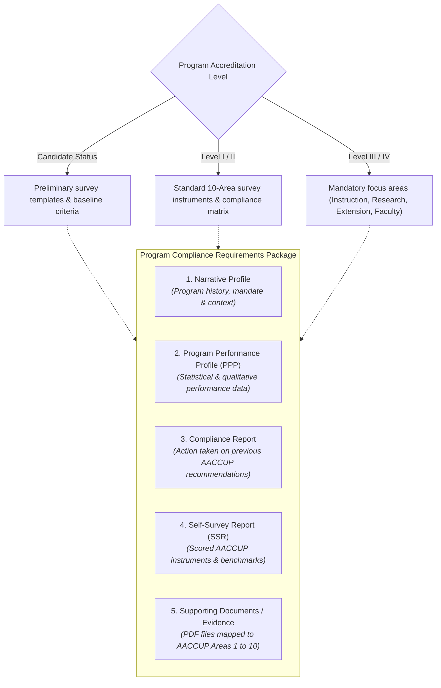
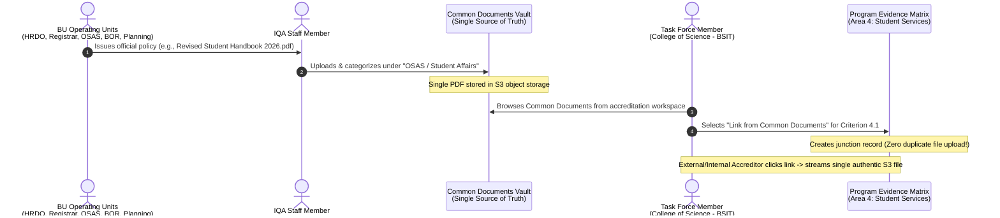

<!--
================================================================================
IQArchive v2 — System Modules Specification
================================================================================
File: v2/docs/MODULES.md
Purpose: Comprehensive functional breakdown and domain specification for all
         subsystem modules within IQArchive v2.
Architecture: Modern Monolithic 3-Tier Architecture (Inertia.js + Laravel 13 + MySQL 8 + S3)
Security Context: Multi-tenant college isolation (college_id scoping), 
                  RBAC gatekeeper across 7 institutional roles, private S3 object
                  storage with 15-minute temporary pre-signed URLs.
Target Institution: Bicol University — Internal Quality Assurance (IQA) Office
================================================================================
-->

# IQArchive v2 — System Modules Specification

This document provides the authoritative functional breakdown of the modular subsystems comprising **IQArchive: A Document Management and Monitoring System for Bicol University (tailored for AACCUP Accreditation)**. 

Each module represents a dedicated operational domain designed to replace fragmented physical paper binders, scattered Google Drive folders, and unmonitored spreadsheet tracking with an auditable, institutional accreditation platform.

---

## High-Level Modules Roadmap

| Module Code | Module Name | Functional Scope | Status |
| :--- | :--- | :--- | :--- |
| **MOD-01** | **Document Management & Evidence Repository** | 3-tier evidence taxonomy (Program, Institutional, Common), dynamic compliance requirements, level-based templates, and shared office reference vaults. | **Detailed & Active** |
| **MOD-02** | **Accreditation Lifecycle & Compliance Monitoring** | Program accreditation cycles, multi-stage state machine tracking, instrument checklists, and compliance progress gauges. | *Upcoming Specification* |
| **MOD-03** | **Review, Verification & Advisory Workflow** | Two-tier approval chain (College Dean gatekeeper $\rightarrow$ IQA consolidation) and Internal Accreditor mock review advisory feedback. | *Upcoming Specification* |
| **MOD-04** | **OCR-Assisted Accreditation Results Processing** | Text and score extraction from physical/scanned accreditation result certificates with mandatory IQA human-in-the-loop verification. | *Upcoming Specification* |
| **MOD-05** | **Notification & Deadline Management** | Automated milestone alerts, missing requirement warnings, dean review triggers, and impending visit countdowns. | *Upcoming Specification* |
| **MOD-06** | **Executive Analytics & Regulatory Audit** | University-wide compliance dashboards, college performance comparisons, and immutable regulatory audit trail exports. | *Upcoming Specification* |
| **MOD-07** | **Authentication, Multi-Tenancy & Access Control** | Google Workspace SSO (`@bicol-u.edu.ph` domain gate), `college_id` multi-tenant scoping, and Dean Lead contextual elevation. | *Upcoming Specification* |

---

# MOD-01: Document Management & Evidence Repository Module

The **Document Management and Evidence Repository Module** serves as the foundational data layer and evidence organizer for IQArchive. It is structured around the specific organizational hierarchy and operational workflows of Bicol University and the Accrediting Agency of Chartered Colleges and Universities in the Philippines (AACCUP).

```
MOD-01: DOCUMENT MANAGEMENT & EVIDENCE REPOSITORY
├── 1. Program Documents (College & Academic Program Scoped)
│   ├── Narrative Profile (Program overview & historical development)
│   ├── Program Performance Profile (PPP)
│   ├── Compliance Report (Resolution of previous survey recommendations)
│   ├── Self-Survey Report (SSR / Completed AACCUP evaluation instruments)
│   └── Supporting Documents / Evidence (Granular evidence mapped to AACCUP Areas 1–10)
│       └── *Scope and criteria dynamically adjust based on Program Level (Candidate, Levels I–IV)
│
├── 2. Institutional Documents (University / College-Wide Institutional Evaluation)
│   ├── Portfolio (Comprehensive institutional narrative & strategic profile)
│   ├── Institutional Performance Profile (PPP)
│   ├── Compliance Report (Institutional-level resolutions to recommendations)
│   ├── Self-Survey Report (Institutional accreditation instrument)
│   └── Supporting Documents / Evidence (University-wide policies, facilities, and records)
│
└── 3. Common Documents (Shared University-Wide Reference Vault)
    ├── Managed & Uploaded By: IQA Staff / Members exclusively
    ├── Origin: Specific BU Operating Units (HRDO, Registrar, OSAS, VPAA, BOR, Budget, Planning)
    ├── Content: University Code, Student Handbook, Faculty Manual, BOR Resolutions, General Policies
    ├── Access Rights: Read-only access for ALL Task Forces across all 10+ colleges
    └── Capability: Direct Evidence Linking into Program & Institutional Criteria (Zero duplicate re-uploads)
```

---

## 1. Program Documents Tier

### 1.1 Overview & Scope
Program Documents encapsulate all official submissions, instruments, and supporting evidence created for a **specific academic program** within a given college (e.g., *Bachelor of Science in Information Technology* under the College of Science; *Bachelor of Science in Civil Engineering* under the College of Engineering).

### 1.2 Multi-Tenant Access & Ownership
- **Owner Unit:** The specific College and Department offering the academic program.
- **Access Boundary:** Scoped strictly by `college_id` and `program_id`. 
  - Assigned **Task Force Members** (Program Chairs, Area Chairs, and faculty) have upload, edit, and organizational permissions for their assigned areas.
  - The **College Dean** has supervisory and verification authority over all programs within their college.
  - Users from other colleges are strictly prohibited from viewing or modifying these records.
  - **IQA Staff** and **BU Executives** retain university-wide monitoring access.

### 1.3 Compliance Requirements Structure
Each academic program undergoing accreditation must satisfy five core compliance requirement categories. The specific templates, instruments, and depth of evidence required **dynamically adjust based on the accreditation level** sought (Candidate Status, Level I, Level II, Level III, or Level IV):



1. **Narrative Profile:**  
   A comprehensive narrative overview detailing the program's history, objectives, administrative structure, faculty roster summary, student profile, and physical resources. It establishes the contextual baseline for accreditors before inspecting granular evidence.
2. **Program Performance Profile (PPP):**  
   The structured quantitative and qualitative performance datasheet required by AACCUP, compiling enrollment trends, graduation rates, faculty credentials, board exam passing percentages, and research/extension outputs over the relevant evaluation period.
3. **Compliance Report:**  
   A formal, point-by-point compliance matrix addressing the specific recommendations, weaknesses, and non-conformities noted by the AACCUP survey team during the program's previous accreditation visit. Each prior recommendation must be paired with concrete actions taken, institutional improvements made, and direct links to supporting evidence.
4. **Self-Survey Report (SSR):**  
   The completed, scored AACCUP self-survey instrument. Task Force Area Chairs evaluate their own program against established AACCUP parameters and benchmarks, assigning initial self-survey ratings across all applicable areas.
5. **Supporting Documents / Evidence (Areas 1–10):**  
   The primary digital archive containing the granular PDF artifacts that substantiate the ratings claimed in the Self-Survey Report. Evidence files are organized strictly according to the **10 AACCUP Survey Areas**:
   - **Area 1:** Vision, Mission, Goals, and Objectives (VMGO)
   - **Area 2:** Faculty (Credentials, appointments, teaching loads, publications)
   - **Area 3:** Curriculum and Instruction (Syllabi, curriculum sheets, instructional materials)
   - **Area 4:** Support to Students (Guidance, student organizations, scholarships)
   - **Area 5:** Research (Research outputs, funding, citations, patents)
   - **Area 6:** Extension and Community Involvement (Adopted communities, outreach programs, MOAs)
   - **Area 7:** Library (Holdings, digital subscriptions, library utilization)
   - **Area 8:** Physical Plant and Facilities (Classrooms, campus grounds, maintenance logs)
   - **Area 9:** Laboratories (Equipment inventory, lab manuals, safety compliance)
   - **Area 10:** Administration (Organizational chart, financial resources, records management)

---

## 2. Institutional Documents Tier

### 2.1 Overview & Scope
Institutional Documents encompass evidence and evaluation instruments for **Institutional Accreditation** or holistic college/university-wide assessments. Unlike Program Documents which focus on an isolated curriculum, Institutional Documents evaluate Bicol University as an integrated higher education institution.

### 2.2 Access & Management
- **Managed By:** Central IQA Office Staff in coordination with the University Institutional Accreditation Committee.
- **Access Scope:** University-wide leadership, BU Executives, College Deans, and institutional accreditors.

### 2.3 Compliance Requirements Structure
Institutional Documents mirror the rigorous architecture of Program Documents, with one essential terminological and conceptual replacement: **Portfolio** replaces the Narrative Profile:

1. **Portfolio (Institutional Comprehensive Overview):**  
   The holistic institutional self-portrait of Bicol University. It integrates university governance, charter mandates, long-term strategic plans, financial stability reports, quality management systems (QMS), and macro development milestones.
2. **Institutional Performance Profile (PPP):**  
   Aggregated institution-wide metrics spanning total university enrollment, faculty-to-student ratios across all campuses, aggregate board examination performance, university-wide research grants, and internationalization rankings.
3. **Compliance Report (Institutional Level):**  
   The institutional response matrix resolving overarching recommendations delivered by previous institutional survey teams, such as administrative decentralization, campus infrastructure upgrades, or university-wide digital transformation initiatives.
4. **Self-Survey Report (Institutional):**  
   The macro institutional evaluation instrument scored across university-wide governance, educational quality, research culture, and community engagement.
5. **Supporting Documents / Evidence:**  
   University-level evidence assets, including Board of Regents (BOR) charter policies, audited financial statements, master campus development blueprints, institutional linkages, and legal accreditations.

---

## 3. Common Documents Tier (The Shared University-Wide Reference Vault)

### 3.1 Problem Statement & Architectural Rationale
In traditional accreditation setups (e.g., Google Drive folders or paper binders), every academic program task force independently gathers and re-uploads identical institutional reference files:
- The *Bicol University Code* (~300 pages)
- The *Faculty Manual* (~150 pages)
- The *Student Handbook* (~120 pages)
- Campus safety manuals, BOR resolutions, and university-wide guidelines

Across 50+ academic programs undergoing accreditation across 10 colleges, this redundant practice causes:
1. **Severe Storage Waste:** Redundant copies of massive PDF files consume cloud storage.
2. **Version Divergence:** One program uploads an outdated 2018 Student Handbook, while another uploads the 2023 revision, leading to compliance flags.
3. **Task Force Burnout:** Faculty members waste hours searching for and scanning official university policies that already exist elsewhere.

### 3.2 Operating Architecture & Workflow
The **Common Documents** vault is a centralized, single-source-of-truth repository of official university issuances originating from specific administrative offices:



### 3.3 Administrative Origin & Categorization
Common Documents are classified by their issuing institutional operating unit:
- **Human Resource Development Office (HRDO):** Faculty Merit Promotion System, Staff Manual, Faculty Hiring Guidelines, Performance Evaluation System (SPMS).
- **University Registrar:** Academic Calendar, University Grading System, Enrollment & Graduation Guidelines.
- **Office of Student Affairs and Services (OSAS):** Bicol University Student Handbook, Student Organization Charters, Scholarship and Financial Assistance Guidelines, Student Disciplinary Code.
- **Office of the Vice President for Academic Affairs (VPAA):** Academic Policies, Curriculum Revision Manuals, Transdisciplinary Guidelines.
- **Board of Regents (BOR) Secretariat:** Official BOR Resolutions, University Charters, Reorganization Orders.
- **Budget & Finance Management Office:** Annual Institutional Budget Allocations, Procurement Guidelines.
- **General Services & Physical Plant:** Campus Disaster Risk Reduction & Management Plan (DRRM), Environmental & Safety Protocols.

### 3.4 Governance & Access Rules
- **Upload & Management Authority:** **Strictly restricted to IQA Staff / Members.** Only IQA personnel can upload, tag, update, or archive records in the Common Documents vault. This guarantees that all shared documents are authentic, officially issued, and current.
- **Universal Read Access:** **Accessible to ALL Task Forces across ALL colleges.** Any authenticated faculty member or task force chair can search, view, and inspect common documents regardless of their assigned `college_id`.
- **Direct Evidence Linking:** Task Force members compiling evidence for Program Documents can directly **link** an existing Common Document to any AACCUP criterion without uploading a new file. The system records a junction reference, preventing file duplication while ensuring full compliance coverage.

---

## 4. Document Storage & Security Specifications

All files processed within MOD-01 adhere strictly to the IQArchive security and storage baseline:

1. **Split-Storage Model:**
   - Relational metadata, categorization tags, compliance requirement junctions, and audit entries are stored in **MySQL 8 (3NF)**.
   - Binary PDF files reside in private, encrypted cloud object storage (S3-compatible) using the structured key convention:
     - Program Documents: `evidence/programs/{college_id}/{program_id}/{file_hash}.pdf`
     - Institutional Documents: `evidence/institutional/{institution_id}/{file_hash}.pdf`
     - Common Documents: `evidence/common/{office_code}/{file_hash}.pdf`
2. **Access Security (15-Minute Pre-Signed URLs):**
   - Direct public access to S3 URLs is strictly blocked.
   - All document views require server-side authorization through `DocumentController`. Upon policy verification, the system mints a temporary, cryptographically signed pre-signed URL with a **15-minute expiration**.
3. **Multi-Tenant Isolation:**
   - Database queries for Program Documents automatically enforce the user's `college_id` boundary.
   - Cross-college document access is forbidden except for Common Documents, which are explicitly marked with a public tenant scope across Bicol University.

---

## 5. Summary of Future Modules (To Be Detailed Next)

The remaining modules will be formally specified in subsequent revisions:
- **MOD-02:** Accreditation Lifecycle & Compliance Monitoring (Cycles, Milestones, Stage State Machine).
- **MOD-03:** Review, Verification & Advisory Workflow (Dean College Gatekeeper + IQA Review + Internal Mock Accreditor).
- **MOD-04:** OCR-Assisted Accreditation Results Processing (Assisted extraction of physical certificates with IQA validation).
- **MOD-05:** Notification & Deadline Management (Triggered reminders, deficit warnings, stage alerts).
- **MOD-06:** Executive Analytics & Regulatory Audit (Macro dashboards, compliance reports, audit log export).
- **MOD-07:** Authentication, Multi-Tenancy & Access Control (Google SSO `@bicol-u.edu.ph`, 7 roles, Dean elevation).
