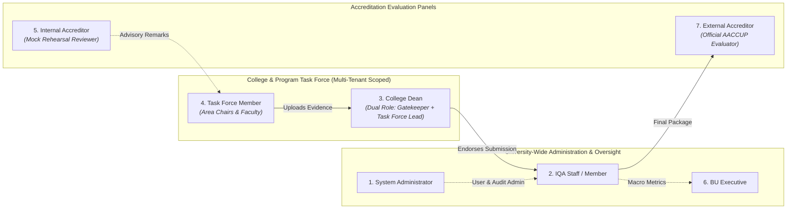
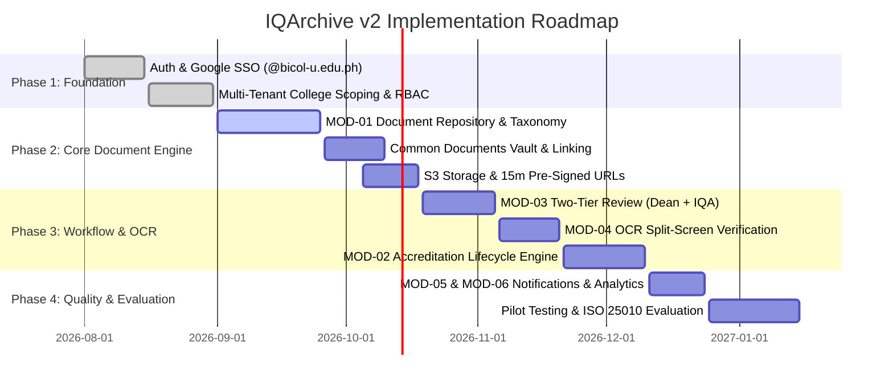

<!--
================================================================================
IQArchive v2 — Product Requirements Document (PRD)
================================================================================
File: v2/docs/PRD.md
Project: IQArchive — Document Management and Monitoring System for Bicol University
Context: Undergraduate Capstone Project | BS Information Technology
         Bicol University College of Science, Legazpi City
Authors: Janice B. Barbacena, Janssen Carl M. Marfil, Vince Mathew O. Temajo,
         Carl Justine O. Tuazon, Cayla C. Villanueva
Target Stakeholder: Office of Internal Quality Assurance (IQA), Bicol University
Regulatory Context: AACCUP Accreditation Standards, ISO/IEC 25010 Quality Model,
                    Republic Act No. 10173 (Philippine Data Privacy Act of 2012)
Architecture Pattern: Modern Monolithic 3-Tier (Inertia.js + Laravel 13 + MySQL 8 + S3)
Security Model: Multi-tenant college isolation (college_id scoping), Google SSO 
                (@bicol-u.edu.ph domain gate), 15-minute temporary pre-signed S3 URLs.
Workstation Policy: Strict Desktop-Only (>= 1024px) | Mobile Unsupported Overlay
================================================================================
-->

# IQArchive v2 — Product Requirements Document (PRD)

**Document Version:** 2.0  
**Status:** Approved Architectural Baseline  
**Target System:** IQArchive: A Document Management and Monitoring System for Bicol University (tailored for AACCUP Accreditation)  

---

## 1. Executive Summary & Problem Framing

### 1.1 Institutional Background & Capstone Origin
Bicol University (BU) is among the premier state universities in the Bicol Region, comprising over ten decentralized colleges and external campuses. The **Office of Internal Quality Assurance (IQA)** serves as the university's regulatory steering engine, tasked with overseeing continuous quality enhancement, managing institutional records, and coordinating accreditation surveys conducted by the **Accrediting Agency of Chartered Colleges and Universities in the Philippines (AACCUP)**.

This Product Requirements Document (PRD) formalizes the design, functional specifications, and operational criteria of **IQArchive**, an undergraduate capstone project developed by BS Information Technology researchers at the Bicol University College of Science. IQArchive synthesizes empirical field research conducted directly with the Bicol University IQA Office into a modern, auditable digital platform.

### 1.2 The Status Quo & Empirical Needs Assessment
A series of empirical elicitation sessions—including an initial exploratory interview with IQA personnel, a formal validation survey involving the IQA Director, two IQA members, and clerical staff, followed by document analysis—revealed that quality assurance and accreditation workflows currently suffer from acute operational fragmentation:

1. **Fragmented Storage Media:** The IQA Office and college departments rely on a disorganized patchwork of physical paper binders in filing cabinets, unstandardized Google Drive shared folders, and local hard drives.
2. **Spreadsheet-Based Tracking Breakdown:** Program compliance statuses and submission milestones are tracked via manually edited spreadsheets. As multiple academic programs across ten colleges undergo simultaneous accreditation, spreadsheets fall out of sync, introducing severe data discrepancies.
3. **Absence of Formal Approval & Audit Trails:** Evidence collection occurs via informal email threads, messaging apps, and in-person flash drive transfers. There is no traceable record of who uploaded an evidence file, when a College Dean endorsed it, or whether an IQA coordinator validated it.
4. **Manual Encoding of Accreditation Results:** Official AACCUP survey results, recommendations, and rating summaries arrive as physical hard-copies or static scanned PDFs. IQA staff must manually transcribe scores and criteria recommendations, creating administrative bottlenecks and risks of clerical transcription errors.
5. **Missed Deadlines & Visibility Blackouts:** The lack of automated deadline alerts and centralized compliance monitoring exposes academic programs to delayed or missed accreditation milestones, jeopardizing their operational status and funding allocations.
6. **Severe Evidence Redundancy:** Across 50+ academic programs, individual task forces repeatedly scan and upload identical institutional records (e.g., University Code, Student Handbook, Faculty Merit Promotion System), consuming excessive storage and producing version divergence.

### 1.3 Product Vision & Core Value Proposition
**IQArchive** transitions Bicol University from fragmented file storage to an integrated **Document Management and Monitoring System tailored for AACCUP Accreditation**. It provides a single source of truth where:
- Institutional and program evidence is systematically gathered, validated through a two-tier approval workflow, and mapped directly to AACCUP survey instruments.
- Common institutional policies are centralized in a shared reference vault, eliminating duplicate file uploads.
- Impending accreditation deadlines, incomplete evidence areas, and survey milestones are tracked with automated alerts and executive visibility.
- Physical accreditation result certificates are transcribed rapidly via assistive Optical Character Recognition (OCR) with mandatory human-in-the-loop validation.

### 1.4 North Star Metrics
- **100% Evidence Auditability:** Every piece of evidence mapped to an AACCUP criterion possesses a verifiable upload timestamp, file hash, college scope, and two-tier approval record.
- **Zero Accreditation Blindspots:** 100% real-time visibility into missing or deficit requirements prior to formal AACCUP survey visits.
- **$\ge 70\%$ Reduction in Duplicate Uploads:** Elimination of redundant institutional policy uploads across academic programs through the centralized Common Documents repository.

---

## 2. User Personas & Jobs-to-be-Done (JTBD)

Access, permissions, and user journeys are strictly structured around **seven institutional roles**:

### Persona 1: System Administrator
- **Institutional Context:** IT specialist responsible for server health, user accounts, and infrastructure maintenance.
- **Core Pain Point:** Needs to manage user access and maintain security without getting tangled in academic accreditation content decisions.
- **JTBD:** *"When faculty or administrators change positions, I want to provision authenticated institutional accounts, assign roles, and audit security logs so that system integrity is strictly maintained."*
- **Permissions:** Full user account lifecycle management, role assignment, audit log inspection. No authority to approve or deny accreditation evidence.

### Persona 2: IQA Staff / Member
- **Institutional Context:** Central quality assurance officers managing university-wide accreditation schedules and compliance files.
- **Core Pain Point:** Overwhelmed by chasing 10 colleges for missing requirements, manually consolidating folders, and transcribing printed survey results.
- **JTBD:** *"When an accreditation cycle is active, I want to establish timelines, monitor submission completeness across all colleges, consolidate dean-approved evidence, and upload shared university issuances so that BU passes AACCUP evaluations seamlessly."*
- **Permissions:** University-wide evidence consolidation, initiation of accreditation milestone transitions, Common Documents management, OCR validation of survey results, deadline configuration.

### Persona 3: College Dean (Dual Role: Gatekeeper & Task Force Lead)
- **Institutional Context:** Academic head of a college (e.g., College of Science, College of Engineering).
- **Core Pain Point:** Liable for program accreditation quality but lacks visibility into what their faculty are preparing until the last minute; overwhelmed by reviewing disorganized drafts.
- **Dual-Role Mechanics:**
  1. *As College Dean (Gatekeeper):* Serves as the Tier-1 approval gate. Reviews and endorses all program evidence uploaded by their college's faculty before central IQA can view it.
  2. *As Task Force Lead (Contextual Elevation):* Automatically leads the college accreditation steering committee, possessing elevated rights to inspect, upload, and organize evidence across all programs within their college.
- **JTBD:** *"When my faculty submit accreditation materials, I want to verify their completeness and authenticity at the college level before endorsing them to IQA, so that only high-quality submissions represent our college."*
- **Permissions:** Scoped to their `college_id`. Program evidence endorsement/rejection, college-wide progress monitoring, criteria editing.

### Persona 4: Task Force Member (Area Chairs & Faculty)
- **Institutional Context:** Subject matter faculty assigned to prepare specific AACCUP survey areas (e.g., Area 1: VMGO, Area 3: Curriculum, Area 5: Research).
- **Core Pain Point:** Spends countless hours searching for old university memos, organizing massive PDF files, and re-uploading documents with no feedback on whether they meet requirements.
- **JTBD:** *"When preparing my assigned accreditation area, I want clear checklists of required documents, the ability to link shared university policies directly, and instant upload status tracking so that my area achieves full compliance without administrative friction."*
- **Permissions:** Scoped to assigned `college_id` and `program_id`. Upload and organize evidence for assigned areas, link Common Documents, view review feedback.

### Persona 5: Internal Accreditor (Mock Reviewer)
- **Institutional Context:** Experienced senior faculty or trained university accreditors assigned to conduct internal "mock surveys" prior to the real AACCUP visit.
- **Core Pain Point:** Forced to flip through thousands of paper pages or messy folders with no easy way to leave annotations or flag evidence gaps for the faculty to fix.
- **JTBD:** *"When conducting a mock accreditation review, I want to navigate the compiled evidence tree exactly as an external surveyor would, leaving advisory comments and defect flags so that the Task Force can remediate weaknesses before the official visit."*
- **Permissions:** Read-only access to compiled evidence for assigned programs. Non-blocking advisory remark creation and gap flagging. No veto or stage approval power.

### Persona 6: BU Executive (University Leadership)
- **Institutional Context:** University President, Vice President for Academic Affairs (VPAA), Campus Directors.
- **Core Pain Point:** Needs high-level institutional clarity on which programs are accredited, which are at risk, and where budget/resource interventions are urgently needed.
- **JTBD:** *"When reviewing institutional performance, I want real-time macro dashboards showing accreditation statuses, compliance percentages, and upcoming surveys across all colleges so that I can make data-driven executive decisions."*
- **Permissions:** University-wide, read-only analytics dashboard access. Program compliance summaries, accreditation level distributions, and compliance report exports.

### Persona 7: External Accreditor (AACCUP Survey Team)
- **Institutional Context:** Official evaluation team dispatched by AACCUP to conduct the formal accreditation survey.
- **Core Pain Point:** Arrives on campus with limited time; struggles when evidence links are broken, documents are disorganized, or file access is cumbersome.
- **JTBD:** *"During the formal survey visit, I want a fast, search-enabled, cleanly categorized digital repository of approved program evidence so that our team can efficiently verify compliance against AACCUP criteria."*
- **Permissions:** Read-only access to formally submitted evidence (activated strictly upon formal submission). High-speed document streaming via secure temporary links.

---

## 3. Product Scope, Boundaries & Explicit Non-Goals

### 3.1 In-Scope Capabilities
- **Modular Evidence Repository (MOD-01):** Structured management of Program Documents, Institutional Documents, and Common Documents with dynamic level-dependent requirements.
- **AACCUP Criteria Tree Integration:** Deep mapping of evidence assets against the 10 standard AACCUP survey areas.
- **Two-Tier Approval Chain:** Formal college gatekeeping (College Dean) preceding central university consolidation (IQA Staff).
- **Extensible Multi-Stage Lifecycle Monitoring:** Configurable milestone progression from initial evidence gathering to formal submission and accredited archiving.
- **Internal Advisory Loop:** Mock-survey review interface for Internal Accreditors with advisory commenting and resolution tracking.
- **Assistive OCR for Accreditation Results:** Tesseract-powered text extraction from physical/scanned result certificates with mandatory IQA human validation.
- **Automated Deadline Notifications:** In-app alerts and reminders for approaching submission milestones and deficit resolutions.
- **Multi-Tenant College Isolation:** Database-level logical isolation guaranteeing colleges cannot access or tamper with peer units' draft evidence.
- **ISO/IEC 25010 Evaluation:** Comprehensive academic software quality assessment with IQA personnel and IT experts.

### 3.2 Explicit Non-Goals & Architectural Delimitations
To ensure architectural focus and timely delivery within the capstone scope, the following boundaries are established:

1. **Strict Desktop-Only Policy ($\ge 1024$px):**  
   IQArchive is engineered as an intensive administrative workstation tool. Complex multi-area compliance matrices, split-screen OCR validation views, and PDF inspection sidebars are incompatible with small mobile screens. Mobile responsiveness is an **explicit non-goal**. A global `<MobileUnsupported />` component will block viewports $< 1024$px with a directive to switch to a desktop browser.
2. **Exclusion of General University Information Systems:**  
   IQArchive is **not** a general-purpose Student Information System (SIS), Human Resource Management System (HRMS), Learning Management System (LMS), or financial accounting platform. It tracks documents and metadata strictly relevant to accreditation and institutional quality assurance.
3. **Assisted OCR, Not Autonomous Decision-Making:**  
   The OCR subsystem does not automatically certify, grade, or evaluate accreditation findings. It functions strictly as an assistive transcription utility; all extracted text must be manually verified and confirmed by an authorized IQA user.
4. **No Public Document Indexing:**  
   No accreditation documents or evidence files are publicly accessible via open internet search. All asset requests require authenticated session authorization and temporary pre-signed S3 links.

---

## 4. Subsystem Modules Specification

### 4.1 MOD-01: Document Management & Evidence Repository
*(Detailed specification formalized in [`v2/docs/MODULES.md`](file:///c:/Users/crljs/OneDrive/Documents/GitHub/iqarchive-capstone/v2/docs/MODULES.md))*

The Document Module partitions institutional records into **three distinct tiers**:

#### Tier 1: Program Documents
- **Scope:** Dedicated to specific academic programs within a college.
- **Requirements Set:** Dynamically adjusts according to the program's accreditation level (Candidate, Level I, Level II, Level III, Level IV):
  1. *Narrative Profile:* Descriptive history, objectives, and academic profile of the program.
  2. *Program Performance Profile (PPP):* Structured quantitative and qualitative performance data.
  3. *Compliance Report:* Formal response matrix resolving recommendations from prior AACCUP surveys.
  4. *Self-Survey Report (SSR):* Scored AACCUP instruments and criteria benchmarks.
  5. *Supporting Documents / Evidence:* Granular PDF files classified under **AACCUP Areas 1 to 10** (VMGO, Faculty, Curriculum, Student Support, Research, Extension, Library, Physical Plant, Laboratories, Administration).

#### Tier 2: Institutional Documents
- **Scope:** University-wide or college-wide institutional assessments.
- **Requirements Set:** Mirrors the program tier, replacing the Narrative Profile with the comprehensive **Portfolio** (comprehensive institutional self-portrait), along with Institutional PPP, Institutional Compliance Report, Institutional Self-Survey Report, and University-Wide Supporting Documents.

#### Tier 3: Common Documents (Shared University-Wide Reference Vault)
- **Scope:** Single-source-of-truth repository for official university issuances originating from specific operating units (HRDO, Registrar, OSAS, VPAA, BOR Secretariat, Budget/Finance, Planning).
- **Governance:** Uploaded, versioned, and maintained **exclusively by IQA Staff**.
- **Access:** Read-only access granted to **all Task Forces across all colleges**.
- **Evidence Linking:** Task Forces satisfy AACCUP criteria by directly linking existing Common Documents, completely eliminating duplicate PDF uploads.

---

### 4.2 MOD-02: Accreditation Lifecycle & Compliance Monitoring
- **Lifecycle Progression:** Tracks academic programs through an extensible multi-stage accreditation pipeline:
  - *Draft / Setup:* Initial cycle configuration and instrument assignment by IQA.
  - *Preliminary Preparation:* Task Force assignment and criteria allocation.
  - *Evidence Collection:* Active document uploading by Task Force members.
  - *College Endorsement:* Review and gatekeeping by College Dean.
  - *Evidence Consolidation:* Central verification and compilation by IQA Staff.
  - *Feedback Integration & Mock Review:* Advisory inspection and commenting by Internal Accreditors.
  - *Revision & Deficit Remediation:* Task Force resolves flagged weaknesses.
  - *Formal Submission:* Accreditation package locked; external accreditor read access unlocked.
  - *Accredited Archive:* Post-survey archiving of final ratings and certificates.
- **Pre-Condition Validation:** Automated checks ensure a program cannot advance stages if required compliance documents are missing, criteria slots are empty, or Dean endorsement has not occurred.
- **Compliance Gauges:** Real-time percentage trackers displaying uploaded vs. required evidence per area.

---

### 4.3 MOD-03: Review, Verification & Advisory Workflow
- **Two-Tier Approval Chain:**
  1. *Tier 1 (College Level):* Task Force Member uploads evidence $\rightarrow$ College Dean reviews, requests revisions, or formally endorses the document.
  2. *Tier 2 (University Level):* Dean-endorsed document advances to IQA Staff $\rightarrow$ IQA consolidates the evidence into the official accreditation package.
- **Internal Accreditor Advisory Loop:**
  - Mock reviewers traverse the compiled AACCUP criteria tree in a dedicated review interface.
  - Can pin advisory comments and deficit flags directly to specific documents or criteria.
  - Comments trigger non-blocking alerts to Area Chairs, enabling pre-survey remediation without impeding formal administrative workflows.

---

### 4.4 MOD-04: OCR-Assisted Accreditation Results Processing
- **Operational Scope:** Targeted at official AACCUP survey results, certificate scans, and summary scorecards.
- **Assistive Extraction Engine:** Employs Tesseract OCR (with local execution in development and Google Cloud Vision adapter readiness in production) to extract printed text, numerical ratings, and criteria recommendations.
- **Mandatory Human-in-the-Loop Validation:**
  - Prevents erroneous OCR outputs from polluting institutional compliance records.
  - Presents a split-screen verification interface: original uploaded image on the left, editable extracted text/scores on the right.
  - Extracted fields require explicit user confirmation and editing by IQA Staff before database commitment.

---

### 4.5 MOD-05: Notification & Deadline Management
- **Automated Milestone Reminders:** Schedules notifications for upcoming submission deadlines, missing compliance reports, and impending survey dates.
- **Workflow Triggers:** Dispatches alerts when:
  - A College Dean rejects a document upload and requests revision.
  - An Internal Accreditor leaves an advisory remark or deficit flag.
  - An accreditation cycle advances to a new operational stage.
- **Multi-Channel Delivery:** In-app notification bell with unread counters, backed by extensible institutional email dispatch.

---

### 4.6 MOD-06: Executive Analytics & Regulatory Audit
- **Executive Dashboard:** Macro analytics tailored for BU Executives and the IQA Director:
  - University-wide accreditation distribution (Programs at Candidate, Level I, II, III, IV).
  - Comparative college compliance completion rates.
  - Upcoming AACCUP survey calendar.
- **Immutable Audit Trail:** Append-only log recording every critical domain event: user authentication, document upload, dean endorsement, IQA consolidation, stage advancement, and file access timestamps.
- **Compliance Report Generation:** One-click export of formal compliance reports and criteria completion matrices formatted for AACCUP presentation.

---

### 4.7 MOD-07: Authentication, Multi-Tenancy & Access Control
- **Institutional Single Sign-On (SSO):** Google Workspace OAuth 2.0 integration strictly gated to `@bicol-u.edu.ph` email domains. Non-institutional domains are rejected at the gatekeeper.
- **Just-In-Time (JIT) Provisioning:** Automatically provisions user accounts and resolves baseline profile data on first successful Google authentication.
- **Multi-Tenant Scoping:** All core data queries enforce a mandatory `college_id` scope. Academic units cannot view, modify, or inspect sibling colleges' non-public evidence or draft reviews.
- **Dynamic Role Resolution:** Automatically elevates College Deans to Task Force Leads for their respective academic units.

---

## 5. Technical & Storage Architecture Requirements

### 5.1 Technology Stack Baseline
- **Frontend SPA (Tier 1):** Inertia.js + Vue 3 (Composition API `<script setup>`) + Tailwind CSS v4 + UI primitives (Shadcn Vue, Lucide Icons).
- **Backend Application Core (Tier 2):** Laravel 13 MVC adhering to `Controller -> Service -> Eloquent Model / Policy` architecture.
- **Database & Storage (Tier 3):** MySQL 8 (3NF normalized metadata, JSON columns for OCR metrics) + Cloud Object Storage (Private S3-compatible bucket).
- **OCR Subsystem:** Tesseract OCR engine (inline processing) with adapter pattern supporting cloud vision services.

### 5.2 Split-Storage & Pre-Signed URL Security
To protect sensitive university intellectual property, faculty records, and accreditation assets:
1. **Private S3 Storage:** Binary PDF evidence is stored in a strictly private S3 bucket under structured keys:
   - Program: `evidence/programs/{college_id}/{program_id}/{file_hash}.pdf`
   - Institutional: `evidence/institutional/{institution_id}/{file_hash}.pdf`
   - Common: `evidence/common/{office_code}/{file_hash}.pdf`
2. **Zero Public Access:** Direct web server public file serving is disabled.
3. **15-Minute Pre-Signed URLs:** Document viewing or streaming requests must pass through `DocumentController` authorization policies. Upon validation, the server generates a cryptographically signed URL valid for **15 minutes only**, preventing hotlinking, unauthorized sharing, and link leakage.

---

## 6. Non-Functional Requirements & Regulatory Compliance

### 6.1 Regulatory Compliance & Privacy
- **Republic Act No. 10173 (Philippine Data Privacy Act of 2012):**
  - Personal data (faculty CVs, student records, evaluation forms) processed strictly for institutional quality assurance.
  - Mandatory Data Privacy Notices displayed on all user registration and evidence intake interfaces.
  - User consent logging and role-restricted viewing of personal data fields.
- **Data Encryption Standards:**
  - Data at Rest: AES-256 encryption across storage volumes and sensitive database fields.
  - Data in Transit: Mandatory HTTPS/TLS encryption across all client-server and server-S3 transactions.

### 6.2 System Performance & Reliability Benchmarks
- **Page Response Time:** Inertia client-side page transitions $\le 500$ms under standard university network conditions.
- **OCR Turnaround Time:** OCR text extraction execution $\le 3.0$ seconds for standard 1–3 page accreditation result certificates.
- **Availability:** Target 99.5% uptime during active accreditation evaluation cycles.

### 6.3 Software Quality Evaluation (ISO/IEC 25010 Framework)
In fulfillment of academic capstone requirements, IQArchive will be formally evaluated against the **ISO/IEC 25010 Software Quality Model**:
- **Characteristics Evaluated:** Functional Suitability, Performance Efficiency, Compatibility, Usability, Reliability, Security, Maintainability, Portability.
- **Respondent Sampling:** Total population sampling of available Bicol University IQA Office personnel (Director, coordinators, clerical staff) combined with IT professionals and academic stakeholder representatives ($N = 10\text{--}15$).
- **Evaluation Instrument:** Structured survey questionnaire utilizing a 5-point Likert scale (1: Strongly Disagree to 5: Strongly Agree).
- **Target Acceptance Benchmark:** Overall mean score $\ge 4.00$ ("Agree" or "Strongly Agree") across all ISO 25010 quality characteristics.

---

## 7. Implementation Roadmap & Development Milestones

---

## 8. Document Approval & Traceability

This Product Requirements Document represents the reconciled, authoritative baseline for IQArchive v2, superseding legacy preliminary specifications and aligning the capstone academic manuscript with active software engineering architecture.

| Prepared By (Proponents) | Academic Affiliation | Endorsed To |
| :--- | :--- | :--- |
| **Janice B. Barbacena** **Janssen Carl M. Marfil** **Vince Mathew O. Temajo** **Carl Justine O. Tuazon** **Cayla C. Villanueva** | BS Information Technology Bicol University College of Science Legazpi City | **Office of Internal Quality Assurance (IQA)** Bicol University Legazpi City |
