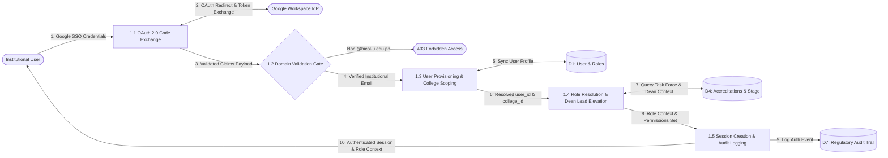
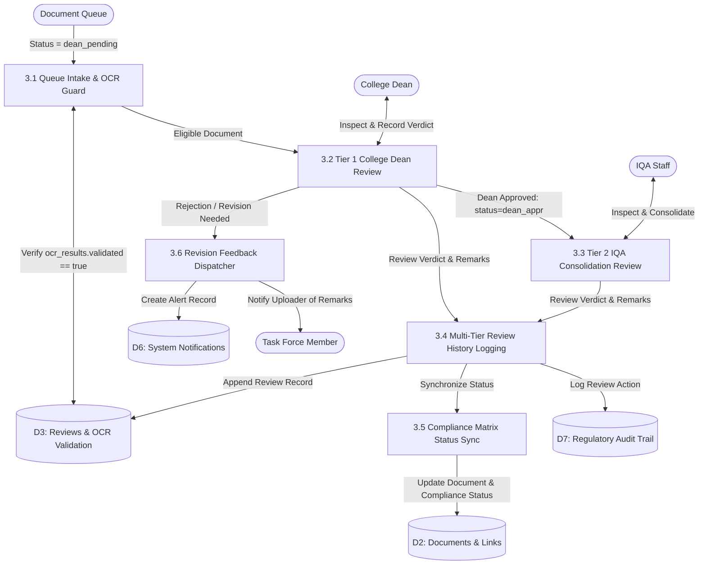
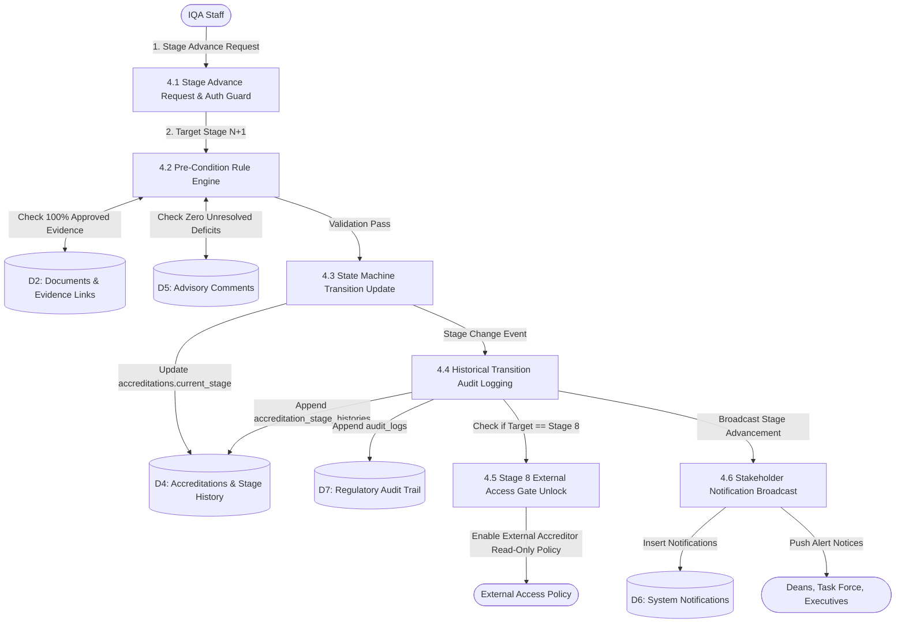
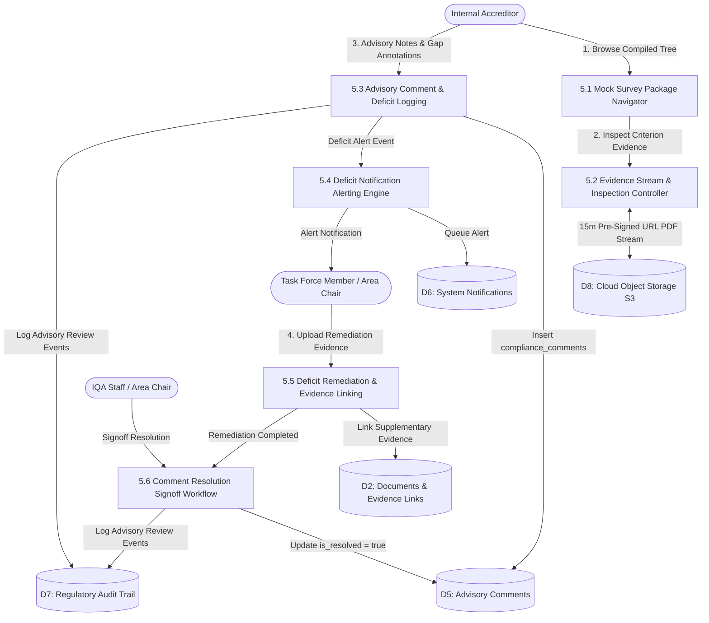

<!--
===================================================================================
IQARCHIVE V2 — LEVEL 2 DATA FLOW SPECIFICATION & SUB-PROCESS DECOMPOSITION
===================================================================================
Architectural Layer: Documentation / Architectural Diagrams / Data Flow Engine
Target System: Bicol University Internal Quality Assurance (IQA) Office
Security Context: Multi-Tenant College Isolation, Google SSO OAuth 2.0, RBAC Matrix
Associated Diagram Files:
  - v2/docs/dataflow/subprocess/lvl2-proc1-auth-scoping.drawio.xml
  - v2/docs/dataflow/subprocess/lvl2-proc2-document-submission-ocr.drawio.xml
  - v2/docs/dataflow/subprocess/lvl2-proc3-document-review-verification.drawio.xml
  - v2/docs/dataflow/subprocess/lvl2-proc4-accreditation-pipeline.drawio.xml
  - v2/docs/dataflow/subprocess/lvl2-proc5-qa-advisory-review.drawio.xml
Parent Catalog: v2/docs/dataflow/iqarchive-data-flows.yaml
===================================================================================
-->

# IQArchive v2 — Level 2 Data Flow Diagrams (DFD) Specification

This document provides the formal engineering specification, process dictionaries, and visual data flow representations for the **Level 2 decomposition** of the IQArchive accreditation management platform. Each core Level 1 process is exploded into its functional sub-processes, data store accesses, entity boundaries, and security enforcement gates.

---

## 1. Architectural Overview & Decomposition Map

In IQArchive's 3-tier monolithic architecture, Level 1 processes encapsulate broad domain subsystems. Level 2 diagrams deconstruct each subsystem into granular operations executed by Laravel controllers, dedicated domain services, and Eloquent models:

| Level 1 Process | Sub-Process Range | Core Focus | Dedicated Diagram File |
| :--- | :--- | :--- | :--- |
| **1.0 Google SSO Authentication & Scoping** | `1.1` – `1.5` | OAuth 2.0 token exchange, institutional domain gating, JIT user provisioning, multi-tenant college scoping, and session establishment. | [`lvl2-proc1-auth-scoping.drawio.xml`](file:///c:/Users/janss/Herd/iqarchive/v2/docs/dataflow/subprocess/lvl2-proc1-auth-scoping.drawio.xml) |
| **2.0 Document Submissions, Linking & OCR** | `2.1` – `2.7` | MIME validation, cloud storage write (S3), SHA-256 hashing, synchronous inline OCR (accreditation results), confidence flagging, split-screen validation (15m pre-signed URL), and criteria junction linking. | [`lvl2-proc2-document-submission-ocr.drawio.xml`](file:///c:/Users/janss/Herd/iqarchive/v2/docs/dataflow/subprocess/lvl2-proc2-document-submission-ocr.drawio.xml) |
| **3.0 Document Review & Dean Verification** | `3.1` – `3.6` | OCR validation guard, Tier 1 College Dean gatekeeping, Tier 2 IQA consolidation, review history logging, and revision alert dispatching. | [`lvl2-proc3-document-review-verification.drawio.xml`](file:///c:/Users/janss/Herd/iqarchive/v2/docs/dataflow/subprocess/lvl2-proc3-document-review-verification.drawio.xml) |
| **4.0 Accreditation Pipeline & Stage Governance** | `4.1` – `4.6` | Stage transition authorization, pre-condition validation rules (100% compliance, zero gaps), state machine updates, transition logging, and Stage 8 external access unlocking. | [`lvl2-proc4-accreditation-pipeline.drawio.xml`](file:///c:/Users/janss/Herd/iqarchive/v2/docs/dataflow/subprocess/lvl2-proc4-accreditation-pipeline.drawio.xml) |
| **5.0 Quality Assurance & Advisory Review** | `5.1` – `5.6` | Mock survey tree traversal, streaming evidence inspection, advisory remark logging, deficit alerts to Area Chairs, supplementary evidence linking, and sign-off resolution. | [`lvl2-proc5-qa-advisory-review.drawio.xml`](file:///c:/Users/janss/Herd/iqarchive/v2/docs/dataflow/subprocess/lvl2-proc5-qa-advisory-review.drawio.xml) |

---

## 2. Process 1.0: Google SSO Authentication & Scoping

Decomposes the authentication pipeline that grants institutional users access while enforcing strict domain verification and college-level multi-tenancy.

### 2.1 Sub-Process Dictionary

- **1.1 Google OAuth 2.0 Code Exchange:** Initiates handshake with Google Workspace Identity Provider, generates secure state parameter, and exchanges authorization code for JWT token claims.
- **1.2 Institutional Domain Validation Gate:** Inspects the verified email claim. Only emails ending in `@bicol-u.edu.ph` pass; all external domains are immediately rejected with HTTP 403 Forbidden.
- **1.3 User Provisioning & College Scoping:** Performs Just-In-Time (JIT) lookup in table `users`. Provisions new accounts or updates profile stamps, anchoring the user to their designated `college_id`.
- **1.4 Role Resolution & Dean Lead Elevation:** Resolves assigned roles from `roles` / `user_roles`. Checks `task_force_members` to establish program-level context; dynamically evaluates Dean status to elevate College Deans to Task Force Leads for their unit.
- **1.5 Session Creation & Auth Audit Logging:** Issues Laravel session cookie with serialized role permissions, and records an immutable authentication event in `audit_logs`.

### 2.2 Data Flows & Stores

- **External Entities:** Institutional User (any role), Google Workspace IdP (OAuth 2.0).
- **Data Stores Accessed:**
  - `D1: User & Roles` (`users`, `roles`, `user_roles`) — Read / Write.
  - `D4: Accreditations & Stage History` (`task_force_members`) — Read.
  - `D7: Regulatory Audit Trail` (`audit_logs`) — Append-only.

### 2.3 Mermaid Visualization



---

## 3. Process 2.0: Document Submissions, Linking & OCR

Decomposes the evidence upload workflow from client-side file selection through private cloud object storage write, synchronous inline OCR token extraction (targeted at accreditation results), confidence flagging, human validation via pre-signed URLs, and AACCUP criteria linking.

### 3.1 Sub-Process Dictionary

- **2.1 File Ingestion & MIME Validation:** Inspects uploaded payload against strict constraints: MIME `application/pdf`, max file size 50MB, and valid upload session token.
- **2.2 SHA-256 Hashing & Cloud Storage Write:** Computes cryptographic SHA-256 checksum for deduplication and non-repudiation. Stores the file directly to private S3-compatible cloud storage at object key `evidence/{college_id}/{program_id}/{hash}.pdf`.
- **2.3 Synchronous OCR Execution:** Executes inline OCR processing on the uploaded accreditation result (1–3 pages) in 1.5–3 seconds via `ProcessDocumentOcrService` (using Cloud OCR / Tesseract driver), producing structured text outputs with word-level bounding boxes and confidence metrics without queue overhead.
- **2.4 Token Parsing & Word Confidence Flagging:** Parses OCR outputs into structured JSON (`pages_data`, `confidence_metrics`). Evaluates individual token confidence scores against threshold $\theta = 0.65$, tagging low-confidence tokens for visual verification.
- **2.5 Split-Screen Human Validation & Editing:** Renders an interactive split-screen review canvas in the Inertia/Vue client (PDF rendered via 15-minute temporary pre-signed URL alongside editable OCR transcription with flagged words highlighted). Collects manual corrections from the uploader.
- **2.6 Criteria Matrix Junction Linking:** Associates the validated document record with target AACCUP criteria by creating junction entries in `accreditation_document_links`.
- **2.7 Submission Event & Audit Dispatcher:** Updates document status to `dean_pending`, appends an entry to `audit_logs`, and dispatches notification alerts to the College Dean.

### 3.2 Data Flows & Stores

- **External Entities:** Task Force Member (Area SME), Cloud OCR Engine / Adapter.
- **Data Stores Accessed:**
  - `D8: Cloud Object Storage (S3-Compatible)` (`evidence/{college_id}/{program_id}/{hash}.pdf`) — Write.
  - `D2: Documents & Evidence Links` (`documents`, `accreditation_document_links`) — Read / Write.
  - `D3: Reviews & OCR Validation` (`ocr_results`, `raw_text`, `edited_text`) — Write.
  - `D7: Regulatory Audit Trail` (`audit_logs`) — Append-only.
  - `D6: System Notifications` (`notifications`) — Append-only.

### 3.3 Mermaid Visualization

```mermaid
flowchart TD
    TF([Task Force Member]) -->|1. Evidentiary Document & Tags| P21[2.1 File Ingestion & MIME Validation]
    P21 -->|2. Validated PDF Stream| P22[2.2 SHA-256 Hashing & Cloud Storage Write]
    P22 -->|Write Private S3 Bucket| D8[(D8: Cloud Object Storage S3)]
    P22 -->|3. Object Key & Hash| P23[2.3 Synchronous OCR Execution]
    P23 <-->|Accreditation Result PDF / TSV Stream| OCR([Cloud OCR Engine])
    P23 -->|4. Structured Token Metrics| P24[2.4 Token Parsing & Confidence Flagging]
    P24 -->|5. Flagged Words < 0.65| P25[2.5 Split-Screen Validation UI]
    TF <-->|Interactive Review & Text Edits (Pre-Signed URL)| P25
    P25 -->|6. Validated OCR Record| D3[(D3: OCR Validation)]
    P22 -->|7. Target Criterion Mapping| P26[2.6 Criteria Matrix Junction Linking]
    P26 <-->|Insert Links & Read Checklist| D2[(D2: Documents & Evidence Links)]
    P26 -->|8. Trigger Submission Event| P27[2.7 Submission Event & Audit Dispatcher]
    P27 -->|Log Submission Event| D7[(D7: Regulatory Audit Trail)]
    P27 -->|Dispatch Dean Alert| D6[(D6: System Notifications)]
```

---

## 4. Process 3.0: Document Review & Dean Verification

Decomposes the dual-tier verification gate: Tier 1 (College Dean approval) and Tier 2 (IQA Consolidation review).

### 4.1 Sub-Process Dictionary

- **3.1 Queue Intake & OCR Validation Guard:** Filters pending queue for documents with status `dean_pending`. Asserts that associated OCR processing is marked `validated=true` before unlocking review actions.
- **3.2 Tier 1 College Dean Gatekeeper Review:** College Dean inspects evidence against college academic criteria and issues verification verdict (`approved`, `rejected`, or `revision_required`) with qualitative feedback remarks.
- **3.3 Tier 2 IQA Consolidation Review & Signoff:** Central IQA Staff inspects Dean-approved evidence (`status = 'dean_appr'`) to ensure institutional standardization before advancing to accreditation readiness.
- **3.4 Multi-Tier Review History Logging:** Appends an immutable review record to `document_reviews` capturing `reviewer_id`, `review_tier`, `verdict`, and timestamped remarks.
- **3.5 Compliance Matrix Status Synchronization:** Evaluates whether linked criteria now meet compliance thresholds. Updates `documents.status` and sets `compliance_requirements.status = 'compliant'`.
- **3.6 Revision Feedback & Notification Dispatch:** Dispatches targeted notification events to the original Task Force uploader if corrections or re-uploads are requested.

### 4.2 Data Flows & Stores

- **External Entities:** College Dean (Tier 1 Reviewer), IQA Staff (Tier 2 Reviewer), Task Force Member (Uploader).
- **Data Stores Accessed:**
  - `D3: Reviews & OCR Validation` (`document_reviews`, `ocr_results`) — Read / Write.
  - `D2: Documents & Evidence Links` (`documents`, `compliance_requirements`) — Read / Write.
  - `D7: Regulatory Audit Trail` (`audit_logs`) — Append-only.
  - `D6: System Notifications` (`notifications`) — Append-only.

### 4.3 Mermaid Visualization



---

## 5. Process 4.0: Accreditation Pipeline & Stage Governance

Decomposes the 9-stage sequential state machine governing accreditation lifecycles, strictly controlled by IQA Staff.

### 5.1 Sub-Process Dictionary

- **4.1 Stage Advance Request & Authorization Guard:** Enforces policy gate: only users with active `iqa_staff` or `admin` role can initiate stage transitions.
- **4.2 Pre-Condition Rule Engine Evaluation:** Executes automated stage validation checks:
  - *Stage 1 $\to$ 2 (Creation $\to$ Assignment):* Task Force chairs assigned across all required areas.
  - *Stage 4 $\to$ 5 (Upload $\to$ Mock Review):* 100% of mandatory core criteria have approved evidence attached.
  - *Stage 7 $\to$ 8 (Consolidation $\to$ Formal Submission):* Zero open/unresolved advisory comments in `compliance_comments`.
- **4.3 State Machine Transition & Current Stage Update:** Mutates `accreditations.current_stage` from $N \to N+1$. Rollbacks or non-linear jumps are prohibited by domain policy.
- **4.4 Historical Transition Audit Logging:** Creates an append-only snapshot in `accreditation_stage_histories` documenting transition timestamp, authorizing user ID, and justification notes.
- **4.5 Stage 8 External Access Gate Unlock:** When transitioning into Stage 8 (*Formal Accreditation Submission*), triggers an event that enables read-only viewing permissions for External Accreditor roles.
- **4.6 Stakeholder Notification Broadcast Engine:** Dispatches real-time broadcast notices to all assigned Deans, Task Force chairs, and BU Executives regarding the newly activated stage.

### 5.2 Data Flows & Stores

- **External Entities:** IQA Staff (Pipeline Administrator), University Stakeholders (Deans, Task Force, BU Executives).
- **Data Stores Accessed:**
  - `D2: Documents & Evidence Links` (`compliance_requirements`, `accreditation_document_links`) — Read.
  - `D5: Advisory Comments` (`compliance_comments`) — Read.
  - `D4: Accreditations & Stage History` (`accreditations`, `accreditation_stage_histories`) — Read / Write.
  - `D7: Regulatory Audit Trail` (`audit_logs`) — Append-only.
  - `D6: System Notifications` (`notifications`) — Append-only.

### 5.3 Mermaid Visualization



---

## 6. Process 5.0: Quality Assurance & Advisory Review

Decomposes the pre-submission advisory review subsystem executed by Internal Accreditors during Stages 5–7.

### 6.1 Sub-Process Dictionary

- **5.1 Mock Survey Package & Criteria Navigator:** Displays an interactive tree view of the accreditation criteria hierarchy for programs currently in Stages 5, 6, or 7.
- **5.2 Evidence Stream & Inspection Controller:** Streams authorized PDF evidence directly from cloud object storage via temporary 15-minute pre-signed URLs minted by `DocumentController`, enforcing read-only inspection without persistent public URLs.
- **5.3 Advisory Comment & Deficit Flag Logging:** Collects qualitative observations, recommendations, and deficiency flags from Internal Accreditors. Persists entries in `compliance_comments`.
- **5.4 Deficit Notification Alerting Engine:** Automatically identifies the Area Chair responsible for the flagged criterion and queues an urgent deficit alert.
- **5.5 Deficit Remediation & Evidence Linking:** Task Force SME uploads replacement or supplementary evidence addressing the deficit, automatically linking the new file to the contested criterion.
- **5.6 Comment Resolution Signoff Workflow:** Upon verifying the uploaded remediation evidence, the Area Chair or IQA Staff marks the advisory comment as resolved (`is_resolved = true`), fulfilling the Stage 8 pre-condition.

### 6.2 Data Flows & Stores

- **External Entities:** Internal Accreditor (Mock Reviewer), Task Force Member (Area SME Remediator), IQA Staff (QA Oversight).
- **Data Stores Accessed:**
  - `D8: Cloud Object Storage (S3-Compatible)` (`evidence/{college_id}/{program_id}/{hash}.pdf`) — Read.
  - `D2: Documents & Evidence Links` (`documents`, `accreditation_document_links`) — Read / Write.
  - `D5: Advisory Comments` (`compliance_comments`) — Read / Write.
  - `D6: System Notifications` (`notifications`) — Append-only.
  - `D7: Regulatory Audit Trail` (`audit_logs`) — Append-only.

### 6.3 Mermaid Visualization



---

## 7. Diagram Artifacts Reference (XML & Vector SVG)

The canonical visual diagrams are stored under [`v2/docs/dataflow/`](file:///c:/Users/janss/Herd/iqarchive/v2/docs/dataflow/) in both editable XML format and rendered vector SVG format:

### Level 1 General Process Diagram
- **Source XML:** [`lvl1-dfd.drawio.xml`](file:///c:/Users/janss/Herd/iqarchive/v2/docs/dataflow/generalprocess/lvl1-dfd.drawio.xml)
- **Vector SVG:** [`lvl1-dfd.drawio.svg`](file:///c:/Users/janss/Herd/iqarchive/v2/docs/dataflow/generalprocess/lvl1-dfd.drawio.svg) | [`lvl1-dfd.svg`](file:///c:/Users/janss/Herd/iqarchive/v2/docs/dataflow/generalprocess/lvl1-dfd.svg)
- **Overview:** 7 macro processes (`1.0`–`7.0`), 7 core data stores (`D1`–`D7`), and all 7 institutional user boundaries.

### Level 2 Sub-Process Diagrams
1. **Process 1.0 (Auth & Scoping):**
   - Source XML: [`lvl2-proc1-auth-scoping.drawio.xml`](file:///c:/Users/janss/Herd/iqarchive/v2/docs/dataflow/subprocess/lvl2-proc1-auth-scoping.drawio.xml)
   - Vector SVG: [`lvl2-proc1-auth-scoping.drawio.svg`](file:///c:/Users/janss/Herd/iqarchive/v2/docs/dataflow/subprocess/lvl2-proc1-auth-scoping.drawio.svg) | [`lvl2-proc1-auth-scoping.svg`](file:///c:/Users/janss/Herd/iqarchive/v2/docs/dataflow/subprocess/lvl2-proc1-auth-scoping.svg)
   - Layout: Standardized External Entities (Peach), 5 Blue Sub-Processes, 3 Green Data Stores (`D1`, `D4`, `D7`), 13 Directed Connectors.
2. **Process 2.0 (Submission & OCR):**
   - Source XML: [`lvl2-proc2-document-submission-ocr.drawio.xml`](file:///c:/Users/janss/Herd/iqarchive/v2/docs/dataflow/subprocess/lvl2-proc2-document-submission-ocr.drawio.xml)
   - Vector SVG: [`lvl2-proc2-document-submission-ocr.drawio.svg`](file:///c:/Users/janss/Herd/iqarchive/v2/docs/dataflow/subprocess/lvl2-proc2-document-submission-ocr.drawio.svg) | [`lvl2-proc2-document-submission-ocr.svg`](file:///c:/Users/janss/Herd/iqarchive/v2/docs/dataflow/subprocess/lvl2-proc2-document-submission-ocr.svg)
   - Layout: Task Force Uploader & Tesseract OCR Engine, 7 Sub-Processes, 5 Data Stores (`D8` Cloud Storage, `D2`, `D3`, `D7`, `D6`), 18 Directed Connectors.
3. **Process 3.0 (Review & Dean Verification):**
   - Source XML: [`lvl2-proc3-document-review-verification.drawio.xml`](file:///c:/Users/janss/Herd/iqarchive/v2/docs/dataflow/subprocess/lvl2-proc3-document-review-verification.drawio.xml)
   - Vector SVG: [`lvl2-proc3-document-review-verification.drawio.svg`](file:///c:/Users/janss/Herd/iqarchive/v2/docs/dataflow/subprocess/lvl2-proc3-document-review-verification.drawio.svg) | [`lvl2-proc3-document-review-verification.svg`](file:///c:/Users/janss/Herd/iqarchive/v2/docs/dataflow/subprocess/lvl2-proc3-document-review-verification.svg)
   - Layout: College Dean, IQA Staff, Task Force Member, 6 Sub-Processes, 4 Data Stores (`D3`, `D2`, `D7`, `D6`), 17 Directed Connectors.
4. **Process 4.0 (Accreditation Pipeline):**
   - Source XML: [`lvl2-proc4-accreditation-pipeline.drawio.xml`](file:///c:/Users/janss/Herd/iqarchive/v2/docs/dataflow/subprocess/lvl2-proc4-accreditation-pipeline.drawio.xml)
   - Vector SVG: [`lvl2-proc4-accreditation-pipeline.drawio.svg`](file:///c:/Users/janss/Herd/iqarchive/v2/docs/dataflow/subprocess/lvl2-proc4-accreditation-pipeline.drawio.svg) | [`lvl2-proc4-accreditation-pipeline.svg`](file:///c:/Users/janss/Herd/iqarchive/v2/docs/dataflow/subprocess/lvl2-proc4-accreditation-pipeline.svg)
   - Layout: IQA Staff & University Stakeholders, 6 Sub-Processes, 5 Data Stores (`D2`, `D5`, `D4`, `D7`, `D6`), 15 Directed Connectors.
5. **Process 5.0 (QA & Advisory Review):**
   - Source XML: [`lvl2-proc5-qa-advisory-review.drawio.xml`](file:///c:/Users/janss/Herd/iqarchive/v2/docs/dataflow/subprocess/lvl2-proc5-qa-advisory-review.drawio.xml)
   - Vector SVG: [`lvl2-proc5-qa-advisory-review.drawio.svg`](file:///c:/Users/janss/Herd/iqarchive/v2/docs/dataflow/subprocess/lvl2-proc5-qa-advisory-review.drawio.svg) | [`lvl2-proc5-qa-advisory-review.svg`](file:///c:/Users/janss/Herd/iqarchive/v2/docs/dataflow/subprocess/lvl2-proc5-qa-advisory-review.svg)
   - Layout: Internal Accreditor, Task Force Remediator, IQA Staff, 6 Sub-Processes, 5 Data Stores (`D8` Cloud Storage, `D2`, `D5`, `D6`, `D7`), 16 Directed Connectors.
