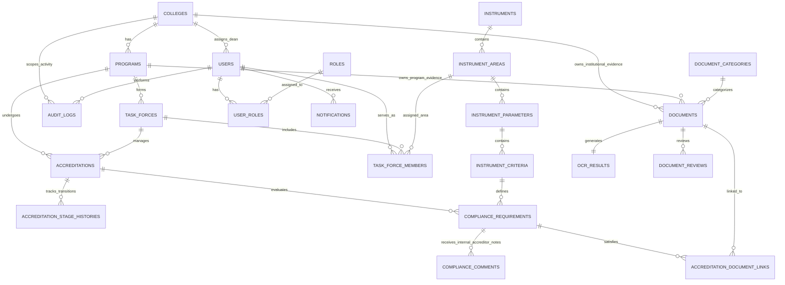

<!--
================================================================================
IQArchive v2 — Relational Database Schema & System Workflows Specification
================================================================================
File: v2/docs/db-design/database-design.md
Purpose: Authoritative relational database schema documentation and end-to-end
         data flow specification for Bicol University's AACCUP Accreditation System.
Architecture: Modern Monolithic 3-Tier (Laravel 13 MVC + Inertia.js + MySQL 8 3NF).
Security Context: Strict multi-tenant college isolation (college_id scoping),
                  immutable audit logging, protected local disk storage, and
                  server-side RBAC enforcement across 7 institutional roles.
================================================================================
-->

# IQArchive v2 — Database Design & System Workflows

This document defines the complete **3NF relational database schema** and details the **12 institutional data workflows** powering the **IQArchive v2** Document Management and Monitoring System for Bicol University's AACCUP accreditation process.

---

## 1. Architectural Foundation & Storage Principles

IQArchive uses a **split-storage model** to balance relational querying speed, compliance integrity, and large binary asset streaming:

1. **Structured Metadata (MySQL 8 InnoDB):** 
   - Strict 3rd Normal Form (3NF) relational tables for institutional hierarchies, user RBAC, survey criteria, task force rosters, and accreditation state machines.
   - Variable-length OCR metrics (per-word bounding boxes, per-page confidence scores) are stored in native MySQL `JSON` columns.
2. **Binary Document Storage (Protected Local Disk):**
   - PDF evidence files live outside the web root at `/mnt/storage/iqarchive/protected/{college}/{program}/`.
   - Direct web server access to PDF URLs is strictly blocked. All file streams require server-side policy authorization through `DocumentController`.
3. **Multi-Tenant College Isolation:**
   - Academic units are isolated at the database level. Key tenant tables (`documents`, `users`, `programs`, `audit_logs`) carry a direct, indexed `college_id` foreign key.

---

## 2. Complete Entity-Relationship Overview (22 Tables)

The database comprises **22 normalized tables** structured into **4 functional zones**:



### Visual Diagram References
- **Interactive Draw.io XML:** [`IQArchive-ERD-CAPSTONE 2 ERD.drawio.xml`](./IQArchive-ERD-CAPSTONE%202%20ERD.drawio.xml)
- **Vector Graphic SVG:** [`IQArchive-ERD-CAPSTONE 2 ERD.drawio.svg`](./IQArchive-ERD-CAPSTONE%202%20ERD.drawio.svg)

---

## 3. Detailed Data Dictionary by Functional Zone

### 🔵 Zone 1: Multi-Tenancy, Identity & Access Control

#### `colleges`
Root tenant boundary representing Bicol University's academic units.
- `id` (BIGINT UNSIGNED, PK, AUTO_INCREMENT)
- `name` (VARCHAR(255), NOT NULL) — e.g., "College of Science"
- `code` (VARCHAR(50), UNIQUE, NOT NULL) — e.g., "CS", "BUCE"
- `created_at`, `updated_at` (TIMESTAMP)

#### `programs`
Degree-granting academic programs undergoing accreditation.
- `id` (BIGINT UNSIGNED, PK, AUTO_INCREMENT)
- `college_id` (BIGINT UNSIGNED, FK $\rightarrow$ `colleges.id`, NOT NULL)
- `name` (VARCHAR(255), NOT NULL) — e.g., "Bachelor of Science in Information Technology"
- `code` (VARCHAR(50), UNIQUE, NOT NULL) — e.g., "BSIT"
- `current_level` (VARCHAR(50), NOT NULL) — e.g., "Level III Re-accredited"
- `created_at`, `updated_at` (TIMESTAMP)

#### `users`
Institutional accounts strictly authenticated via Google Workspace OAuth 2.0.
- `id` (BIGINT UNSIGNED, PK, AUTO_INCREMENT)
- `college_id` (BIGINT UNSIGNED, FK $\rightarrow$ `colleges.id`, NULLABLE) — Populated for Deans & college faculty; NULL for university-wide staff (IQA, BU Exec, SysAdmin)
- `name` (VARCHAR(255), NOT NULL)
- `email` (VARCHAR(255), UNIQUE, NOT NULL) — Must match `@bicol-u.edu.ph`
- `google_id` (VARCHAR(255), UNIQUE, NULLABLE) — Google OAuth subject identifier
- `avatar_url` (VARCHAR(500), NULLABLE)
- `status` (ENUM('active', 'inactive'), DEFAULT 'active')
- `email_verified_at` (TIMESTAMP, NULLABLE)
- `created_at`, `updated_at` (TIMESTAMP)

#### `roles`
The 7 defined institutional roles.
- `id` (BIGINT UNSIGNED, PK, AUTO_INCREMENT)
- `name` (VARCHAR(50), UNIQUE, NOT NULL) — `system_admin`, `iqa_staff`, `college_dean`, `task_force_member`, `internal_accreditor`, `bu_executive`, `external_accreditor`
- `display_name` (VARCHAR(100), NOT NULL)
- `description` (TEXT, NULLABLE)
- `created_at`, `updated_at` (TIMESTAMP)

#### `user_roles`
Many-to-many role assignments (supports Dean dual role: Dean + Task Force Lead).
- `id` (BIGINT UNSIGNED, PK, AUTO_INCREMENT)
- `user_id` (BIGINT UNSIGNED, FK $\rightarrow$ `users.id`, NOT NULL)
- `role_id` (BIGINT UNSIGNED, FK $\rightarrow$ `roles.id`, NOT NULL)
- `created_at`, `updated_at` (TIMESTAMP)
- *Unique Index:* `(user_id, role_id)`

#### `audit_logs`
Immutable, append-only compliance audit trail.
- `id` (BIGINT UNSIGNED, PK, AUTO_INCREMENT)
- `college_id` (BIGINT UNSIGNED, FK $\rightarrow$ `colleges.id`, NULLABLE)
- `user_id` (BIGINT UNSIGNED, FK $\rightarrow$ `users.id`, NULLABLE) — NULL for automated system events
- `action` (VARCHAR(100), NOT NULL) — e.g., "document.upload", "stage.transition", "ocr.validate"
- `target_type` (VARCHAR(100), NOT NULL) — Model class name
- `target_id` (VARCHAR(50), NULLABLE)
- `ip_address` (VARCHAR(45), NULLABLE)
- `details` (JSON, NULLABLE) — Field diffs and contextual payload
- `created_at` (TIMESTAMP)

#### `notifications`
In-app operational alerts and assignments.
- `id` (BIGINT UNSIGNED, PK, AUTO_INCREMENT)
- `user_id` (BIGINT UNSIGNED, FK $\rightarrow$ `users.id`, NOT NULL)
- `type` (VARCHAR(100), NOT NULL)
- `title` (VARCHAR(255), NOT NULL)
- `message` (TEXT, NOT NULL)
- `link` (VARCHAR(500), NULLABLE)
- `is_read` (BOOLEAN, DEFAULT FALSE)
- `read_at` (TIMESTAMP, NULLABLE)
- `created_at` (TIMESTAMP)

---

### 🟢 Zone 2: AACCUP Survey Instrument Master Hierarchy

#### `instruments`
Master evaluation tools released by AACCUP.
- `id` (BIGINT UNSIGNED, PK, AUTO_INCREMENT)
- `name` (VARCHAR(255), NOT NULL) — e.g., "AACCUP Revised Survey Instrument"
- `code` (VARCHAR(50), UNIQUE, NOT NULL) — e.g., "AACCUP-2024-UG"
- `type` (ENUM('ug', 'grad', 'inst'), NOT NULL)
- `version` (VARCHAR(20), NOT NULL)
- `is_active` (BOOLEAN, DEFAULT TRUE)
- `created_at` (TIMESTAMP)

#### `instrument_areas`
The 10 standard accreditation areas.
- `id` (BIGINT UNSIGNED, PK, AUTO_INCREMENT)
- `instrument_id` (BIGINT UNSIGNED, FK $\rightarrow$ `instruments.id`, NOT NULL)
- `area_number` (INT UNSIGNED, NOT NULL) — Range 1 to 10
- `name` (VARCHAR(255), NOT NULL) — e.g., "Area I: Vision, Mission, Goals, and Objectives"
- `description` (TEXT, NULLABLE)
- `created_at` (TIMESTAMP)

#### `instrument_parameters`
Sub-sections within an accreditation area.
- `id` (BIGINT UNSIGNED, PK, AUTO_INCREMENT)
- `instrument_area_id` (BIGINT UNSIGNED, FK $\rightarrow$ `instrument_areas.id`, NOT NULL)
- `parameter_letter` (VARCHAR(10), NOT NULL) — e.g., "Parameter A"
- `name` (VARCHAR(255), NOT NULL) — e.g., "Statement of Vision, Mission, Goals, and Objectives"
- `description` (TEXT, NULLABLE)
- `created_at` (TIMESTAMP)

#### `instrument_criteria`
Individual evaluation benchmarks against which evidence is mapped.
- `id` (BIGINT UNSIGNED, PK, AUTO_INCREMENT)
- `instrument_parameter_id` (BIGINT UNSIGNED, FK $\rightarrow$ `instrument_parameters.id`, NOT NULL)
- `benchmark_code` (VARCHAR(50), NOT NULL) — e.g., "S.1", "I.1", "O.1"
- `title` (TEXT, NOT NULL) — The exact criterion benchmark text
- `type` (ENUM('system', 'impl', 'outcome'), NOT NULL)
- `created_at` (TIMESTAMP)

---

### 🟠 Zone 3: Accreditation Pipeline & Task Force Management

#### `task_forces`
Program accreditation committee formed per academic cycle.
- `id` (BIGINT UNSIGNED, PK, AUTO_INCREMENT)
- `program_id` (BIGINT UNSIGNED, FK $\rightarrow$ `programs.id`, NOT NULL)
- `dean_lead_user_id` (BIGINT UNSIGNED, FK $\rightarrow$ `users.id`, NOT NULL) — College Dean automatically elevated to Lead
- `academic_year` (VARCHAR(20), NOT NULL) — e.g., "2025-2026"
- `status` (ENUM('active', 'archived'), DEFAULT 'active')
- `created_at` (TIMESTAMP)

#### `task_force_members`
Faculty subject-matter experts assigned to specific AACCUP areas.
- `id` (BIGINT UNSIGNED, PK, AUTO_INCREMENT)
- `task_force_id` (BIGINT UNSIGNED, FK $\rightarrow$ `task_forces.id`, NOT NULL)
- `user_id` (BIGINT UNSIGNED, FK $\rightarrow$ `users.id`, NOT NULL)
- `instrument_area_id` (BIGINT UNSIGNED, FK $\rightarrow$ `instrument_areas.id`, NULLABLE) — Area assignment; NULL for general leads
- `role_in_team` (ENUM('lead', 'area_chair', 'member'), NOT NULL)
- `assigned_at` (TIMESTAMP, NOT NULL)

#### `accreditations`
Formal accreditation survey instance for a program.
- `id` (BIGINT UNSIGNED, PK, AUTO_INCREMENT)
- `program_id` (BIGINT UNSIGNED, FK $\rightarrow$ `programs.id`, NOT NULL)
- `task_force_id` (BIGINT UNSIGNED, FK $\rightarrow$ `task_forces.id`, NOT NULL)
- `applied_level` (VARCHAR(50), NOT NULL) — e.g., "Level II", "Level III Phase 1"
- `current_stage` (INT UNSIGNED, NOT NULL, DEFAULT 1) — Stages 1 to 9
- `stage_status` (ENUM('in_progress', 'done', 'revision'), DEFAULT 'in_progress')
- `target_date` (DATE, NULLABLE)
- `created_at` (TIMESTAMP)

#### `accreditation_stage_histories`
State machine transition audit log for all 9 accreditation stages.
- `id` (BIGINT UNSIGNED, PK, AUTO_INCREMENT)
- `accreditation_id` (BIGINT UNSIGNED, FK $\rightarrow$ `accreditations.id`, NOT NULL)
- `from_stage` (INT UNSIGNED, NULLABLE)
- `to_stage` (INT UNSIGNED, NOT NULL)
- `initiated_by` (BIGINT UNSIGNED, FK $\rightarrow$ `users.id`, NOT NULL) — IQA Staff only
- `approved_by` (BIGINT UNSIGNED, FK $\rightarrow$ `users.id`, NOT NULL) — IQA Staff only
- `remarks` (TEXT, NULLABLE)
- `transitioned_at` (TIMESTAMP, NOT NULL)

#### `compliance_requirements`
Compliance status checklist item for each criterion in an active accreditation survey.
- `id` (BIGINT UNSIGNED, PK, AUTO_INCREMENT)
- `accreditation_id` (BIGINT UNSIGNED, FK $\rightarrow$ `accreditations.id`, NOT NULL)
- `instrument_criteria_id` (BIGINT UNSIGNED, FK $\rightarrow$ `instrument_criteria.id`, NOT NULL)
- `status` (ENUM('unassigned', 'in_progress', 'compliant'), DEFAULT 'unassigned')
- `due_date` (DATE, NULLABLE)
- `remarks` (TEXT, NULLABLE)
- `created_at` (TIMESTAMP)
- *Unique Index:* `(accreditation_id, instrument_criteria_id)`

#### `compliance_comments`
Advisory commentary and gap notes left by Internal Accreditors on specific criteria.
- `id` (BIGINT UNSIGNED, PK, AUTO_INCREMENT)
- `compliance_requirement_id` (BIGINT UNSIGNED, FK $\rightarrow$ `compliance_requirements.id`, NOT NULL)
- `user_id` (BIGINT UNSIGNED, FK $\rightarrow$ `users.id`, NOT NULL) — Internal Accreditor, IQA, or Task Force Member
- `comment_type` (ENUM('advisory', 'gap', 'clarification'), NOT NULL)
- `comment_text` (TEXT, NOT NULL)
- `is_resolved` (BOOLEAN, DEFAULT FALSE)
- `created_at` (TIMESTAMP)

---

### 🟣 Zone 4: Evidence Document Storage, Review & OCR Engine

#### `document_categories`
Taxonomy classification for uploaded evidence.
- `id` (BIGINT UNSIGNED, PK, AUTO_INCREMENT)
- `name` (VARCHAR(100), NOT NULL) — e.g., "Curriculum & Syllabi", "Faculty Records", "Board Resolutions"
- `scope` (ENUM('institutional', 'college', 'program'), NOT NULL)
- `description` (TEXT, NULLABLE)
- `created_at` (TIMESTAMP)

#### `documents`
Master evidence registry containing file paths, cryptographic hashes, and multi-tenant scoping.
- `id` (BIGINT UNSIGNED, PK, AUTO_INCREMENT)
- `college_id` (BIGINT UNSIGNED, FK $\rightarrow$ `colleges.id`, NOT NULL) — Enforces multi-tenant isolation
- `program_id` (BIGINT UNSIGNED, FK $\rightarrow$ `programs.id`, NULLABLE) — NULL for institutional/college-level evidence
- `category_id` (BIGINT UNSIGNED, FK $\rightarrow$ `document_categories.id`, NOT NULL)
- `user_id` (BIGINT UNSIGNED, FK $\rightarrow$ `users.id`, NOT NULL) — Uploader
- `title` (VARCHAR(255), NOT NULL)
- `original_filename` (VARCHAR(255), NOT NULL)
- `file_path` (VARCHAR(500), NOT NULL) — Protected local storage path
- `file_hash` (VARCHAR(64), NOT NULL) — Cryptographic SHA-256 integrity hash
- `file_size_bytes` (BIGINT UNSIGNED, NOT NULL)
- `mime_type` (VARCHAR(100), NOT NULL) — e.g., "application/pdf"
- `status` (ENUM('draft', 'dean_appr', 'iqa_appr', 'rejected'), DEFAULT 'draft')
- `visibility` (ENUM('private', 'college', 'univ', 'accreditor'), DEFAULT 'college')
- `created_at` (TIMESTAMP)

#### `accreditation_document_links`
Many-to-many junction linking uploaded documents to compliance requirements.
- `id` (BIGINT UNSIGNED, PK, AUTO_INCREMENT)
- `compliance_requirement_id` (BIGINT UNSIGNED, FK $\rightarrow$ `compliance_requirements.id`, NOT NULL)
- `document_id` (BIGINT UNSIGNED, FK $\rightarrow$ `documents.id`, NOT NULL)
- `relevance_notes` (TEXT, NULLABLE)
- `created_at` (TIMESTAMP)
- *Unique Index:* `(compliance_requirement_id, document_id)`

#### `ocr_results`
Synchronous Tesseract OCR extraction output (1:1 with `documents`).
- `id` (BIGINT UNSIGNED, PK, AUTO_INCREMENT)
- `document_id` (BIGINT UNSIGNED, FK $\rightarrow$ `documents.id`, UNIQUE, NOT NULL)
- `validated_by_user_id` (BIGINT UNSIGNED, FK $\rightarrow$ `users.id`, NULLABLE) — Stamped upon human validation
- `raw_text` (LONGTEXT, NOT NULL) — Original Tesseract text output
- `edited_text` (LONGTEXT, NULLABLE) — Human-corrected text
- `confidence_metrics` (JSON, NOT NULL) — Per-word bounding boxes and confidence scores $(< 0.65$ flagged)
- `pages_data` (JSON, NOT NULL) — Per-page dimensions and layout metrics
- `average_confidence` (DECIMAL(5,4), NOT NULL) — Overall document confidence rating (e.g. 0.8924)
- `status` (ENUM('processing', 'completed', 'validated'), DEFAULT 'processing')
- `duration_ms` (INT UNSIGNED, NOT NULL) — Processing execution time
- `validated_at` (TIMESTAMP, NULLABLE)
- `created_at` (TIMESTAMP)

#### `document_reviews`
Two-tier approval records (Dean gate, IQA consolidation gate, and Internal Accreditor advisory notes).
- `id` (BIGINT UNSIGNED, PK, AUTO_INCREMENT)
- `document_id` (BIGINT UNSIGNED, FK $\rightarrow$ `documents.id`, NOT NULL)
- `user_id` (BIGINT UNSIGNED, FK $\rightarrow$ `users.id`, NOT NULL) — Reviewer
- `review_stage` (ENUM('dean', 'iqa', 'internal_accreditor'), NOT NULL)
- `decision` (ENUM('approved', 'rejected', 'advisory'), NOT NULL)
- `remarks` (TEXT, NULLABLE)
- `reviewed_at` (TIMESTAMP, NOT NULL)

---

## 4. End-to-End System Workflows & Data Flows

### Workflow 1: Institutional Single Sign-On & RBAC Initialization
```
User Browser ──(Google SSO)──► Backend Auth Controller
                                     │
                                     ├── Validate @bicol-u.edu.ph domain
                                     ├── Query users (google_id / email)
                                     ├── Load roles from user_roles
                                     ├── Share props via Inertia (user, roles, college_id)
                                     └── Log audit_logs ("auth.login")
```

### Workflow 2: Multi-Tenant Academic Setup
```
System Admin ──► Create colleges ──► Create programs (college_id)
                      │
                      └──► Create User (Dean) with college_id
```

### Workflow 3: AACCUP Master Survey Instrument Cataloging
```
IQA Staff ──► instruments ──► instrument_areas (1 to 10)
                                    │
                                    └──► instrument_parameters (A-J)
                                               │
                                               └──► instrument_criteria (S.1, I.1)
```

### Workflow 4: Task Force Formation & Area SME Assignment
```
College Dean ──► task_forces (program_id, dean_lead_user_id)
                       │
                       └──► task_force_members (user_id, instrument_area_id)
                                  │
                                  └──► notifications (alert members)
```

### Workflow 5: Accreditation Cycle Launch & Checklist Generation
```
IQA Staff ──► accreditations (program_id, current_stage=1)
                    │
                    ├──► Auto-generate compliance_requirements (per criterion)
                    └──► accreditation_stage_histories (stage 1 Draft logged)
```

### Workflow 6: Evidence Upload, Synchronous OCR & Human Validation
```
Task Force Member ──► Upload PDF
                           │
                           ├── Write protected storage + compute SHA-256 hash ──► documents
                           ├── Synchronous ProcessDocumentOcrService ──────────► ocr_results
                           │    (extract raw_text, JSON confidence, flag < 0.65)
                           └── Split-Screen Human Validation UI
                                └── Reviewer edits & approves ─────────────────► ocr_results.edited_text
```

### Workflow 7: Evidence-to-Criteria Matrix Linking
```
Task Force Member ──► Drag document to criterion in AACCUP Tree
                           │
                           ├── Insert accreditation_document_links
                           └── Update compliance_requirements.status = 'in_progress'
```

### Workflow 8: Two-Tier Evidence Approval Chain
```
Task Force Member ──► Submit Evidence Package (status: 'dean_pending')
                           │
                           ▼
Tier 1: College Dean Gate ──(Approve)──► document_reviews ('dean', 'approved')
                           │             documents.status = 'dean_approved'
                           ▼
Tier 2: IQA Consolidation ──(Approve)──► document_reviews ('iqa', 'approved')
                                         documents.status = 'iqa_approved'
```

### Workflow 9: 9-Stage Pipeline State Machine Progression
```
IQA Staff ──► Verify stage completion requirements
                   │
                   ▼
State Machine Transition (Stage N ──► Stage N+1)
                   │
                   ├── Update accreditations.current_stage
                   ├── Record immutable accreditation_stage_histories
                   └── Dispatch notifications to Dean & Task Force
```

### Workflow 10: Mock Review & Internal Accreditor Advisory Feedback
```
Internal Accreditor (Stages 5-7) ──► Browse compiled evidence
                                          │
                                          ├── Post advisory note ──► compliance_comments
                                          └── Optional review ───► document_reviews ('internal_accreditor')
                                                    │
                                                    ▼
Task Force Member / IQA ───────────► Address feedback & set is_resolved = true
```

### Workflow 11: Stage 8 Formal Submission & External Accreditor Audit
```
IQA Staff ──► Transition to Stage 8 (Submitted)
                   │
                   ▼
External Accreditor ──► Read-only access unlocked
                             │
                             ├── Browse compiled AACCUP tree
                             ├── Stream bytes via DocumentController
                             └── Every download logged in audit_logs
```

### Workflow 12: Executive Analytics & Macro Monitoring
```
BU Executive ──► Read-only Macro Dashboard
                      │
                      └── Query aggregations across colleges, programs & stages
```
